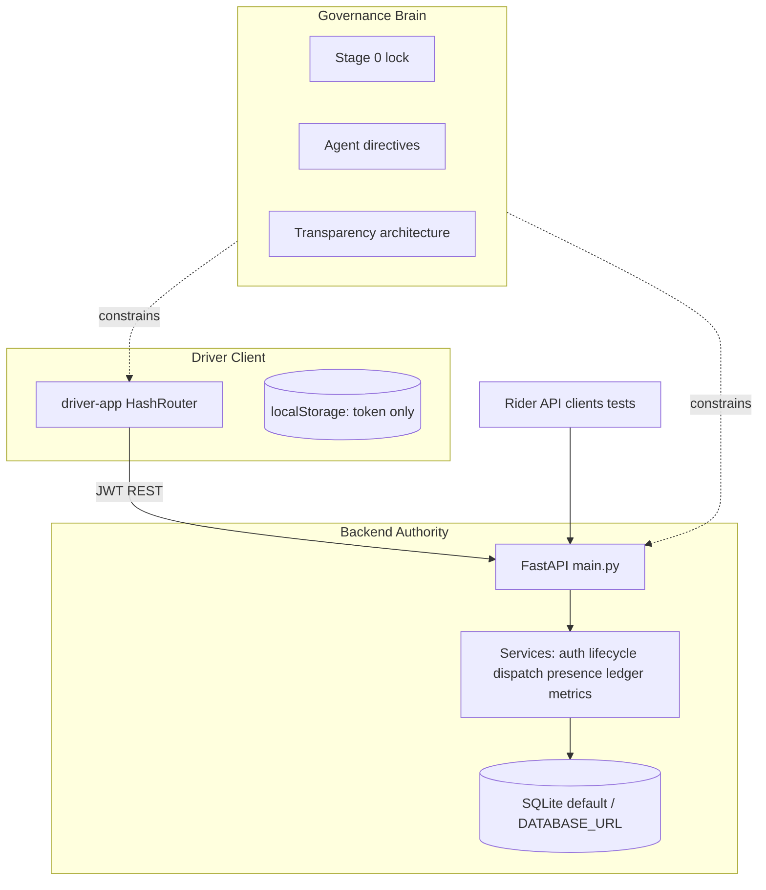

# HalfApp Comprehensive Program Report

**Document ID:** `HALFAPP_COMPREHENSIVE_PROGRAM_REPORT_01`  
**Audience:** Advanced engineering reviewers, product leadership, and program owners  
**Workspace:** `c:\Users\him\Desktop\halfapp-driver`  
**Report date:** 2026-05-21  
**Verification snapshot:** Backend `54 passed` (pytest), active route inventory from `scripts/print_active_routes.py`

---

## How to read this document

This report is intentionally long. It exists so you can move to the **next program step** with a shared, evidence-based picture of:

1. What HalfApp **is** and what it **is not**
2. The **governance brain** (documentation + contracts + agent execution order) that steers implementation
3. The **runtime product spine** (`backend` + `driver-app`) and its real capabilities
4. **Strengths** worth preserving and **weaknesses** that must not be mistaken for completion
5. **Inactive** surfaces that create illusion risk
6. A **prioritized roadmap** aligned with existing program directives

Every major claim below should be traceable to a file path, test, or explicit “not implemented” boundary.

---

# Part I — Executive Summary

## 1.1 One-paragraph verdict

HalfApp is a **driver-only ride-hailing MVP** with a **credible backend-owned lifecycle** and a **React driver cockpit** that increasingly treats the API as authority. It is **not** a production marketplace, payment platform, routing engine, rider product, admin operations center, or city-scale mobility OS. The program’s distinguishing intellectual asset is not a single ML model in this repo—it is a **deliberate transparency and truth-boundary system** (“the brain”) encoded in governance documents, contracts, tests, and incremental backend audit structures. The engineering frontier is **financial ledger truth**, **route proof**, **production hardening**, and **closing remaining UI/backend gaps**—not expanding screen count.

## 1.2 Program maturity scorecard (honest)

| Dimension | Score (1–5) | Notes |
|-----------|-------------|-------|
| Driver lifecycle correctness | 4 | Real state machine, tested transitions |
| Dispatch honesty (open board) | 3 | Atomic claim, visibility, 409 conflicts; no geo fairness |
| Marketplace audit trail | 3 | `marketplace_ledger_events`, claim records; not full candidate rounds |
| Driver presence truth | 3 | Backend presence + heartbeat; no WebSocket gateway |
| Spatial truth | 2 | Coordinates stored; no routing engine proof |
| Financial truth | 1 | Float `fare_amount` summary only |
| Production security | 1 | Dev `SECRET_KEY`, permissive CORS union |
| Product boundary clarity | 4 | Stage 0 lock, dormant inventory, CI guards |
| Repository hygiene / sprawl risk | 2 | Legacy frontend, dormant routes look “complete” |
| Test discipline | 4 | 54 backend tests + Playwright trust lane |

**Overall:** Strong **prototype spine**, weak **production marketplace** layers.

## 1.3 What “success at the next step” means

The next successful phase is **not** more dashboards. It is:

- Every driver-visible fact answerable with: *which backend record, which endpoint, which test, which audit event*
- Money and routes **either absent or provably backend-backed**
- No accidental revival of dormant surfaces without explicit orders
- Governance docs staying synchronized with `main.py` and `App.jsx`

---

# Part II — The Brain: Governance Intelligence Layer

## 2.1 Definition: what “the brain” is in this repository

In this workspace, **“the brain”** does not refer to a deployed autonomous agent service or a monolithic AI runtime. It refers to the **program intelligence layer**: the set of documents, contracts, checklists, and ordered directives that tell humans and coding agents **what to build, in what order, what to forbid, and how to verify truth**.

The brain has three coupled functions:

| Function | Mechanism | Primary files |
|----------|-----------|---------------|
| **Truth boundary** | Defines active vs inactive surfaces and forbidden claims | `docs/PRODUCT_BOUNDARY_STAGE0.md`, `docs/CURRENT_TRUTH.md` |
| **Architecture target** | Separates implemented vs target transparency pillars | `docs/HALFAPP_TRANSPARENCY_ARCHITECTURE.md` |
| **Execution order** | Converts overview into sequenced engineering actions | `docs/HALFAPP_AGENT_ACTION_DIRECTIVES.md` |

Without this layer, the codebase would read as a larger product than it is—because dormant routers, legacy frontend, and demo UI components **look** feature-complete.

## 2.2 Core program principle (non-negotiable)

From `docs/HALFAPP_EXPERT_PROGRAM_CRITICAL_OVERVIEW.md` and `docs/HALFAPP_TRANSPARENCY_ARCHITECTURE.md`:

> **Every important driver-facing fact must come from durable backend truth, not frontend inference.**

Transparency is **earned** only when backend records prove:

- Lifecycle facts
- Dispatch facts (visibility, ordering, claim win/loss)
- Presence facts
- Route facts (when claimed)
- Pricing and payout facts (when claimed)
- Audit facts

UI polish without backend proof is classified as **misleading**, not MVP progress.

## 2.3 Stage 0 truth lock (`HALFAPP_STAGE0_TRUTH_BOUNDARY_LOCK_01`)

**Status:** Active contract (2026-05-20)

**Active product surfaces only:**

- `backend/` — FastAPI API
- `driver-app/` — React/Vite driver app

**Forbidden to claim until separate implementation orders:**

- Real routing, ETA, traffic
- Payments, wallets, payouts, platform fee truth
- Rider app UI
- Nearest-driver / geo dispatch
- City-scale mobility OS
- Admin production readiness on live API
- Geocoding proof from text addresses

**Allowed honest framing:**

> “Driver-only MVP with backend lifecycle and audit foundation; geo and money layers not built.”

## 2.4 Agent action directives (execution brain)

`docs/HALFAPP_AGENT_ACTION_DIRECTIVES.md` defines nine ordered actions:

| Action | Topic | Status in repo (high level) |
|--------|-------|------------------------------|
| 1 | Lock active product boundary | Largely done in docs + CI build guards |
| 2 | Backend-owned driver presence | **Implemented** (`/drivers/presence`, heartbeat) |
| 3 | Backend ride hide/dismiss | **Implemented** (`POST /drivers/rides/{id}/hide`) |
| 4 | Dispatch auditability | **Implemented** (visibility, claim attempts, 409) |
| 5 | Marketplace ledger events | **Implemented** (`marketplace_ledger_events`) |
| 6 | Database migration discipline | **Implemented** (Alembic `0001`–`0005`, startup `run_migrations`) |
| 7 | Financial ledger foundation | **Not implemented** (integer cents, fee splits) |
| 8 | Route snapshot foundation | **Not implemented** |
| 9 | Production hardening | **Partial** (CI exists; secrets/CORS/revocation gaps) |

**Success definition for any feature:**

1. Which backend record proves this?
2. Which endpoint changed it?
3. Which test covers it?
4. Which audit event explains it?
5. What happens on refresh, retry, conflict, or disconnect?

If those five questions have no answer, the feature is incomplete.

## 2.5 Review and merge gates

`docs/REVIEW_CHECKLIST.md` defines PR review areas and a **Standard Merge Gate** including:

- Backend pytest
- Driver app production build
- E2E and trust lanes
- OpenAPI / route inventory checks

CI enforcement: `.github/workflows/halfapp-driver-ci.yml`

**Note:** This repository contains **no** references to “CMM” workflows. Governance is Stage 0 lock + review checklist + CI—not a separate CMM module.

## 2.6 Expert program documents (strategic brain)

| Document | Role |
|----------|------|
| `docs/HALFAPP_EXPERT_PROGRAM_CRITICAL_OVERVIEW.md` | Candid architectural verdict, weaknesses, phased roadmap |
| `docs/HALFAPP_EXPERT_PROGRAM_OVERVIEW.md` | Broader program map |
| `docs/HALFAPP_TRANSPARENCY_ARCHITECTURE.md` | Five pillars: ledger, dispatch, spatial, lifecycle, local-first scale |
| `docs/BACKLOG.md` | Ticketized epics derived from expert overview |
| `docs/RIDE_LIFECYCLE_CONTRACT.md` | API contract for ride states and payloads |
| `docs/DORMANT_ROUTERS_INVENTORY.md` | Mounted vs unmounted API |
| `docs/DRIVER_APP_BACKEND_ALIGNMENT_REPORT.md` | UI/API alignment evidence |
| `HALFAPP_INTERNAL_FUNCTION_MAP_01.md` | Internal map (some cockpit items superseded by later work) |
| `HALFAPP_PHASE2_ACCEPTANCE_AND_PHASE3_PRECHECK_01.md` | Phase 2 GO, Phase 3 partial |

## 2.7 What the brain does **not** include (in this workspace)

The following were discussed in broader program planning elsewhere but **are not present** in this repository tree as of this report:

- `apps/api/command-gateway.mjs`
- `apps/api/editor-authority.mjs`
- `WORKSPACE_AUTHORITY_CONTRACT.md`
- LSP diagnostics wired to a workbench Problems drawer
- I2V loopback / GPU editor intelligence pipeline

If those are part of your **next** program step, they are **out-of-tree** relative to `halfapp-driver` and should be integrated as a separate milestone with their own truth contract.

## 2.8 Brain strength vs brain weakness

**Strengths:**

- Rare clarity for an MVP repo: explicit forbidden claims list
- Execution order prevents “UI-first fantasy”
- Transparency architecture separates **current truth** vs **target**
- Tests and route inventory scripts operationalize governance

**Weaknesses:**

- Doc drift risk when code moves faster than `HALFAPP_INTERNAL_FUNCTION_MAP_01.md`
- `INVESTOR_READINESS_STATUS.md` may lag implementation (verify before decks)
- Brain does not auto-enforce claims—humans/agents can still violate boundaries without checklist discipline

---

# Part III — Product Definition and Boundaries

## 3.1 What HalfApp is

HalfApp is a **backend-backed driver marketplace prototype** that proves:

- Driver registration and JWT authentication (driver role only on active app path)
- Open-board ride pool (`requested`, unassigned)
- Atomic first-claim acceptance with conflict transparency
- Full driver lifecycle transitions through completion
- Rider-side **API-only** create and cancel (no rider UI product)
- Backend-owned presence, hide, visibility, and append-only marketplace events
- Earnings **summary** projection from completed rides

## 3.2 What HalfApp is not

| Not this | Why |
|----------|-----|
| Uber/Lyft-scale dispatch | No geo eligibility, no nearest-driver engine |
| Payment processor | No PSP, ledger cents, payouts |
| Navigation product | Map is stylized SVG; no route engine |
| Rider-facing app | No passenger UI in active spine |
| Admin ops platform | Admin routers unmounted |
| Complete mobility OS | Stage 0 explicitly forbids |
| Video QA product | `video-gate` is isolated tooling |
| WIND heavy transporter | `wind/` is separate engineering program |

## 3.3 Investor vs engineering truth

Use `docs/INVESTOR_READINESS_STATUS.md` and `docs/INVESTOR_SHOWCASE_SCRIPT.md` only after cross-checking `docs/CURRENT_TRUTH.md`. Engineering authority is:

1. `backend/main.py` + OpenAPI
2. `driver-app/src/App.jsx`
3. pytest + Playwright trust results

---

# Part IV — Repository Architecture

## 4.1 Top-level map

```
halfapp-driver/
├── backend/          # ACTIVE — FastAPI product API
├── driver-app/       # ACTIVE — React/Vite driver UI
├── docs/             # ACTIVE — governance & contracts
├── scripts/          # ACTIVE — route inventory tooling
├── .github/          # ACTIVE — CI
├── frontend/         # INACTIVE — legacy multi-role UI
├── video-gate/       # ISOLATED — video QA/generation
├── wind/             # UNRELATED — WIND-Alpha Stage 0 specs
├── README.md
├── PROJECT_OVERVIEW.md
└── HALFAPP_*.md      # acceptance / function maps
```

## 4.2 Active product spine diagram



## 4.3 Technology stack

| Layer | Technology | Version notes |
|-------|------------|---------------|
| API | FastAPI | See `backend/requirements.txt` |
| ORM | SQLAlchemy 2 | Models with FKs on active tables |
| Migrations | Alembic | `0001` through `0005` |
| Auth | JWT HS256 + bcrypt | Dev `SECRET_KEY=change_me` — **unsafe for deploy** |
| Driver UI | React 18 + Vite 7 | HashRouter for static hosting |
| Styling | Tailwind | `driver-app` |
| E2E | Playwright | smoke + trust (mock-off) lanes |
| CI | GitHub Actions | build, pytest, Alembic drift |

---

# Part V — Backend Deep Dive

## 5.1 Boot sequence (`backend/main.py`)

1. Import ORM models: `user`, `ride`, `metrics`, `ledger`, `presence`, notifications model
2. `run_migrations(engine)` — Alembic upgrade head
3. Create FastAPI app, configure CORS (dev defaults **unioned** with `CORS_ORIGINS`)
4. Mount routers: `auth`, `drivers`, `internal`, `notifications`, `rider_rides`
5. Expose `GET /health`

**Important:** Schema evolution is **not** relying solely on `create_all` at startup for new environments; migrations are authoritative.

## 5.2 Active API catalog (verified routes)

### Health and internal

| Method | Path | Purpose |
|--------|------|---------|
| GET | `/health` | Liveness |
| GET | `/internal/system-health` | Internal diagnostics |

### Authentication (`/auth`)

| Method | Path | Purpose |
|--------|------|---------|
| POST | `/auth/register` | Driver registration only on active path |
| POST | `/auth/login` | Driver login |
| GET | `/auth/me` | Current user profile |

### Drivers (`/drivers`) — core marketplace surface

| Method | Path | Purpose |
|--------|------|---------|
| GET | `/drivers/` | List drivers (limited MVP use) |
| GET | `/drivers/presence` | Read backend presence |
| PUT | `/drivers/presence` | Set requested presence state |
| POST | `/drivers/heartbeat` | Liveness timestamp |
| GET | `/drivers/my-rides` | Assigned rides for driver |
| GET | `/drivers/available-rides` | Open board pool with dispatch metadata |
| GET | `/drivers/rides/{ride_id}/transparency` | Dispatch proof for authorized driver |
| POST | `/drivers/simulate-ride` | Dev simulation → real DB row |
| POST | `/drivers/accept-ride/{ride_id}` | Atomic claim |
| POST | `/drivers/decline-ride/{ride_id}` | Release accepted → requested |
| POST | `/drivers/dismiss-ride/{ride_id}` | Legacy alias for hide |
| POST | `/drivers/rides/{ride_id}/hide` | Backend hide with TTL |
| POST | `/drivers/arrive-pickup/{ride_id}` | `driver_arrived` |
| POST | `/drivers/start-ride/{ride_id}` | `in_progress` |
| POST | `/drivers/complete-ride/{ride_id}` | `completed` + fare calculation |
| GET | `/drivers/earnings` | Summary over completed fares |
| GET | `/drivers/performance` | Performance metrics |
| GET | `/drivers/insights` | Measured insights |
| PUT | `/drivers/profile` | Profile update |
| GET | `/drivers/status` | Driver status snapshot |
| POST | `/drivers/update-location` | Last lat/lng on user |
| GET | `/drivers/statistics` | Aggregated stats |

### Rider API (`/rides` via `rider_rides.py`)

| Method | Path | Purpose |
|--------|------|---------|
| POST | `/rides/` | Create ride (customer role) |
| POST | `/rides/{ride_id}/cancel` | Rider cancel |
| POST | `/rides/{ride_id}/action` | Extended rider action (verify contract before UI claims) |

### Notifications (`/notifications`)

| Method | Path | Purpose |
|--------|------|---------|
| GET | `/notifications/` | List |
| POST | `/notifications/send` | Admin send |
| POST | `/notifications/{id}/read` | Mark read |
| DELETE | `/notifications/{id}` | Delete |
| POST | `/notifications/driver/ride-alert` | Driver alert |

## 5.3 Dormant API (exists in tree, **404 on live app**)

| Module | Prefix | Risk if confused with active |
|--------|--------|------------------------------|
| `routes/admin.py` | `/admin` | False admin readiness |
| `routes/admin_access.py` | `/admin-access` | Demo access codes |
| `routes/rides.py` | `/rides` (legacy) | Contract collision with `rider_rides` |
| `routes/users.py` | `/users` | User listing |
| `routes/test.py` | `/test` | Debug DB endpoints |

Enforced by `backend/tests/test_active_route_surface.py`.

## 5.4 Services layer

### `backend/services/auth.py`

- bcrypt password hashing (72-byte truncation)
- JWT create/decode
- `require_driver`, role checks
- Public user serialization

### `backend/services/lifecycle.py`

- Canonical status enums and transitions
- Storage alias normalization (`arrived_at_pickup` ↔ `driver_arrived`, etc.)
- Transition guards for arrive/start/complete/decline

### `backend/services/dispatch.py`

- `BaseDispatchPolicy` abstract boundary
- `OpenBoardDispatchPolicy` — active implementation
- `get_available_rides`: filters hidden visibility, orders by `created_at`, ranks via metrics
- `claim_ride`: atomic SQL `UPDATE ... WHERE status='requested' AND driver_id IS NULL`
- Exceptions: `RideAlreadyClaimed`, `RideNotFound`, `RideNotAvailable` → HTTP 409 with transparent detail

### `backend/services/presence.py`

- `DriverPresence` requested vs effective state
- Stale/disconnected derivation from heartbeat

### `backend/services/ledger.py`

- `MarketplaceLedgerEventType` enum (ride, dispatch, presence, earning events)
- SHA-256 hash chain fields: `previous_event_hash`, `event_hash`
- Idempotency and correlation support
- Writes on create, visibility, hide, claim, release, cancel, complete, presence, earning calculation

### `backend/services/metrics.py`

- `RideVisibility` exposure records
- `RideClaimAttempt` win/loss/conflict audit
- `DISPATCH_POLICY_VERSION` constant
- Ranking metadata on available rides

## 5.5 Data model (active tables)

### `users`

- Roles: `customer`, `driver`, `admin` (admin not on active UI path)
- Driver profile fields, `availability` legacy field, last location columns
- `is_active` stored as string — quirk for new engineers

### `rides`

- Lifecycle status with DB check constraint
- Pickup/dropoff labels + **coordinates** (`pickup_latitude`, etc.)
- `fare_amount` as **Float** — demo pricing at complete
- `distance`, `duration` — client-supplied or simulation, not routing proof
- Timestamps: `accepted_at`, `arrived_pickup_at`, `started_at`, `completed_at`, `cancelled_at`
- `lifecycle_reason` — single last explanation, not full history

### `driver_presence`

- Backend-owned online/offline/paused/stale/disconnected semantics

### `ride_visibility`

- Per-driver exposure, hide TTL, ordering rank, policy version, correlation ID

### `ride_claim_attempts`

- Claim attempted/won/lost/conflict audit

### `marketplace_ledger` / `marketplace_ledger_events`

- Append-only event stream with hash chaining (foundation for transparency pillar 1)

### `events`, `metrics`

- Operational counters and entity events

### `notifications`

- Model owned by notifications route module

## 5.6 Alembic migrations

| Revision | Focus |
|----------|-------|
| `0001` | Hardened initial schema |
| `0002` | Canonical ride status contract |
| `0003` | (presence/visibility — see file) |
| `0004` | Restore schema indexes |
| `0005` | Marketplace ledger events foundation |

**CI:** Alembic drift check prevents silent schema divergence.

## 5.7 Ride lifecycle (implemented path)

```
requested → accepted → driver_arrived → in_progress → completed
                ↑ decline (releases to requested)
requested|accepted → cancelled (rider API)
```

**Driver decline semantics:** Not a terminal rejection—returns ride to open pool.

**Simulation:** `POST /drivers/simulate-ride` creates `lifecycle_reason=simulation` row; still uses normal lifecycle.

**Fare at complete:** Documented demo formula (`$5 + $1.50/km` style)—not rate card ledger.

## 5.8 Authorization model

| Actor | Active capabilities |
|-------|---------------------|
| Driver | All `/drivers/*` lifecycle, presence, hide, earnings |
| Customer | `POST /rides/`, cancel — **API only** |
| Admin | Notification send/delete — **no admin UI on live API** |

JWT stored in driver app `localStorage` as `driver_token` — acceptable for MVP, needs hardening for production.

---

# Part VI — Driver App Deep Dive

## 6.1 Routing (`driver-app/src/App.jsx`)

| Route | Component | Backend dependency |
|-------|-----------|-------------------|
| `/login` | `LoginScreen` | register/login |
| `/` | `MapHome` | cockpit — full lifecycle |
| `/rides`, `/trips` | `TripsList` | completed rides |
| `/earnings` | `Earnings` | earnings API |
| `/notifications` | `Notifications` | notifications + **demo messages tab** |
| `/profile` | `Profile` | profile, stats, earnings |

**HashRouter:** Supports static hosting without server-side URL rewriting.

## 6.2 Auth (`driver-app/src/hooks/useAuth.jsx`)

- AuthProvider wraps app
- Token rehydration via `/auth/me`
- Driver-only registration enforced in UI
- `ProtectedRoute` allows token presence; optional `disable_guard` for E2E when `VITE_ENABLE_GUARD_BYPASS=true`

## 6.3 API client (`driver-app/src/utils/api.js`)

- `DriverAPI` centralizes backend calls
- `VITE_ALLOW_OFFLINE_MOCK=true` → localStorage mock — **not marketplace truth**
- Production build blocked by `scripts/assert-prod-truth.mjs` if mock/bypass flags set

## 6.4 Cockpit (`MapHome.jsx`) — operational center

**Backend-backed behaviors:**

- Available rides, my rides, earnings refresh
- Accept, arrive, start, complete
- Presence read/write (when aligned with latest acceptance docs)
- Hide via backend endpoint (when wired — verify against current `MapHome` imports)
- Simulation button when `VITE_ENABLE_RIDE_SIMULATION=true`

**Must not invent:**

- ETA, traffic, route geometry, nearest-driver narrative
- Hardcoded city coordinates when backend provides coords

## 6.5 Map (`MapView.jsx`)

- Stylized SVG grid + straight line between pickup/dropoff
- **Not** Mapbox/Google/OSRM
- Copy must say approximate visualization where applicable

## 6.6 Active vs dormant components

**Active (imported by App):**

- `LoginScreen`, `MapHome`, `TripsList`, `Earnings`, `Notifications`, `Profile`
- `DevBanner`, `MockModeBanner`, `ErrorBoundary`, `BottomNavigation`, `MapView`

**Dormant (exist, not routed):**

- `RideList.jsx` — full backend ride UI, **not in App.jsx**
- `Dashboard.jsx`, `AdminDashboard.jsx`
- `AuthDebugger`, `AppDiagnostics`, `DatabaseTest`, `PerformanceMonitor`
- `SimpleDashboard`, `SimpleLoginTest`, `SplashScreen`, `LoadingScreen`
- `EarningsChart.jsx`, `RideMap.jsx`

**Risk:** Future developer wires `RideList` thinking it is new work—it already exists.

## 6.7 Environment flags (truth policy)

| Flag | Effect |
|------|--------|
| `VITE_ALLOW_OFFLINE_MOCK` | localStorage fake API |
| `VITE_ENABLE_RIDE_SIMULATION` | Shows simulation UI → `POST /drivers/simulate-ride` |
| `VITE_ENABLE_GUARD_BYPASS` | E2E route guard bypass (non-prod) |

Trust Playwright config disables mock/simulation inappropriate paths.

## 6.8 localStorage boundary (Phase 2 accepted)

| Key | Classification |
|-----|----------------|
| `driver_token`, `driver_role` | Auth storage — OK for MVP |
| `halfapp_driver_state` | UI preference if still used — not ride truth |
| `halfapp_trips`, `halfapp_active_ride` | Legacy — must not drive earnings/lifecycle |
| `halfapp_mock_backend_rides` | Dev mock only |
| `disable_guard` | Test only |

---

# Part VII — Transparency Architecture (Five Pillars)

Reference: `docs/HALFAPP_TRANSPARENCY_ARCHITECTURE.md`

## 7.1 Pillar 1 — Radical transparency / anti-black-box ledger

**Implemented foundation:**

- `marketplace_ledger_events` with hash chain
- Event types: ride.created, dispatch.*, ride.hidden, presence.*, earning.calculated, etc.

**Not implemented:**

- Full fare split audit
- Candidate evaluation rounds
- Driver-facing audit UI projections

## 7.2 Pillar 2 — Open dispatch

**Implemented:**

- Open board policy `Open Board v1`
- Deterministic ordering metadata on available rides
- `ride_visibility` records
- Atomic claim with HTTP 409 `Ride already claimed`
- Transparency endpoint per ride

**Not implemented:**

- FIFO regional queue
- Geo eligibility
- Nearest-driver smoke test with proved geometry

## 7.3 Pillar 3 — Spatial truth

**Implemented:**

- Backend coordinate fields on rides
- Contract: UI uses backend coords only

**Not implemented:**

- Geocoding, route snapshots, ETA, traffic, geometry hash

## 7.4 Pillar 4 — Passenger delivery lifecycle

**Implemented:**

- Driver path + rider cancel API
- Status machine in backend

**Not implemented:**

- Rider app, rich passenger notifications product

## 7.5 Pillar 5 — Lightweight local-first scale

**Current:**

- SQLite local dev, `DATABASE_URL` override
- Single-region MVP assumptions

**Not implemented:**

- Multi-city ops, gateway presence, horizontal dispatch partitions

---

# Part VIII — Inactive and Satellite Programs

## 8.1 Legacy `frontend/`

- Multi-role BrowserRouter app (driver, customer, admin)
- Calls `/admin/*`, legacy `/rides/*` — **unmounted** on live API
- **No `package.json`** — cannot build from directory
- `frontend/README.md` marks archive
- **Do not revive** without revival checklist in Stage 0 doc

## 8.2 `video-gate/`

- Independent Python tooling: ComfyUI orchestration, motion audit agents, MP4 quality gate
- 51+ tests in isolation — **not** ride-hailing product
- Useful for media QA experiments; keep out of HalfApp MVP CI claims

## 8.3 `wind/` (WIND-Alpha)

Separate **heavy transporter Stage 0 feasibility** program:

- Mass/torque/ground-heat gates
- Locomotion specs (gait, foot plate)
- Numeric closure matrix
- Expert review alignment docs

**Do not conflate** with HalfApp ride-hailing Stage 0. Different product, different physics, different success criteria.

---

# Part IX — Testing, CI, and Verification Posture

## 9.1 Backend tests (15 modules, 54 tests passing)

| Test file | Focus |
|---------|-------|
| `test_smoke.py` | Basic health |
| `test_active_route_surface.py` | Dormant routers 404 |
| `test_ride_lifecycle.py` | Full driver path |
| `test_rider_cancel.py` | Customer cancel |
| `test_earnings_contract.py` | Earnings shape |
| `test_dispatch_auditability.py` | Visibility, claims, 409 |
| `test_marketplace_ledger_events.py` | Ledger append-only |
| `test_metrics_observability.py` | Metrics counters |
| `test_database_integrity.py` | Schema constraints |
| `test_driver_marketplace_truth_slice.py` | Presence + hide |
| `test_ride_state_machine.py` | State machine rules |
| `test_lifecycle_contract.py` | Contract alignment |
| `test_rbac.py`, `test_rbac_boundary.py` | Role boundaries |

**Warning:** PyJWT `InsecureKeyLengthWarning` for dev `SECRET_KEY` — fix in Action 9.

## 9.2 Driver app tests

- `tests/smoke-mvp.spec.ts` — MVP smoke (may use mock paths)
- `tests/trust-mock-off/mock-off-contract.spec.ts` — **trust lane** with live backend, mock off

## 9.3 Verification commands (methodology)

```powershell
cd c:\Users\him\Desktop\halfapp-driver
py -3.11 scripts\print_active_routes.py

cd backend
py -3.11 -m pytest tests -q
py -3.11 scripts\print_openapi_driver_rides.py

cd ..\driver-app
npm run build
npm run test:e2e:trust
```

## 9.4 CI pipeline

`.github/workflows/halfapp-driver-ci.yml`:

- Driver production build + mock flag rejection
- Backend pytest
- Alembic drift check

## 9.5 Phase acceptance status

From `HALFAPP_PHASE2_ACCEPTANCE_AND_PHASE3_PRECHECK_01.md`:

- Phase 2 cockpit/backend alignment: **GO**
- Overall project: **PARTIAL_GO** until Phase 3 hardening (e.g. production `SECRET_KEY` guard)

---

# Part X — Strengths (Preserve These)

## 10.1 Architectural strengths

1. **Honest scope** — Stage 0 forbids fantasy claims (routing, payments, nearest-driver).
2. **Real lifecycle spine** — Not a UI mock-up; DB rows survive refresh.
3. **Modular dispatch policy** — `BaseDispatchPolicy` allows future FIFO/geo policies without rewriting accept logic blindly.
4. **Atomic claim semantics** — Industry-correct pattern for open board race conditions.
5. **Append-only marketplace events** — Foundation for audit views and dispute resolution.
6. **Alembic discipline** — Schema changes reviewable; CI drift check.
7. **Prod build guards** — `assert-prod-truth.mjs` blocks mock/bypass in production builds.
8. **Test culture** — Lifecycle, dispatch races, ledger, RBAC covered.
9. **Governance brain** — Agent directives + transparency doc reduce agent/human hallucination of features.
10. **API-only rider** — Enables integration tests without building rider UI prematurely.

## 10.2 Operational strengths for demos

- `backend/scripts/seed_investor_demo.py` for controlled demos
- Simulation creates **real** backend rows labeled `simulation`
- Internal health endpoint for ops smoke checks
- Transparency endpoint for “show your work” dispatch narratives

---

# Part XI — Weaknesses and Risk Register

## 11.1 Critical risks (P0)

| ID | Risk | Impact | Mitigation |
|----|------|--------|------------|
| R1 | Default `SECRET_KEY=change_me` | Token forgery in any exposed deploy | Env-injected secret + boot guard (Phase 3) |
| R2 | Float `fare_amount` | Financial drift, reconciliation failure | Action 7 integer cents ledger |
| R3 | Repository sprawl illusion | Wrong product decisions | Archive labels, CI route tests, this report |
| R4 | UI map implies routing | Legal/trust exposure | Copy + route snapshot Action 8 |
| R5 | Simulation endpoint in prod | Fake demand mixed with real | Env-gate `simulate-ride` to dev only |

## 11.2 High risks (P1)

| ID | Risk | Impact | Mitigation |
|----|------|--------|------------|
| R6 | No geo dispatch but map shows movement | Misleading UX | Disable proximity copy; backend-only coords |
| R7 | CORS union defaults | Cross-origin abuse in deploy | Restrict to prod origins only |
| R8 | No token revocation | Stolen token valid until expiry | Refresh/revocation policy |
| R9 | SQLite locking assumptions | Race behavior differs on Postgres | Test claim on target DB |
| R10 | Doc drift (`INTERNAL_FUNCTION_MAP`) | Wrong cockpit truth narrative | Update map after each phase |

## 11.3 Medium risks (P2)

| ID | Risk | Impact |
|----|------|--------|
| R11 | Dormant `RideList` re-wired without review | Duplicate/conflicting UX |
| R12 | Demo messages tab in Notifications | Confused with backend notifications |
| R13 | `lifecycle_reason` single field | Cannot reconstruct full history alone |
| R14 | Investor doc lag | Overstated readiness in pitches |

## 11.4 Weakness summary by domain

| Domain | Weakness |
|--------|----------|
| Dispatch | Open board only; no candidate eligibility proof |
| Money | Summary endpoint only; no platform fee/payout |
| Spatial | Coordinates without routing proof |
| Presence | Heartbeat REST; no WebSocket gateway |
| Security | Dev secrets, permissive CORS |
| Product surface | No rider app, no admin on live API |
| Observability | No structured request tracing in app code |

---

# Part XII — What Exists vs What Does Not

## 12.1 Exists on active path (may claim with tests)

- [x] Driver JWT auth
- [x] Ride lifecycle state machine
- [x] Open-board dispatch with atomic accept
- [x] HTTP 409 on claim conflict
- [x] Backend presence + heartbeat
- [x] Backend ride hide with visibility TTL
- [x] Ride coordinates in API
- [x] Marketplace ledger events (append-only)
- [x] Claim attempt audit rows
- [x] Transparency endpoint
- [x] Rider create/cancel API
- [x] Notifications API
- [x] Earnings summary from completed rides
- [x] Alembic migrations (5 revisions)
- [x] CI + prod build guards
- [x] Playwright trust lane

## 12.2 Exists in tree but inactive (do not claim as shipped)

- [ ] Admin API (`routes/admin.py`)
- [ ] Admin access codes
- [ ] Legacy rides router
- [ ] Users listing router
- [ ] Test/debug router
- [ ] Legacy `frontend` multi-role app
- [ ] Dormant driver components (`RideList`, `AdminDashboard`, etc.)
- [ ] `video-gate` product integration
- [ ] `wind/` ride-hailing features (N/A — different program)

## 12.3 Does not exist (forbidden to claim)

- [ ] Payment processing / Stripe / wallet
- [ ] Integer-cent financial ledger
- [ ] Platform fee / tax / refund / payout truth
- [ ] Route engine / OSRM / Mapbox proof
- [ ] ETA / traffic in API
- [ ] Nearest-driver matching
- [ ] Rider mobile/web app
- [ ] Admin console on live API
- [ ] WebSocket real-time presence gateway
- [ ] Geocoding from address strings
- [ ] City-scale mobility OS
- [ ] Editor LSP / command gateway (not in this repo)
- [ ] Double-entry accounting system

---

# Part XIII — Recommended Roadmap (Next Steps)

## 13.1 Immediate priority (complete Phase 3 hardening)

1. Production `SECRET_KEY` boot guard — fail fast if default key in non-local env
2. Gate `POST /drivers/simulate-ride` to dev/test env only
3. Tighten CORS for deployment profiles
4. Update `HALFAPP_INTERNAL_FUNCTION_MAP_01.md` to reflect presence/hide/backend coords

## 13.2 Near-term product/engineering (Actions 7–8)

| Order | Action | Outcome |
|-------|--------|---------|
| 1 | Financial ledger foundation | Integer cents, fee splits, earnings as projection |
| 2 | Route snapshot foundation | Provider metadata before any ETA/route UI claims |
| 3 | Driver audit UI (read-only) | Projections over `marketplace_ledger_events` |

## 13.3 Dispatch evolution (after ledger/route foundations)

- Configurable policy selection (`OpenBoard` vs future `FIFORegional`)
- Dispatch round records with candidate eligibility
- Postgres-validated claim tests

## 13.4 Surface expansion (only after 1–8 in agent directives)

- Rider app
- Admin ops on mounted routers with RBAC tests
- Payment UI

## 13.5 Parallel programs (explicitly separate repos/milestones)

- **Editor intelligence / LSP diagnostics** — if part of broader HalfApp workbench, not in `halfapp-driver` tree today
- **WIND-Alpha** — continue under `wind/` with physical feasibility gates
- **video-gate** — keep isolated from ride CI

## 13.6 Suggested 90-day narrative for stakeholders

**Month 1:** Hardening + doc sync + simulation gating  
**Month 2:** Financial ledger cents + earnings projection refactor  
**Month 3:** Route snapshots + honest map/ETA contract + driver audit read UI  

---

# Part XIV — Open Questions for Program Owners

1. **Production database target:** PostgreSQL confirmed? When do claim-race tests run against it?
2. **Simulation policy:** Hard 403 in staging/prod, or feature-flag per tenant?
3. **Rider product:** Is API-only rider sufficient for next funding milestone, or is rider UI in scope?
4. **Dispatch policy roadmap:** Stay on open board how long before FIFO/geo experiments?
5. **Financial regulatory scope:** Payments in-scope for next phase, or ledger-only internal accounting first?
6. **Map provider:** Build vs buy for route snapshots (OSRM self-host vs commercial)?
7. **Legacy frontend:** Archive/delete vs keep as museum—deadline?
8. **Workbench/LSP:** Is next step in this repo or a sibling monorepo package?
9. **WIND vs HalfApp:** Shared branding but separate funding/engineering—confirm firewall.
10. **Investor materials:** Who owns reconciling `INVESTOR_READINESS_STATUS.md` with `CURRENT_TRUTH.md` before each demo?

---

# Part XV — Appendix A: File Reference Index

## Governance and brain

- `docs/PRODUCT_BOUNDARY_STAGE0.md`
- `docs/CURRENT_TRUTH.md`
- `docs/HALFAPP_AGENT_ACTION_DIRECTIVES.md`
- `docs/HALFAPP_TRANSPARENCY_ARCHITECTURE.md`
- `docs/HALFAPP_EXPERT_PROGRAM_CRITICAL_OVERVIEW.md`
- `docs/REVIEW_CHECKLIST.md`
- `docs/BACKLOG.md`
- `docs/RIDE_LIFECYCLE_CONTRACT.md`
- `docs/DORMANT_ROUTERS_INVENTORY.md`

## Runtime spine

- `backend/main.py`
- `backend/routes/drivers.py`
- `backend/services/dispatch.py`
- `backend/services/ledger.py`
- `backend/models/ride.py`
- `driver-app/src/App.jsx`
- `driver-app/src/components/MapHome.jsx`
- `driver-app/src/utils/api.js`

## Verification

- `scripts/print_active_routes.py`
- `backend/tests/test_dispatch_auditability.py`
- `driver-app/scripts/assert-prod-truth.mjs`
- `.github/workflows/halfapp-driver-ci.yml`

## Acceptance artifacts

- `HALFAPP_PHASE2_ACCEPTANCE_AND_PHASE3_PRECHECK_01.md`
- `HALFAPP_INTERNAL_FUNCTION_MAP_01.md`
- `PROJECT_OVERVIEW.md`

---

# Part XVI — Appendix B: Lifecycle State Reference

| Status | Set by | Terminal? |
|--------|--------|-------------|
| `requested` | Rider create, simulation | No |
| `accepted` | Driver accept | No |
| `driver_arrived` | arrive-pickup | No |
| `in_progress` | start-ride | No |
| `completed` | complete-ride | Yes |
| `cancelled` | rider cancel | Yes |

Decline from `accepted` → `requested` (pool release).

---

# Part XVII — Appendix C: Marketplace Event Types (ledger)

From `backend/services/ledger.py` `MarketplaceLedgerEventType`:

- `ride.created`
- `ride.accepted`
- `ride.arrived_pickup`
- `ride.started`
- `ride.completed`
- `ride.cancelled`
- `ride.hidden`
- `presence.changed`
- `presence.heartbeat`
- `dispatch.ride_visible`
- `dispatch.claim_attempted`
- `dispatch.claim_won`
- `dispatch.claim_lost`
- `dispatch.claim_released`
- `earning.calculated`

Use these as the vocabulary for future driver audit screens—do not invent parallel event names in UI.

---

# Part XVIII — Final Expert Closing

HalfApp has done something many MVPs skip: it built a **narrow path that is real** and a **governance brain that refuses fantasy**. The active spine can demonstrate driver authentication, open-board dispatch with honest conflict handling, a full lifecycle, backend presence and hide, coordinate-bearing rides, and an append-only event foundation. That is enough to be proud of as an engineering base—and not enough to call the program finished.

The wrong next step is visual expansion: more screens, legacy frontend revival, or investor copy that outruns `CURRENT_TRUTH.md`. The right next step is **computational honesty**: cents-based money records, route snapshots before map claims, production secrets and simulation gates, and read-only audit projections that prove the five questions every feature must answer.

Treat this document as the **big picture bridge** between Stage 0 lock and Phase 3+ execution. Update it when `main.py`, `App.jsx`, or the agent directives materially change.

---

**End of report** — `HALFAPP_COMPREHENSIVE_PROGRAM_REPORT_01`
