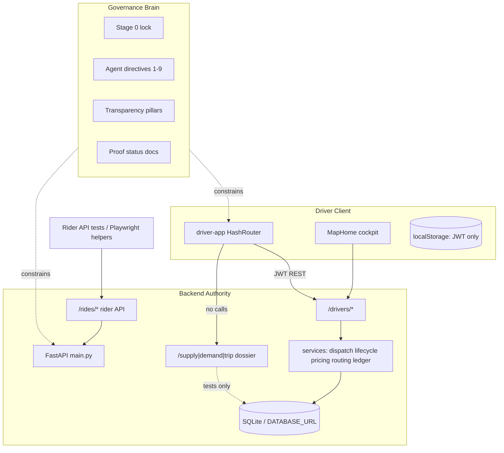

# HalfApp Comprehensive Program Report — Brain, Spine, and Next Step

**Document ID:** `HALFAPP_COMPREHENSIVE_PROGRAM_REPORT_02`  
**Supersedes for planning:** `HALFAPP_COMPREHENSIVE_PROGRAM_REPORT_01.md` (2026-05-21 snapshot; keep for history)  
**Audience:** Advanced engineering reviewers, program owners, investors who read technical truth  
**Workspace:** `c:\Users\him\Desktop\halfapp-driver`  
**Report date:** 2026-05-22  
**Verification snapshot:** `110 passed` backend pytest (~54s); ride-flow UI proof **GO**; OSRM runtime proof **NO_GO** (frozen)

---

## How to read this document

This report is intentionally long (~700+ lines). It is the **big-picture bridge** between what exists today and what you should build next. It is written for readers who already understand marketplaces, ledgers, and distributed systems—but who need a single artifact that ties **governance (“the brain”)**, **runtime code**, and **honest gaps** together.

**Authority order when facts conflict:**

1. `backend/main.py` + OpenAPI + green tests  
2. `driver-app/src/App.jsx` + production build guards  
3. Status docs dated 2026-05-22 (`RIDE_FLOW_UI_PROOF_V0_2`, `SELF_HOSTED_ROUTING_PROOF_V0_1_STATUS`)  
4. `docs/CURRENT_TRUTH.md` and `docs/PRODUCT_BOUNDARY_STAGE0.md` (update when stale—several passages predate v0.1 map/pricing)  
5. Older overview docs and investor materials (verify before decks)

**Every major claim** should trace to a path, test name, or an explicit “not implemented” boundary.

---

# Part I — Executive Summary

## 1.1 One-paragraph verdict

HalfApp is a **driver-only ride-hailing MVP** with a **real backend-owned lifecycle**, **open-board dispatch with audit proofs**, and a **v0.1 foundation layer** (integer-cent pricing ledger, Leaflet/OSM in-app map, routing abstraction with honest fallback). It is **not** a finished marketplace, payment processor, geo-dispatch platform, rider product, or city-scale mobility OS.

The program’s distinguishing asset is dual:

1. **Runtime spine** — `backend` + `driver-app` that survives refresh, records claims and visibility, and can complete a priced trip end-to-end in Playwright.  
2. **Governance brain** — documentation and agent directives that forbid claiming capabilities the backend cannot prove.

The **wrong next step** is screen expansion or reviving legacy `frontend`. The **right next step** is closing the gap between **what the UI can show** (pricing ledger, map provider metadata) and **what production can prove** (OSRM runtime, Postgres claim races, payments, route snapshot durability, doc sync).

## 1.2 Program maturity scorecard (2026-05-22)

| Dimension | Score (1–5) | Notes |
|-----------|-------------|-------|
| Driver lifecycle correctness | 4 | State machine + tests; v0.1 display labels layered |
| Dispatch honesty (open board) | 4 | Atomic claim, 409 structure, visibility, transparency endpoint |
| Marketplace audit trail | 4 | `marketplace_ledger_events` hash chain; no full candidate rounds |
| Driver presence truth | 3 | REST + heartbeat; no WebSocket gateway |
| Spatial / routing truth | 3 | OSRM code path + haversine fallback; **runtime OSRM blocked**; no `route_snapshots` table |
| Financial truth (pricing) | 4 | Integer-cent `ride_pricing` + lock on complete; **no PSP/payout** |
| Financial truth (payments) | 1 | No Stripe, settlement, refunds ledger |
| Production security | 1 | Dev `SECRET_KEY`, permissive CORS patterns |
| Product boundary clarity | 4 | Stage 0 lock; some boundary docs lag v0.1 |
| Repository hygiene / sprawl | 2 | Legacy frontend, dossier parallel spine, dormant components |
| Test discipline | 5 | 110 backend + 50 driver unit + ride-flow E2E GO |

**Overall:** Strong **prototype with v0.1 proof lane**; not production marketplace.

## 1.3 What “success at the next step” means

Success is **computational honesty**, not more pixels:

- Every driver-visible fact answers: *which record, which endpoint, which test, which audit event, what on refresh/conflict/disconnect?*  
- Routing claims either cite **live OSRM proof** or honestly show `haversine_fallback`.  
- Money claims cite **`ride_pricing` integer cents**; never imply settlement.  
- **One marketplace spine** — dossier foundation merged or permanently quarantined; never dual-write from UI.  
- Governance docs updated when `main.py` or cockpit behavior changes.

---

# Part II — The Brain: Governance Intelligence Layer

## 2.1 Definition

In this repository, **“the brain”** is not a deployed ML service or autonomous agent runtime. It is the **program intelligence layer**: documents, contracts, checklists, phased acceptance reports, and agent execution order that tell humans and coding agents **what to build, in what order, what to forbid, and how to verify truth**.

The brain exists because the codebase **looks larger than it is**. Dormant routers, legacy `frontend`, dossier endpoints, and demo components resemble finished product. The brain prevents **illusion-driven engineering**.

## 2.2 Three coupled functions

| Function | Mechanism | Primary files |
|----------|-----------|---------------|
| **Truth boundary** | Active vs inactive surfaces; forbidden claims | `docs/PRODUCT_BOUNDARY_STAGE0.md`, `docs/CURRENT_TRUTH.md` |
| **Architecture target** | Five transparency pillars; current vs target | `docs/HALFAPP_TRANSPARENCY_ARCHITECTURE.md` |
| **Execution order** | Nine agent actions with done-when criteria | `docs/HALFAPP_AGENT_ACTION_DIRECTIVES.md` |

## 2.3 Core program principle (non-negotiable)

> **Every important driver-facing fact must come from durable backend truth, not frontend inference.**

Transparency is **earned** only when backend records prove lifecycle, dispatch, presence, route (when claimed), pricing (when claimed), and audit facts. UI polish without proof is **misleading**, not progress.

## 2.4 Stage 0 truth lock

**Order:** `HALFAPP_STAGE0_TRUTH_BOUNDARY_LOCK_01` (2026-05-20)  
**Active surfaces only:** `backend/`, `driver-app/`

**Still forbidden without new implementation orders:**

- Real payments, wallets, payouts  
- Nearest-driver / geo auto-dispatch as product truth  
- Rider app UI  
- Admin ops on live API  
- City-scale mobility OS  

**v0.1 nuance (2026-05-22):** Integer-cent **pricing ledger** and **in-app Leaflet map** are real on the active path—but Stage 0 **forbidden-claims** sections in `PRODUCT_BOUNDARY_STAGE0.md` still describe pre-v0.1 map/pricing in places. Treat **tests + ride-flow proof** as authority until boundary docs are reconciled.

## 2.5 Agent action directives — status matrix

From `docs/HALFAPP_AGENT_ACTION_DIRECTIVES.md`:

| # | Action | Status (2026-05-22) | Evidence |
|---|--------|---------------------|----------|
| 1 | Lock active product boundary | **Largely done** | README, CI route tests, prod build guards |
| 2 | Backend-owned driver presence | **Done** | `/drivers/presence`, heartbeat, stale derivation |
| 3 | Backend ride hide/dismiss | **Done** | `POST /drivers/rides/{id}/hide`, visibility TTL |
| 4 | Dispatch auditability | **Done** | Visibility, claim attempts, 409, transparency |
| 5 | Marketplace ledger events | **Done** | `marketplace_ledger_events`, hash chain |
| 6 | Migration discipline | **Done** | Alembic `0001`–`0009`, startup `run_migrations` |
| 7 | Financial ledger foundation | **Partial** | `ride_pricing` integer cents; no payout/refund ledger |
| 8 | Route snapshot foundation | **Partial** | `routing_service`, ride route fields; no `route_snapshots` table |
| 9 | Production hardening | **Partial** | CI yes; secrets/CORS/revocation gaps |

**Per-feature success definition (always apply):**

1. Which backend record proves this?  
2. Which endpoint changed it?  
3. Which test covers it?  
4. Which audit event explains it?  
5. What happens on refresh, retry, conflict, or disconnect?

## 2.6 Strategic brain documents

| Document | Role |
|----------|------|
| `docs/HALFAPP_EXPERT_PROGRAM_CRITICAL_OVERVIEW.md` | Candid verdict, weaknesses, phased roadmap |
| `docs/HALFAPP_EXPERT_PROGRAM_OVERVIEW.md` | Broader program map |
| `docs/HALFAPP_TRANSPARENCY_ARCHITECTURE.md` | Five pillars contract |
| `docs/BACKLOG.md` | Ticketized epics (some tickets now closed) |
| `docs/RIDE_LIFECYCLE_CONTRACT.md` | Ride API + pricing view fields |
| `docs/RIDE_APP_FOUNDATION_V0_1.md` | v0.1 scope: pricing, map, nav |
| `docs/HALFAPP_DOSSIER_SPINE_RECONCILIATION_01.md` | Active vs dossier parallel spines |
| `docs/DORMANT_ROUTERS_INVENTORY.md` | Mounted vs unmounted API |
| `docs/REVIEW_CHECKLIST.md` | PR merge gates |
| `docs/HALFAPP_DRIVER_COCKPIT_REAL_PRODUCT_PASS_01.md` | Cockpit product pass evidence |
| `docs/RIDE_FLOW_UI_PROOF_V0_2_STATUS.md` | End-to-end UI proof **GO** |
| `docs/SELF_HOSTED_ROUTING_PROOF_V0_1_STATUS.md` | OSRM code GO, runtime NO_GO |

## 2.7 Acceptance and proof artifacts (operational brain)

These are **frozen verdicts** agents must respect:

| Lane | Verdict | Implication |
|------|---------|-------------|
| `RIDE_FLOW_UI_PROOF_V0_2` | **GO** | Cockpit can demo full priced lifecycle with locked ledger UI |
| `SELF_HOSTED_ROUTING_PROOF_V0_1` | Code **GO**, runtime **NO_GO** | Do not claim live OSRM until Docker/VPS proof |
| Phase 2 cockpit alignment | **GO** (prior acceptance) | Presence/hide backend-backed |
| Phase 3 hardening | **PARTIAL** | Secrets, simulation gating |

## 2.8 What the brain does **not** include (in-tree)

Not present in `halfapp-driver` as shipped product:

- Command gateway / editor authority services  
- LSP diagnostics workbench integration  
- I2V / GPU editor pipelines  
- Autonomous agent runtime separate from Cursor/docs  

If the **next program step** includes editor intelligence, treat it as a **sibling milestone** with its own truth contract—not an implied part of this repo.

## 2.9 Brain strengths

1. **Explicit forbidden claims** — rare for MVPs  
2. **Ordered execution** — prevents UI-first fantasy  
3. **Separation of current vs target** in transparency doc  
4. **Proof lanes** — ride-flow and routing status docs  
5. **Dossier reconciliation** — prevents silent dual marketplace truth  
6. **Test-operationalized governance** — route surface tests, mock-off trust lane  

## 2.10 Brain weaknesses

1. **Doc drift** — `CURRENT_TRUTH.md` still says “stylized SVG map”; v0.1 uses Leaflet  
2. **BACKLOG tickets** — Epic 2–4 items marked open though largely implemented  
3. **No automatic claim enforcement** — agents can still violate boundaries without checklist  
4. **Investor docs** — may lag `RIDE_FLOW_UI_PROOF` and pricing ledger  
5. **Two financial vocabularies** — `ride_pricing` vs dossier `ledger_*` confuses newcomers  

---

# Part III — Product Definition and Boundaries

## 3.1 What HalfApp is (2026-05-22)

HalfApp is a **backend-backed driver marketplace prototype** that proves:

- Driver JWT auth (driver role on active path)  
- Open-board pool with **atomic first-claim-wins**  
- Full driver lifecycle through **completed** with **locked integer-cent pricing**  
- Rider **API-only** create/cancel  
- Backend presence, hide, visibility, append-only marketplace events  
- **v0.1** in-app map (Leaflet + OSM tiles), external Google Maps navigation only  
- Routing **abstraction** with provider metadata on rides (`osrm_self_hosted` or `haversine_fallback`)  
- Optional **traffic signal awareness** (experimental, region-bounded)  
- Earnings/trip summaries projecting from completed rides and pricing rows  

## 3.2 What HalfApp is not

| Not this | Why |
|----------|-----|
| Uber/Lyft-scale dispatch | No geo eligibility engine, no nearest-driver assignment |
| Payment processor | No PSP, capture, wallet, payout execution |
| Guaranteed OSRM production routing | Runtime proof blocked; fallback is honest but not road-network truth |
| Rider-facing app | No passenger UI in `App.jsx` |
| Admin ops platform | Admin routers unmounted |
| Complete mobility OS | Stage 0 forbids |
| Single financial spine | Dossier double-entry exists in parallel, not wired to UI |
| `video-gate` product | Isolated video tooling |

## 3.3 Investor vs engineering truth

Engineering authority:

1. `backend/main.py` + OpenAPI  
2. `driver-app/src/App.jsx`  
3. pytest + Playwright ride-flow + trust configs  

Use `docs/INVESTOR_READINESS_STATUS.md` only after cross-checking `CURRENT_TRUTH.md` and proof status docs.

---

# Part IV — Repository Architecture

## 4.1 Top-level map

```
halfapp-driver/
├── backend/              # ACTIVE — FastAPI product API
├── driver-app/           # ACTIVE — React/Vite driver UI
├── docs/                 # ACTIVE — governance, contracts, proof reports
├── scripts/              # ACTIVE — route inventory, utilities
├── docker/osrm-portland/ # INFRA — OSRM compose + data (runtime proof lane)
├── .github/workflows/    # ACTIVE — CI
├── frontend/             # INACTIVE — legacy multi-role UI
├── video-gate/           # ISOLATED — video QA
├── wind/                 # UNRELATED — separate engineering program
└── HALFAPP_*.md          # acceptance / function maps (repo root)
```

## 4.2 System diagram (runtime + brain)



## 4.3 Technology stack

| Layer | Technology |
|-------|------------|
| API | FastAPI |
| ORM | SQLAlchemy 2 |
| Migrations | Alembic revisions `0001`–`0009` |
| Auth | JWT HS256 + bcrypt |
| Driver UI | React 18 + Vite 7 + Tailwind |
| In-app map | Leaflet 1.9 + OSM tiles |
| E2E | Playwright (trust, ride-flow, cockpit suites) |
| Routing infra | OSRM via `docker/osrm-portland` (optional) |
| CI | GitHub Actions — pytest, build, Alembic drift |

---

# Part V — Dual Spine: Active Path vs Dossier Foundation

**Authoritative:** `docs/HALFAPP_DOSSIER_SPINE_RECONCILIATION_01.md`

This is one of the most important architectural facts for the **next step**.

## 5.1 Active app path (PRIMARY — `driver-app` uses this only)

| Concern | Implementation |
|---------|----------------|
| Entry | `backend/routes/drivers.py` (`/drivers/*`) |
| Auth | `/auth/*` |
| Rider demand | `POST /rides/` via `rider_rides.py` |
| Ride record | `rides` table + status FSM |
| Presence | `driver_presence` |
| Dispatch | Open board — `GET /drivers/available-rides`, `POST /drivers/accept-ride/{id}` |
| Audit | `marketplace_ledger_events`, `ride_visibility`, `ride_claim_attempts` |
| Pricing | `ride_pricing` integer cents, `pricing_policy` |
| Complete | `POST /drivers/complete-ride/{id}` locks pricing |

**Client rule:** `driver-app/src/utils/api.js` calls `/drivers/*` only — **never** dossier endpoints in production UI.

## 5.2 Dossier foundation spine (PARALLEL — mounted, NOT wired to UI)

| Concern | Implementation |
|---------|----------------|
| Routes | `POST /supply/heartbeat`, `POST /demand/request`, `POST /trip/complete` |
| Migration | `0006_dossier_dispatch_ledger_foundation` |
| Supply | `active_drivers` (not `users` / `driver_presence`) |
| Lifecycle audit | `trip_lifecycle_events` |
| Money | `ledger_accounts`, `ledger_transactions`, `ledger_entries` (double-entry) |
| Dispatch model | Geospatial auto-match inside `/demand/request` (PostGIS on PG; app-level on SQLite) |

**Labels in code:** `FOUNDATION`, `NOT WIRED TO MAIN APP`, `BACKEND-TRUTH EXPERIMENTAL SPINE`

## 5.3 Why two spines exist

The dossier slice implements patterns from `docs/HALFAPP_ARCHITECTURE_DOSSIER_EXTRACTION_01.md` — geospatial supply, demand matching, double-entry settlement — as a **rehearsal** for a future production architecture. The active path implements the **honest open-board MVP** the driver app actually uses.

**Risk if ignored:** Engineers wire cockpit to `/demand/request` and create **two ride truths** (`rides.id` vs dossier `trip_id`, two presence models, two ledgers).

## 5.4 Reconciliation prerequisites (before UI uses dossier)

1. Single presence source (`driver_presence` vs `active_drivers`)  
2. Single ride ID space or mapping table  
3. Dispatch policy choice — open board vs auto-match  
4. Lifecycle matrix alignment (`RideStatus` vs dossier FSM states)  
5. Ledger boundary — audit events vs double-entry books  
6. One integration E2E; no parallel writes from one UI action  

## 5.5 409 conflict canonical shape (active path only)

Losing claim returns structured `detail` (not a plain string):

```json
{
  "detail": {
    "detail": "Ride already claimed",
    "ride_id": 123,
    "claim_result": "lost",
    "truth_status": "backend_conflict"
  }
}
```

Implemented in `services/transparency.py` → `claim_conflict_detail()`. Tests: `test_dispatch_auditability.py`, `test_ride_transparency_and_claim_conflict.py`.

---

# Part VI — Backend Deep Dive (Active Path)

## 6.1 Boot sequence (`backend/main.py`)

1. Import ORM models: `user`, `ride`, `metrics`, `ledger`, `ride_pricing`, `pricing_policy`, `presence`, `dossier_marketplace`, notifications  
2. `run_migrations(engine)` — Alembic upgrade head  
3. FastAPI + CORS (`get_cors_origins()`)  
4. Mount routers: `auth`, `drivers`, `traffic_signals`, `internal`, `notifications`, `rider_rides`, **`dossier_marketplace`**  
5. `GET /health`

## 6.2 Mounted routers (product-relevant)

| Router | Prefix | Used by driver-app |
|--------|--------|-------------------|
| `auth` | `/auth` | Yes |
| `drivers` | `/drivers` | Yes |
| `traffic_signals` | `/drivers` (traffic routes) | Optional/experimental |
| `rider_rides` | `/rides` | No (rider/tests/helpers) |
| `notifications` | `/notifications` | Yes |
| `internal` | `/internal` | Diagnostics |
| `dossier_marketplace` | `/supply`, `/demand`, `/trip` | **No** |

## 6.3 Dormant routers (404 on live app)

`admin`, `admin_access`, legacy `rides`, `users`, `test` — enforced by `test_active_route_surface.py`.

## 6.4 Services layer (active path)

| Service | Responsibility |
|---------|----------------|
| `auth.py` | bcrypt, JWT, role guards |
| `lifecycle.py` | Status transitions, alias normalization |
| `dispatch.py` | `OpenBoardDispatchPolicy`, atomic claim, visibility |
| `presence.py` | Requested/effective presence, stale/disconnected |
| `ledger.py` | `marketplace_ledger_events` append-only hash chain |
| `metrics.py` | Visibility rows, claim attempts, dispatch metadata |
| `pricing_service.py` | Integer-cent fare math, commission rules |
| `ride_pricing.py` | Persist/unlock/lock `ride_pricing` rows |
| `pricing_policy_loader.py` | Active policy from DB |
| `routing_service.py` | OSRM + haversine fallback, traffic buffer hooks |
| `map_route_foundation.py` | Stamp route provider fields on `Ride` |
| `osrm_self_hosted_provider.py` | HTTP OSRM client |
| `traffic_signals_service.py` | ODOT/WSDOT experimental signals |
| `v01_lifecycle.py` | Display lifecycle labels (`priced`, `driver_assigned`, …) |
| `transparency.py` | Claim conflict detail, dispatch proof assembly |

## 6.5 Data model (active tables — conceptual)

### `users`

Driver/customer/admin roles; profile; last location columns; legacy `availability`.

### `rides`

Lifecycle status (DB check constraint); pickup/dropoff labels + coordinates; distance/duration; **`fare_amount`** legacy display dollars when pricing exists; route provider metadata fields (v0.1); timestamps; `lifecycle_reason`.

### `ride_pricing` (v0.1 financial truth — quote/settlement display)

Integer cents throughout; `financial_locked` on complete; fields include shareable fare, commission, service fee ($1.50 = 150 cents in proof), tips, tolls, pass-through fees, customer total. See `docs/RIDE_APP_FOUNDATION_V0_1.md` formulas.

### `pricing_policy`

Versioned policy rows for markets.

### `driver_presence`

Backend marketplace online state.

### `ride_visibility` / `ride_claim_attempts`

Dispatch audit.

### `marketplace_ledger` / `marketplace_ledger_events`

Append-only audit (not double-entry books).

### `events` / `metrics`

Operational counters.

## 6.6 Alembic migration history

| Revision | Focus |
|----------|-------|
| `0001` | Hardened initial schema |
| `0002` | Canonical ride status contract |
| `0003` | Driver presence and visibility hide |
| `0004` | Schema indexes |
| `0005` | Marketplace ledger events |
| `0006` | **Dossier** dispatch + double-entry foundation |
| `0007` | **v0.1** pricing + map foundation columns on rides |
| `0008` | Pricing policy + ledger columns |
| `0009` | Traffic signal aware |

CI should run Alembic drift check on schema changes.

## 6.7 Ride lifecycle (storage statuses)

```
requested → accepted → driver_arrived → in_progress → completed
                ↑ decline → requested (pool release)
requested|accepted → cancelled (rider API)
```

**v0.1 display mapping** (`v01_lifecycle_status`): e.g. `requested` + pricing row → `priced`; `accepted` → `driver_assigned`. Transitions still use **storage** statuses on driver endpoints.

**Simulation:** `POST /drivers/simulate-ride` → `lifecycle_reason=simulation`.

## 6.8 Pricing at quote and complete

- **Quote:** `quote_ride_pricing()` uses routing estimates (distance/duration) + active policy.  
- **Complete:** locks pricing; sets `financial_locked`; earnings projections use ledger fields.  
- **Legacy:** `fare_amount` remains for compatibility — UI labels clarify “driver payout” vs customer total (`ridePricingDisplay.js`).

## 6.9 Routing behavior

`routing_service.route()`:

1. Try OSRM if `ROUTING_PROVIDER=osrm_self_hosted` (default)  
2. On failure, if `ROUTING_FALLBACK_ENABLED`, use `haversine_fallback` with explicit `used_fallback=true`  
3. Optional traffic signal buffer via `traffic_signals_service` when region matches  

**Runtime truth:** Without OSRM container on port 5000, proofs show `haversine_fallback` — honest, not road network.

**Not yet:** Durable `route_snapshots` table linking quote and settlement to geometry hash history.

## 6.10 Authorization model

| Actor | Capabilities |
|-------|----------------|
| Driver | `/drivers/*` lifecycle, presence, hide, earnings, transparency |
| Customer | `POST /rides/`, cancel — API/tests only |
| Admin | Not on live mounted admin routers |

JWT in `localStorage` as `driver_token` — MVP only.

---

# Part VII — Driver App Deep Dive

## 7.1 Routing (`driver-app/src/App.jsx`)

| Route | Component |
|-------|-----------|
| `/`, `/login` | `HalfAppDriverPortalFrontPage` (portal front) |
| `/driver` | `MapHome` cockpit |
| `/driver/trips`, `/rides`, `/trips` | `TripsList` |
| `/driver/earnings` | `Earnings` |
| `/driver/notifications` | `Notifications` |
| `/driver/profile` | `Profile` |

HashRouter for static hosting. `DevBanner`, `MockModeBanner` for truth labeling.

## 7.2 API client (`utils/api.js`)

- Central `DriverAPI`  
- `VITE_ALLOW_OFFLINE_MOCK` → localStorage — **not marketplace truth**  
- `scripts/assert-prod-truth.mjs` blocks mock/bypass on production build  

## 7.3 Cockpit (`MapHome.jsx` + marketplace sheet)

**Backend-backed:**

- Available/my rides, accept, arrive, start, complete  
- Presence read/write  
- Hide via backend  
- Pricing summaries via `RidePayoutSummary`, `RidePricingBreakdown`  
- Simulation when enabled  

**Map (`MapView.jsx` + `mapProvider.js`):**

- Leaflet + OSM tiles  
- `data-route-provider`, `data-traffic-provider` attributes for tests  
- Straight-line or backend-provided geometry — **visualization only** per component comments  

**External nav (`ExternalNavigationButtons.jsx`):**

- Opens Google Maps URL — no embed, no API key  

## 7.4 Pricing display (`ridePricingDisplay.js`)

Mirrors backend integer-cent fields; documents `fare_amount` vs `fare_earned` ambiguity; customer receipt breakdown on complete.

## 7.5 Environment flags

| Flag | Effect |
|------|--------|
| `VITE_ALLOW_OFFLINE_MOCK` | Fake API |
| `VITE_ENABLE_RIDE_SIMULATION` | Backend simulation rides |
| `VITE_ENABLE_GUARD_BYPASS` | E2E route guard (non-prod) |

## 7.6 Test suites (driver-app)

| Suite | Purpose |
|-------|---------|
| `npm test` | 50 unit tests (pricing display, map foundation, traffic markers, …) |
| `test:e2e:trust` | Mock-off contract with live backend |
| `test:e2e:ride-flow` | Full priced lifecycle **GO** |
| `test:e2e:cockpit` | Cockpit identity and map truth |

## 7.7 Dormant components (do not wire without review)

`RideList.jsx`, `Dashboard.jsx`, `AdminDashboard.jsx`, diagnostics screens, etc. — exist but **not** in `App.jsx`. High risk of duplicate UX if revived casually.

---

# Part VIII — Transparency Architecture (Five Pillars) — Current vs Target

Reference: `docs/HALFAPP_TRANSPARENCY_ARCHITECTURE.md`

## 8.1 Pillar 1 — Anti-black-box ledger

**Implemented:**

- `marketplace_ledger_events` with hash chain, idempotency, correlation  
- Event types: ride lifecycle, dispatch visibility/claims, presence, earning.calculated  

**Partial (v0.1):**

- `ride_pricing` proves fare **breakdown** at cent level for completed trips  

**Not implemented:**

- Driver-facing audit UI projections  
- Full candidate evaluation rounds  
- Unified narrative across dossier `ledger_*` and marketplace events  

## 8.2 Pillar 2 — Open dispatch

**Implemented:**

- Open board `Open Board v1`  
- Deterministic ordering metadata on available rides  
- Visibility + claim attempt rows + structured 409  
- `GET /drivers/rides/{id}/transparency`  

**Not implemented:**

- FIFO regional queue  
- Geo eligibility proofs  
- Nearest-driver with recorded candidate geometry  

## 8.3 Pillar 3 — Spatial truth

**Implemented:**

- Backend coordinates on rides  
- Routing service with provider metadata on ride  
- Map displays provider attributes honestly (`haversine_fallback` when OSRM down)  
- Traffic signal experimental layer (not “Google traffic”)  

**Partial:**

- Distance/duration from engine or fallback — stamped on ride, not immutable snapshot table  

**Not implemented:**

- Geocoding proof from addresses  
- `route_snapshots` durable history per quote/settlement role  
- Live ETA product claims  

## 8.4 Pillar 4 — Passenger lifecycle

**Implemented:** Driver path + rider cancel API  

**Not implemented:** Rider app, rich passenger comms product  

## 8.5 Pillar 5 — Local-first scale

**Current:** SQLite dev; `DATABASE_URL` override; single-region MVP  

**Not implemented:** Multi-city ops, WebSocket presence gateway, horizontal dispatch partitions  

---

# Part IX — Proof Lanes and Verification Posture

## 9.1 Backend tests (24 modules, 110 tests)

Representative coverage:

| Area | Test files |
|------|------------|
| Lifecycle | `test_ride_lifecycle.py`, `test_ride_state_machine.py`, `test_lifecycle_contract.py` |
| Dispatch | `test_dispatch_auditability.py`, `test_ride_transparency_and_claim_conflict.py` |
| Marketplace truth | `test_driver_marketplace_truth_slice.py`, `test_marketplace_ledger_events.py` |
| v0.1 foundation | `test_v01_foundation.py`, `test_pricing_ledger_v01.py`, `test_v01_lifecycle_display.py` |
| Routing | `test_routing_service.py`, `test_osrm_self_hosted_routing.py` |
| Ride flow API | `test_ride_flow_ui_proof.py` |
| Dossier slice | `test_dossier_dispatch_ledger_slice.py` |
| Integrity | `test_database_integrity.py`, `test_active_route_surface.py` |
| RBAC | `test_rbac.py`, `test_rbac_boundary.py` |
| Traffic | `test_traffic_signals_service.py` |

```powershell
cd c:\Users\him\Desktop\halfapp-driver\backend
python -m pytest -q
# 110 passed
```

## 9.2 Ride-flow UI proof (GO)

`docs/RIDE_FLOW_UI_PROOF_V0_2_STATUS.md` documents:

- Portal → online → incoming request → quote with $1.50 service fee → accept → arrive → start → complete with tip/toll fixtures  
- Locked pricing after reload  
- Map provider accepts `haversine_fallback` when OSRM unavailable  
- External Google Maps opens in new window — no iframe embed  

## 9.3 OSRM self-hosted proof (runtime frozen)

`docs/SELF_HOSTED_ROUTING_PROOF_V0_1_STATUS.md`:

- Code path **GO** (provider, tests with mocks)  
- Runtime **NO_GO** — `BLOCKED_RUNTIME_DOCKER_UNAVAILABLE` on Windows dev host  
- Mandatory order: `docs/RUNTIME_PROOF_PROCEDURE.md`  

**Do not** claim production routing until Portland legs show `route_provider=osrm_self_hosted`, `used_fallback=False`.

## 9.4 Recommended verification ritual (pre-merge / pre-demo)

```powershell
cd c:\Users\him\Desktop\halfapp-driver
py -3.11 scripts\print_active_routes.py

cd backend
python -m pytest -q

cd ..\driver-app
npm run build
npm test
npm run test:e2e:trust
npm run test:e2e:ride-flow
```

## 9.5 CI

`.github/workflows/halfapp-driver-ci.yml` — backend pytest, driver production build, Alembic drift.

---

# Part X — Strengths (Preserve These)

## 10.1 Architectural

1. **Honest scope documentation** — Stage 0 + proof status docs  
2. **Real lifecycle spine** — DB survives refresh; E2E proven  
3. **Modular dispatch policy** — `BaseDispatchPolicy` extensibility  
4. **Atomic open-board claims** — correct concurrency pattern  
5. **Append-only marketplace events** — audit foundation  
6. **Integer-cent pricing ledger (v0.1)** — major step toward Action 7  
7. **Routing honesty** — explicit fallback provider ID, no silent guess  
8. **Alembic discipline** — nine revisions, CI drift  
9. **Prod build guards** — mock/bypass blocked in release builds  
10. **Dossier quarantine doc** — prevents accidental dual spine wiring  
11. **Test culture** — 110 backend + ride-flow GO  

## 10.2 Demonstration strengths

- End-to-end priced trip in Playwright with screenshot artifact  
- Transparency endpoint for dispatch narratives  
- Simulation creates labeled backend rows  
- Internal health endpoint  

---

# Part XI — Weaknesses and Risk Register

## 11.1 Critical (P0)

| ID | Risk | Mitigation |
|----|------|------------|
| R1 | Default `SECRET_KEY=change_me` | Env secret + boot guard |
| R2 | Dual marketplace spines | Do not wire dossier UI until reconciliation |
| R3 | Doc drift (map, pricing claims) | Update `CURRENT_TRUTH.md`, Stage 0 |
| R4 | OSRM runtime down → haversine only | Label UI; complete runtime proof on Linux/VPS |
| R5 | Simulation endpoint in prod | Env-gate `simulate-ride` |

## 11.2 High (P1)

| ID | Risk | Impact |
|----|------|--------|
| R6 | No payment settlement | Pricing ledger ≠ money movement |
| R7 | SQLite vs Postgres claim races | Behavior may differ under load |
| R8 | No token revocation | Stolen JWT valid until expiry |
| R9 | CORS permissive patterns | Cross-origin risk when deployed |
| R10 | Legacy `frontend` confusion | Wrong product decisions |

## 11.3 Medium (P2)

| ID | Risk |
|----|------|
| R11 | Dormant `RideList` re-wired without review |
| R12 | Demo messages in Notifications tab |
| R13 | Single `lifecycle_reason` field — incomplete history alone |
| R14 | Traffic signals experimental — mistaken for paid traffic APIs |
| R15 | `fare_amount` legacy coexistence — misread customer vs driver totals |

## 11.4 Weakness by domain (summary)

| Domain | Weakness |
|--------|----------|
| Dispatch | Open board only; dossier auto-match not productized |
| Money | No PSP; dossier double-entry not connected |
| Spatial | No snapshot table; OSRM runtime unproven locally |
| Presence | REST heartbeat only |
| Security | Dev secrets, no refresh/revocation |
| Product | No rider/admin UI on live API |
| Observability | Limited structured request tracing |
| Governance | BACKLOG and boundary docs partially stale |

---

# Part XII — What Exists vs What Does Not (2026-05-22)

## 12.1 Exists on active path (may claim with tests)

- [x] Driver JWT auth  
- [x] Full ride lifecycle state machine  
- [x] Open-board dispatch + atomic accept  
- [x] Structured HTTP 409 on claim conflict  
- [x] Backend presence + heartbeat + stale/disconnected  
- [x] Backend ride hide with TTL  
- [x] Ride coordinates in API  
- [x] `marketplace_ledger_events` append-only  
- [x] Claim attempt audit rows  
- [x] Transparency endpoint  
- [x] Rider create/cancel API  
- [x] Notifications API  
- [x] **Integer-cent `ride_pricing` ledger** with lock on complete  
- [x] **Pricing policy** versioning  
- [x] **In-app Leaflet/OSM map** with provider metadata  
- [x] **External Google Maps navigation** (no embed)  
- [x] **Routing service** with OSRM + haversine fallback (code tested)  
- [x] **v0.1 lifecycle display labels**  
- [x] Alembic migrations through `0009`  
- [x] CI + prod build guards  
- [x] Playwright ride-flow proof **GO**  
- [x] Traffic signals API (experimental, bounded)  

## 12.2 Exists in tree but inactive or parallel (do not claim as driver-app product)

- [ ] Admin API (`routes/admin.py`) — unmounted  
- [ ] Legacy `frontend` multi-role app  
- [ ] Dossier endpoints — mounted for **tests/foundation only**  
- [ ] Dossier double-entry `ledger_*` — not driver earnings UI  
- [ ] Dormant driver diagnostic components  
- [ ] `video-gate` integration  

## 12.3 Partially exists (claim with qualifiers only)

- [~] **Financial ledger** — pricing breakdown yes; payouts/refunds/settlement no  
- [~] **Route truth** — provider metadata on ride yes; immutable snapshots no  
- [~] **OSRM routing** — code yes; **runtime proof no** on current dev host  
- [~] **Traffic awareness** — experimental signals, not commercial traffic APIs  
- [~] **Earnings** — projection from completed rides + pricing; not payout batches  

## 12.4 Does not exist (forbidden to claim)

- [ ] Payment processing / Stripe / wallet  
- [ ] Payout execution / settlement status product  
- [ ] Full platform fee reconciliation with tax authority  
- [ ] Nearest-driver matching  
- [ ] Rider mobile/web app  
- [ ] Admin console on live API  
- [ ] WebSocket real-time presence gateway  
- [ ] Geocoding from address strings with proof  
- [ ] City-scale mobility OS  
- [ ] Durable `route_snapshots` table per transparency target  
- [ ] Driver audit screen UI (ledger projections)  
- [ ] Editor LSP / command gateway (not in repo)  

---

# Part XIII — Recommended Roadmap (Next Steps)

## 13.1 Immediate (weeks 0–2): truth sync + runtime proof

| Priority | Work | Outcome |
|----------|------|---------|
| P0 | Update `CURRENT_TRUTH.md` + `PRODUCT_BOUNDARY_STAGE0.md` for Leaflet, pricing ledger, routing abstraction | Brain matches code |
| P0 | OSRM runtime proof on Docker-capable host (`RUNTIME_PROOF_PROCEDURE.md`) | Can claim `osrm_self_hosted` in prod-like env |
| P0 | Production `SECRET_KEY` guard + simulation env gate | Safer deploy |
| P1 | Postgres claim-race test suite | Dispatch truth under real DB |

## 13.2 Near-term (weeks 2–6): complete agent actions 7–8–9

| Order | Action | Outcome |
|-------|--------|---------|
| 1 | **Route snapshots table** + link to quote/complete | Pillar 3 durable proof |
| 2 | **Financial settlement layer** OR explicit “computed only” UI lock | No payout illusion |
| 3 | **Driver audit read UI** | Projections over `marketplace_ledger_events` + pricing |
| 4 | CORS + token refresh/revocation policy | Action 9 |
| 5 | Structured logging + request IDs | Action 9 |

## 13.3 Medium-term: spine reconciliation (strategic fork)

**Choose one path before scaling team:**

**Path A — Evolve active spine:** Keep open board; enrich geo via routing snapshots; add payments on `ride_pricing`.  
**Path B — Merge dossier:** Reconcile IDs, presence, dispatch; migrate financial truth to `ledger_*`; deprecate duplicate tables.  

**Do not** run Path A and Path B in production UI simultaneously.

## 13.4 Surface expansion (only after honesty gates)

- Rider app  
- Admin on mounted routers with RBAC tests  
- Payment UI tied to settlement ledger  
- FIFO/geo dispatch experiments with recorded candidates  

## 13.5 Parallel programs (separate milestones)

- **video-gate** — media QA, not ride CI  
- **wind/** — separate physics program  
- **Editor/workbench intelligence** — out of tree; own contract  

## 13.6 Suggested 90-day narrative

| Month | Focus |
|-------|-------|
| 1 | Doc sync, OSRM runtime GO, secrets/simulation gates, Postgres races |
| 2 | Route snapshots + audit read UI |
| 3 | Settlement design OR hard “no payouts” product lock; dossier reconciliation decision |

---

# Part XIV — Open Questions for Program Owners

1. **Production database:** PostgreSQL confirmed? When do claim tests run against it exclusively?  
2. **Dossier fate:** Merge into active spine or keep as R&D sandbox permanently?  
3. **OSRM hosting:** Local Docker vs VPS (`docker/osrm-portland`) for production?  
4. **Rider product:** Is API-only rider enough for next funding gate?  
5. **Payments scope:** Ledger-only accounting first, or PSP in same quarter?  
6. **Dispatch roadmap:** How long on open board before geo experiments?  
7. **Legacy frontend:** Archive/delete deadline?  
8. **Traffic signals:** Productize or keep experimental?  
9. **Investor materials:** Who reconciles decks with `RIDE_FLOW_UI_PROOF` and routing status?  
10. **Workbench/LSP:** Same monorepo next or sibling package?  

---

# Part XV — Appendix A: Key File Index

## Governance / brain

- `docs/PRODUCT_BOUNDARY_STAGE0.md`  
- `docs/CURRENT_TRUTH.md`  
- `docs/HALFAPP_AGENT_ACTION_DIRECTIVES.md`  
- `docs/HALFAPP_TRANSPARENCY_ARCHITECTURE.md`  
- `docs/HALFAPP_EXPERT_PROGRAM_CRITICAL_OVERVIEW.md`  
- `docs/HALFAPP_DOSSIER_SPINE_RECONCILIATION_01.md`  
- `docs/RIDE_APP_FOUNDATION_V0_1.md`  
- `docs/RIDE_LIFECYCLE_CONTRACT.md`  

## Runtime spine

- `backend/main.py`  
- `backend/routes/drivers.py`  
- `backend/services/dispatch.py`  
- `backend/services/ledger.py`  
- `backend/services/ride_pricing.py`  
- `backend/services/routing_service.py`  
- `backend/routes/dossier_marketplace.py`  
- `driver-app/src/App.jsx`  
- `driver-app/src/components/MapHome.jsx`  
- `driver-app/src/utils/api.js`  
- `driver-app/src/utils/ridePricingDisplay.js`  

## Proof / infra

- `docs/RIDE_FLOW_UI_PROOF_V0_2_STATUS.md`  
- `docs/SELF_HOSTED_ROUTING_PROOF_V0_1_STATUS.md`  
- `docs/RUNTIME_PROOF_PROCEDURE.md`  
- `docker/osrm-portland/README.md`  
- `driver-app/tests/ride-flow-ui-proof.spec.ts`  

## Verification

- `scripts/print_active_routes.py`  
- `.github/workflows/halfapp-driver-ci.yml`  
- `driver-app/scripts/assert-prod-truth.mjs`  

---

# Part XVI — Appendix B: v0.1 Pricing Formula (reference)

From `docs/RIDE_APP_FOUNDATION_V0_1.md`:

```
driverShareableRideFareCents = base + distance + time + wait (min fare applied)
platformCommissionCents = 20% of driverShareableRideFareCents
driverRidePayoutCents = 80% of driverShareableRideFareCents
platformServiceFeeCents = 150 ($1.50 — proven in ride-flow UI)
platformRevenueCents = platformCommissionCents + platformServiceFeeCents
customerTotalCents = shareable + serviceFee + passThroughFees + tipCents
```

Tips and pass-through fees excluded from commission. Completion sets `financial_locked`.

---

# Part XVII — Appendix C: Lifecycle States

| Storage `status` | v0.1 display (when applicable) | Terminal? |
|----------------|--------------------------------|-----------|
| `requested` | `requested` or `priced` | No |
| `accepted` | `driver_assigned` | No |
| `driver_arrived` | `driver_arriving` | No |
| `in_progress` | `in_progress` | No |
| `completed` | `completed` | Yes |
| `cancelled` | `cancelled` | Yes |

Decline: `accepted` → `requested` (not terminal rejection).

---

# Part XVIII — Appendix D: Marketplace Event Types

From `backend/services/ledger.py` — vocabulary for future audit UI:

- `ride.created`, `ride.accepted`, `ride.arrived_pickup`, `ride.started`, `ride.completed`, `ride.cancelled`, `ride.hidden`  
- `presence.changed`, `presence.heartbeat`  
- `dispatch.ride_visible`, `dispatch.claim_attempted`, `dispatch.claim_won`, `dispatch.claim_lost`, `dispatch.claim_released`  
- `earning.calculated`  

Do not invent parallel event names in UI.

---

# Part XIX — Appendix E: Agent Directive Completion Tracker

Use this when planning sprints:

| Action | Done when | Blockers |
|--------|-----------|----------|
| 1 Boundary lock | New dev finds active path in 5 min | Doc drift |
| 2 Presence | Refresh does not change truth | WebSocket N/A for MVP |
| 3 Hide | Hidden ride respects TTL | — |
| 4 Dispatch audit | 409 + transparency answer why | Geo candidates |
| 5 Ledger events | Reconstruct from events | Audit UI |
| 6 Migrations | `upgrade head` clean | — |
| 7 Financial | **Pricing row yes; payout ledger no** | PSP decision |
| 8 Route | **Ride fields yes; snapshots no** | OSRM runtime |
| 9 Hardening | Deploy without dev shortcuts | Secrets, CORS |

---

# Part XX — Final Expert Closing

HalfApp has crossed an important line since the first comprehensive report: it can **prove** a full driver ride loop in the browser with **locked integer-cent pricing**, **honest routing provider metadata**, and **append-only marketplace audit events**—while still refusing to pretend it is Uber-scale dispatch or a bank.

The **brain** is what keeps that honesty from eroding as the repo grows. Treat `HALFAPP_AGENT_ACTION_DIRECTIVES.md` and proof status docs as part of the product, not paperwork.

The **next step** is not ambiguous:

1. Sync governance docs with v0.1 reality.  
2. Complete runtime OSRM proof or permanently label fallback in production configs.  
3. Add durable route snapshots and settlement clarity (or explicitly forbid payout language).  
4. Decide dossier merge vs quarantine before any new marketplace features.  
5. Build read-only audit projections before new dashboards.

The program earns the right to grow when every important pixel answers the five proof questions—and when dual spines, stale docs, and runtime blockers are visible to experts, not hidden behind impressive UI.

---

**End of report** — `HALFAPP_COMPREHENSIVE_PROGRAM_REPORT_02`

*Update this document when `main.py`, v0.1 foundation, proof lanes, or dossier reconciliation materially change.*
