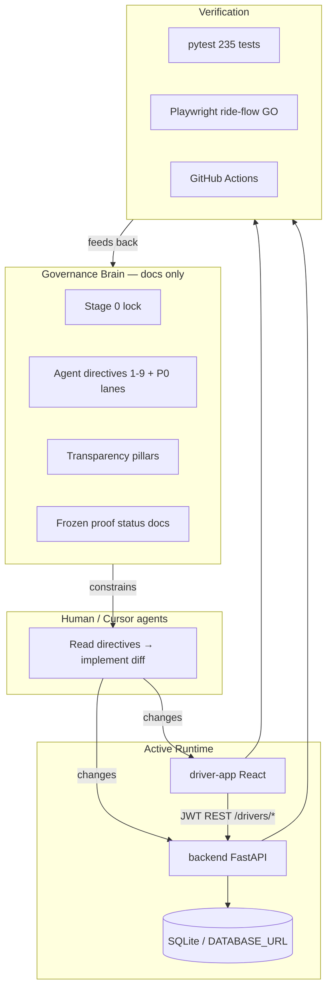
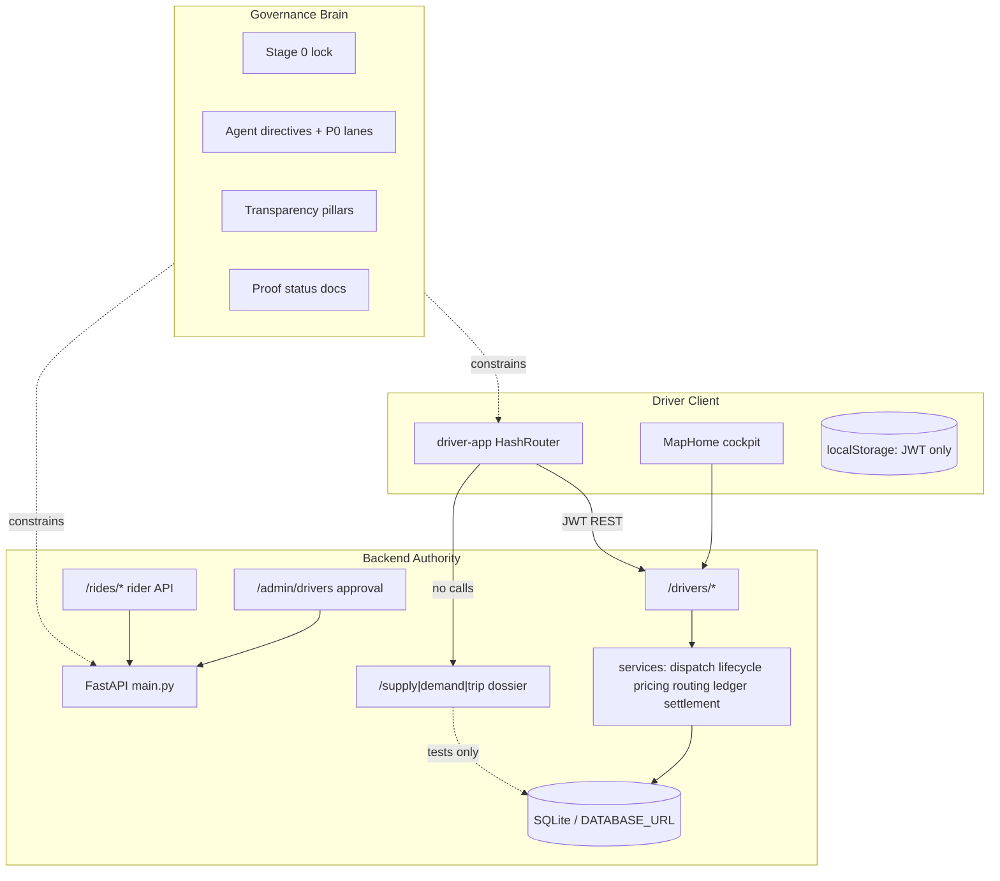

# HalfApp Comprehensive Program Report — Brain, Spine, and Next Step

> **Combined edition — Book B:** This file is **Part B** of [`HALFAPP_DRIVER_PROGRAM_MASTER_REPORT_01.md`](HALFAPP_DRIVER_PROGRAM_MASTER_REPORT_01.md). It is published together with **Book A** (`HALFAPP_DRIVER_PROGRAM_ADVANCED_OVERVIEW_01`) in one volume because the overview answers *where we stand and what to do next* after recent lanes, while the comprehensive report explains *how the brain and spine work* in depth — strategy first, architecture second, one artifact for experts and program owners.

**Document ID:** `HALFAPP_COMPREHENSIVE_PROGRAM_REPORT_03`  
**Supersedes for planning:** `HALFAPP_COMPREHENSIVE_PROGRAM_REPORT_02.md` (2026-05-22; keep for history)  
**Audience:** Advanced engineering reviewers, program owners, investors who read technical truth  
**Workspace:** `c:\Users\him\Desktop\halfapp-driver`  
**Report date:** 2026-05-22  
**Verification snapshot (this session):** `235 passed` backend pytest (~124s); `52 passed` driver-app unit tests; ride-flow UI proof **GO**; OSRM runtime proof **NO_GO** (frozen)

---

## How to read this document

This report is intentionally long (~750+ lines). It is the **big-picture bridge** between what exists today and what you should build next. It is written for readers who already understand marketplaces, ledgers, and distributed systems — but who need a single artifact that ties **governance (“the brain”)**, **runtime code**, and **honest gaps** together.

**Authority order when facts conflict:**

1. `backend/main.py` + OpenAPI + green tests  
2. `driver-app/src/App.jsx` + production build guards  
3. Status docs dated 2026-05-22 (`RIDE_FLOW_UI_PROOF_V0_2`, `SELF_HOSTED_ROUTING_PROOF_V0_1_STATUS`, P0 lane reports)  
4. `docs/CURRENT_TRUTH.md` and `docs/PRODUCT_BOUNDARY_STAGE0.md`  
5. Older overview docs and investor materials (verify before decks)

**Every major claim** should trace to a path, test name, or an explicit “not implemented” boundary.

---

# Part I — Executive Summary

## 1.1 One-paragraph verdict

HalfApp is a **driver-only ride-hailing MVP** with a **real backend-owned lifecycle**, **open-board dispatch with audit proofs**, and a **v0.1 foundation layer** (integer-cent pricing ledger, Leaflet/OSM in-app map, routing abstraction with honest fallback, route snapshot rows, settlement obligation rows). It is **not** a finished marketplace, payment processor, geo-dispatch platform, rider product, or city-scale mobility OS.

The program’s distinguishing asset is dual:

1. **Runtime spine** — `backend` + `driver-app` that survives refresh, records claims and visibility, and can complete a priced trip end-to-end in Playwright.tsx.  
2. **Governance brain** — documentation and agent directives that forbid claiming capabilities the backend cannot prove.

The **wrong next step** is screen expansion or reviving legacy `frontend`. The **right next step** is closing the gap between **what the backend can prove** (OSRM runtime, Postgres claim races, payments execution, audit UI projections) and **what production can honestly claim** — while deciding the fate of the parallel dossier spine before any new marketplace features.

## 1.2 Program maturity scorecard (2026-05-22)

| Dimension | Score (1–5) | Notes |
|-----------|-------------|-------|
| Driver lifecycle correctness | 5 | Formal state machine guards (RIDE-001 GO); structured 409 on invalid transitions |
| Dispatch honesty (open board) | 4 | Atomic claim (RIDE-002 GO); sequential cascade also implemented (RIDE-003 GO) |
| Marketplace audit trail | 4 | `marketplace_ledger_events` hash chain; no full candidate eligibility rounds |
| Driver presence truth | 4 | REST + heartbeat; approval gate (DRIVER-002 GO); no WebSocket gateway |
| Spatial / routing truth | 3 | OSRM code path + haversine fallback; **runtime OSRM blocked**; `route_snapshots` table exists but limited UI |
| Financial truth (pricing) | 4 | Integer-cent `ride_pricing` + lock on complete; `settlement_entries` obligation rows |
| Financial truth (payments) | 1 | No Stripe, PSP capture, payout execution, or refund processing |
| Production security | 2 | Rate limiting shipped; dev `SECRET_KEY` still default; CORS patterns permissive |
| Product boundary clarity | 4 | Stage 0 lock; some BACKLOG tickets stale |
| Repository hygiene / sprawl | 2 | Legacy frontend, dossier parallel spine, dormant components |
| Test discipline | 5 | 235 backend + 52 driver unit + ride-flow E2E GO; per-test DB isolation |

**Overall:** Strong **prototype with v0.1 proof lane and closed P0 gates**; not production marketplace.

## 1.3 What “success at the next step” means

Success is **computational honesty**, not more pixels:

- Every driver-visible fact answers: *which record, which endpoint, which test, which audit event, what on refresh/conflict/disconnect?*  
- Routing claims either cite **live OSRM proof** or honestly show `haversine_fallback`.  
- Money claims cite **`ride_pricing` integer cents** and **`settlement_entries` obligations**; never imply PSP settlement unless shipped.  
- **One marketplace spine** — dossier foundation merged or permanently quarantined; never dual-write from UI.  
- Governance docs updated when `main.py` or cockpit behavior changes.

---

# Part II — The Brain: Governance Intelligence Layer

## 2.1 Definition

In this repository, **“the brain”** is not a deployed ML service, LLM runtime, or autonomous agent process. It is the **program intelligence layer**: documents, contracts, checklists, phased acceptance reports, and ordered “agent action” directives that tell humans and coding agents **what to build, in what order, what to forbid, and how to verify truth**.

The brain exists because the codebase **looks larger than it is**. Dormant routers, legacy `frontend`, dossier endpoints, demo components, and isolated subsystems (`video-gate`, `wind/`) resemble finished product. The brain prevents **illusion-driven engineering**.

### What people sometimes mean by “brain” (disambiguation)

| Meaning | Location | Role |
|---------|----------|------|
| **Governance brain** (primary) | `docs/HALFAPP_*`, `docs/CURRENT_TRUTH.md`, agent directives | Constrains product truth and execution order |
| **Marketplace decision engine** | `backend/services/dispatch.py`, `claim_eligibility.py`, `lifecycle.py` | Rule-based SQL policy — not AI |
| **Session “conflict memory”** | `driver-app/.../ConflictTransparencyMemory.jsx` | UI display of backend 409 proof — not cognition |
| **Agent Brief Generator** | `driver-app/.../AgentBriefGenerator.jsx` | DEV-only prompt copier for Cursor agents |
| **video-gate agents** | `video-gate/core/agents/agent2.py` | Motion auditor for generated video — isolated from ride product |

There is **no** OpenAI/Anthropic integration, vector database, embedding store, or in-process LLM inference service in the ride-hailing spine.

## 2.2 Three coupled functions of the brain

| Function | Mechanism | Primary files |
|----------|-----------|---------------|
| **Truth boundary** | Active vs inactive surfaces; forbidden claims | `docs/PRODUCT_BOUNDARY_STAGE0.md`, `docs/CURRENT_TRUTH.md` |
| **Architecture target** | Five transparency pillars; current vs target | `docs/HALFAPP_TRANSPARENCY_ARCHITECTURE.md` |
| **Execution order** | Nine agent actions + P0 lane statuses | `docs/HALFAPP_AGENT_ACTION_DIRECTIVES.md` |

## 2.3 Core program principle (non-negotiable)

> **Every important driver-facing fact must come from durable backend truth, not frontend inference.**

Transparency is **earned** only when backend records prove lifecycle, dispatch, presence, route (when claimed), pricing (when claimed), and audit facts. UI polish without proof is **misleading**, not progress.

## 2.4 How the brain constrains engineering (data flow)



**Critical property:** The brain has **no automated enforcement**. An agent or developer can violate boundaries without checklist discipline. The defense is tests, prod build guards, route surface tests, and proof-lane documents with explicit GO/NO_GO verdicts.

## 2.5 Stage 0 truth lock

**Order:** `HALFAPP_STAGE0_TRUTH_BOUNDARY_LOCK_01` (2026-05-20)  
**Active surfaces only:** `backend/`, `driver-app/`

**Still forbidden without new implementation orders:**

- Real payments, wallets, payouts via PSP  
- Nearest-driver / geo auto-dispatch as **driver-app product truth**  
- Rider app UI  
- Full admin ops console on live API  
- City-scale mobility OS  

**v0.1 nuance:** Integer-cent **pricing ledger**, **route snapshots table**, **settlement obligation rows**, and **in-app Leaflet map** are real on the active path — but must not be confused with payment settlement or production OSRM.

## 2.6 Agent action directives — status matrix (2026-05-22)

From `docs/HALFAPP_AGENT_ACTION_DIRECTIVES.md`:

| # | Action | Status | Evidence |
|---|--------|--------|----------|
| 1 | Lock active product boundary | **Largely done** | README, CI route tests, prod build guards |
| 2 | Backend-owned driver presence | **Done** | `/drivers/presence`, heartbeat, stale derivation |
| 3 | Backend ride hide/dismiss | **Done** | `POST /drivers/rides/{id}/hide`, visibility TTL |
| 4 | Dispatch auditability | **Done** | Visibility, claim attempts, 409, transparency endpoint |
| 5 | Marketplace ledger events | **Done** | `marketplace_ledger_events`, hash chain |
| 6 | Migration discipline | **Done** | Alembic `0001`–`0015`, startup `run_migrations` |
| 7 | Financial ledger foundation | **Done (settlement boundary)** | `ride_pricing` lock + `settlement_entries`; no PSP execution |
| 8 | Route snapshot foundation | **Done (foundation)** | `route_snapshots` table; quote/complete rows; read API; OSRM runtime still **NO_GO** |
| 9 | Production hardening | **Partial** | Rate limit, simulation guards; revocation/structured logging remain |

### P0 closed lanes (do not reopen without explicit rescope)

| Lane | Verdict | Report |
|------|---------|--------|
| AUTH-001 | **GO** | JWT role claims middleware |
| RIDE-001 | **GO** | State machine guards, structured invalid transition 409s |
| RIDE-002 | **GO** | Atomic claim lock, 10-driver concurrency proof |
| RIDE-003 | **GO** | Sequential dispatch cascade, timeout, exhaustion cancel |
| DRIVER-001B | **GO** | Presence + busy scope guards |
| DRIVER-002 | **GO** | Driver approval workflow gates online/accept/dispatch |
| TEST-ISOLATION-01 | **GO** | 254 tests pass in one command; per-test DB wipe |

**Per-feature success definition (always apply):**

1. Which backend record proves this?  
2. Which endpoint changed it?  
3. Which test covers it?  
4. Which audit event explains it?  
5. What happens on refresh, retry, conflict, or disconnect?

## 2.7 Strategic brain documents (index)

| Document | Role |
|----------|------|
| `docs/HALFAPP_AGENT_ACTION_DIRECTIVES.md` | **Execution brain** — mission, 9 actions, P0 statuses, operating rules |
| `docs/HALFAPP_TRANSPARENCY_ARCHITECTURE.md` | Five pillars contract; current vs target |
| `docs/HALFAPP_EXPERT_PROGRAM_CRITICAL_OVERVIEW.md` | Candid verdict, weaknesses, phased roadmap |
| `docs/HALFAPP_DOSSIER_SPINE_RECONCILIATION_01.md` | Active `/drivers/*` vs dossier `/supply|demand|trip` |
| `docs/DORMANT_ROUTERS_INVENTORY.md` | Mounted vs unmounted API |
| `docs/RIDE_LIFECYCLE_CONTRACT.md` | Ride API + pricing view fields |
| `docs/RIDE_APP_FOUNDATION_V0_1.md` | v0.1 scope: pricing, map, nav |
| `docs/BACKLOG.md` | Ticketized epics — **reconciled** 2026-05-22 (`HALFAPP_TRUTH_SYNC_BACKLOG_RECONCILIATION_01`) |
| `docs/REVIEW_CHECKLIST.md` | PR merge gates |
| `docs/RIDE_FLOW_UI_PROOF_V0_2_STATUS.md` | End-to-end UI proof **GO** |
| `docs/SELF_HOSTED_ROUTING_PROOF_V0_1_STATUS.md` | OSRM code GO, runtime **NO_GO** |
| `docs/HALFAPP_TEST_ISOLATION_AND_P0_GATE_STABILIZATION_01_REPORT.md` | 235-test suite stabilization |

## 2.8 Acceptance and proof artifacts (operational brain)

These are **frozen verdicts** agents must respect:

| Lane | Verdict | Implication |
|------|---------|-------------|
| `RIDE_FLOW_UI_PROOF_V0_2` | **GO** | Cockpit can demo full priced lifecycle with locked ledger UI |
| `SELF_HOSTED_ROUTING_PROOF_V0_1` | Code **GO**, runtime **NO_GO** | Do not claim live OSRM until Docker/VPS proof |
| P0 chain (AUTH/RIDE/DRIVER) | **GO** | Do not modify claim-lock, cascade, approval without rescope |
| Phase 3 hardening | **PARTIAL** | Secrets, token revocation, observability |

## 2.9 Brain strengths

1. **Explicit forbidden claims** — rare for MVPs at this stage  
2. **Ordered execution** — prevents UI-first fantasy  
3. **Separation of current vs target** in transparency doc  
4. **Proof lanes** — ride-flow and routing status docs with GO/NO_GO  
5. **Dossier reconciliation doc** — prevents silent dual marketplace truth  
6. **Test-operationalized governance** — route surface tests, mock-off trust lane, 235-test isolation  
7. **Closed P0 lanes** — claim lock, cascade, approval cannot be casually rewritten  
8. **Agent Brief Generator** — dev-only structured prompt for next slices  

## 2.10 Brain weaknesses

1. **Doc drift risk** — BACKLOG epics 2–4 largely implemented but tickets still open  
2. **No automatic claim enforcement** — boundary violations possible without checklist  
3. **Two financial vocabularies** — `ride_pricing`/`settlement_entries` vs dossier `ledger_*` confuses newcomers  
4. **Investor docs** — may lag `RIDE_FLOW_UI_PROOF` and pricing ledger reality  
5. **Report supersession** — multiple comprehensive reports; must track `_03` as planning authority  
6. **Brain is docs-only** — no CI step that fails when UI copy violates forbidden claims  

## 2.11 What the brain does **not** include (in-tree)

Not present in `halfapp-driver` as shipped ride product:

- Command gateway / editor authority services  
- LSP diagnostics workbench integration  
- I2V / GPU editor pipelines for ride product  
- Autonomous agent runtime separate from Cursor/docs  
- Long-term AI memory or planning system  

If the **next program step** includes editor intelligence or LLM agents, treat it as a **sibling milestone** with its own truth contract — not an implied part of this repo.

---

# Part III — Product Definition and Boundaries

## 3.1 What HalfApp is (2026-05-22)

HalfApp is a **backend-backed driver marketplace prototype** that proves:

- Driver JWT auth with role guards (driver role on active path)  
- Open-board pool with **atomic first-claim-wins** (toggle: sequential cascade via env)  
- Full driver lifecycle through **completed** with **locked integer-cent pricing**  
- Rider **API-only** create/cancel  
- Backend presence, hide, visibility, append-only marketplace events  
- **v0.1** in-app map (Leaflet + OSM tiles), external Google Maps navigation only  
- Routing **abstraction** with provider metadata on rides and **`route_snapshots` rows**  
- **`settlement_entries`** obligation rows derived from locked pricing (not PSP execution)  
- Driver approval workflow before online/accept  
- Earnings/trip summaries projecting from completed rides and pricing rows  

## 3.2 What HalfApp is not

| Not this | Why |
|----------|-----|
| Uber/Lyft-scale dispatch | No geo eligibility engine on active driver path; dossier auto-match is parallel only |
| Payment processor | No PSP, capture, wallet, payout execution |
| Guaranteed OSRM production routing | Runtime proof blocked; fallback is honest but not road-network truth |
| Rider-facing app | No passenger UI in `App.jsx` |
| Full admin ops platform | Legacy admin routers unmounted; only driver approval API mounted |
| Complete mobility OS | Stage 0 forbids |
| Single financial spine | Dossier double-entry exists in parallel, not wired to UI |
| `video-gate` product | Isolated video QA tooling |
| `wind/` product | Separate robotics feasibility program |

## 3.3 Investor vs engineering truth

Engineering authority:

1. `backend/main.py` + OpenAPI  
2. `driver-app/src/App.jsx`  
3. pytest + Playwright ride-flow + trust configs  

Use `docs/INVESTOR_READINESS_STATUS.md` only after cross-checking `CURRENT_TRUTH.md` and proof status docs.

---

# Part IV — Repository Architecture

## 4.1 Top-level map

```
halfapp-driver/
├── backend/              # ACTIVE — FastAPI product API
├── driver-app/           # ACTIVE — React/Vite driver UI
├── docs/                 # ACTIVE — governance, contracts, proof reports (~53 files)
├── scripts/              # ACTIVE — route inventory (`print_active_routes.py`)
├── docker/osrm-portland/ # INFRA — OSRM compose + data (runtime proof lane)
├── .github/workflows/    # ACTIVE — CI
├── frontend/             # INACTIVE — legacy multi-role UI (no package.json)
├── video-gate/           # ISOLATED — video QA / ComfyUI orchestration
├── wind/                 # UNRELATED — robotics feasibility specs
└── HALFAPP_*.md          # acceptance / function maps (repo root)
```

## 4.2 System diagram (runtime + brain)



## 4.3 Technology stack

| Layer | Technology |
|-------|------------|
| API | FastAPI 0.x + Uvicorn |
| ORM | SQLAlchemy 2 |
| Migrations | Alembic revisions `0001`–`0015` |
| Auth | JWT HS256 + bcrypt |
| Rate limiting | In-memory middleware on auth paths |
| Driver UI | React 18 + Vite 7 + Tailwind 3 |
| In-app map | Leaflet 1.9 + OSM tiles |
| E2E | Playwright (trust, ride-flow, cockpit suites) |
| Routing infra | OSRM via `docker/osrm-portland` (optional) |
| CI | GitHub Actions — pytest, build, Alembic drift |
| Default DB | SQLite (`halfapp_local.db`); Postgres-compatible via `DATABASE_URL` |

---

# Part V — Dual Spine: Active Path vs Dossier Foundation

**Authoritative:** `docs/HALFAPP_DOSSIER_SPINE_RECONCILIATION_01.md`

This is one of the most important architectural facts for the **next step**.

## 5.1 Active app path (PRIMARY — `driver-app` uses this only)

| Concern | Implementation |
|---------|----------------|
| Entry | `backend/routes/drivers.py` (`/drivers/*`) |
| Auth | `/auth/*` |
| Rider demand | `POST /rides/` via `rider_rides.py` |
| Ride record | `rides` table + status FSM |
| Presence | `driver_presence` |
| Dispatch | Open board — `GET /drivers/available-rides`, `POST /drivers/accept-ride/{id}` |
| Sequential mode | `ride_dispatch_cascade.py` when `HALFAPP_OPEN_BOARD_DISPATCH=0` |
| Audit | `marketplace_ledger_events`, `ride_visibility`, `ride_claim_attempts`, `ride_dispatch_log` |
| Pricing | `ride_pricing` integer cents, `pricing_policy` |
| Settlement | `settlement_entries` obligation rows on pricing lock |
| Routes | `route_snapshots` + ride provider metadata fields |
| Approval | `driver_approvals` gates online/accept/dispatch |
| Complete | `POST /drivers/complete-ride/{id}` locks pricing |

**Client rule:** `driver-app/src/utils/api.js` calls `/drivers/*` and `/auth/*` only — **never** dossier endpoints in production UI.

## 5.2 Dossier foundation spine (PARALLEL — mounted, NOT wired to UI)

| Concern | Implementation |
|---------|----------------|
| Routes | `POST /supply/heartbeat`, `POST /demand/request`, `POST /trip/complete` |
| Migration | `0006_dossier_dispatch_ledger_foundation` |
| Supply | `active_drivers` (not `users` / `driver_presence`) |
| Lifecycle audit | `trip_lifecycle_events` |
| Money | `ledger_accounts`, `ledger_transactions`, `ledger_entries` (double-entry) |
| Dispatch model | Geospatial auto-match inside `/demand/request` |

**Labels in code:** `FOUNDATION`, `NOT WIRED TO MAIN APP`, `BACKEND-TRUTH EXPERIMENTAL SPINE`

## 5.3 Why two spines exist

The dossier slice implements patterns from architecture extraction docs — geospatial supply, demand matching, double-entry settlement — as a **rehearsal** for a future production architecture. The active path implements the **honest open-board MVP** the driver app actually uses.

**Risk if ignored:** Engineers wire cockpit to `/demand/request` and create **two ride truths** (`rides.id` vs dossier `trip_id`, two presence models, two ledgers).

## 5.4 Reconciliation prerequisites (before UI uses dossier)

1. Single presence source (`driver_presence` vs `active_drivers`)  
2. Single ride ID space or mapping table  
3. Dispatch policy choice — open board vs auto-match  
4. Lifecycle matrix alignment (`RideStatus` vs dossier FSM states)  
5. Ledger boundary — audit events vs double-entry books vs `settlement_entries`  
6. One integration E2E; no parallel writes from one UI action  

## 5.5 Strategic fork (must decide before scaling)

**Path A — Evolve active spine:** Keep open board; enrich geo via routing snapshots; add payments on `ride_pricing` + `settlement_entries`.  
**Path B — Merge dossier:** Reconcile IDs, presence, dispatch; migrate financial truth to `ledger_*`; deprecate duplicate tables.

**Do not** run Path A and Path B in production UI simultaneously.

---

# Part VI — Backend Deep Dive (Active Path)

## 6.1 Boot sequence (`backend/main.py`)

1. Import ORM models: `user`, `ride`, `metrics`, `ledger`, `ride_pricing`, `route_snapshot`, `settlement_entry`, `pricing_policy`, `presence`, `driver_approval`, `driver_status`, `ride_dispatch_log`, `dossier_marketplace`, notifications  
2. `run_migrations(engine)` — Alembic upgrade head  
3. FastAPI + CORS (`get_cors_origins()`) + `AuthRateLimitMiddleware`  
4. Mount routers: `auth`, `drivers`, `traffic_signals`, `internal`, `admin_driver_approval`, `notifications`, `rider_rides`, **`dossier_marketplace`**  
5. `GET /health`

## 6.2 Mounted routers (product-relevant)

| Router | Prefix | Used by driver-app |
|--------|--------|-------------------|
| `auth` | `/auth` | Yes |
| `drivers` | `/drivers` | Yes |
| `traffic_signals` | traffic overlay routes | Optional/experimental |
| `rider_rides` | `/rides` | No (rider/tests/helpers) |
| `notifications` | `/notifications` | Yes |
| `internal` | `/internal` | Diagnostics |
| `admin_driver_approval` | `/admin/drivers` | No (admin approval API; not full admin console) |
| `dossier_marketplace` | `/supply`, `/demand`, `/trip` | **No** |

## 6.3 Dormant routers (404 on live app)

`admin`, `admin_access`, legacy `rides`, `users`, `test` — enforced by `test_active_route_surface.py`.

## 6.4 Services layer (32 modules)

| Service | Responsibility |
|---------|----------------|
| `auth.py` | bcrypt, JWT, role guards |
| `lifecycle.py` | Status transitions, alias normalization, guard enforcement |
| `dispatch.py` | `OpenBoardDispatchPolicy`, atomic claim, visibility |
| `ride_dispatch_cascade.py` | Sequential dispatch, timeout, decline cascade, exhaustion cancel |
| `claim_eligibility.py` | Accept/decline/online guards (presence, approval, busy, suspended) |
| `presence.py` | Requested/effective presence, stale/disconnected |
| `driver_approval.py` | Approval workflow, pending/suspended gates |
| `driver_status_service.py` | Online/offline status model |
| `ledger.py` | `marketplace_ledger_events` append-only hash chain |
| `metrics.py` | Visibility rows, claim attempts, dispatch metadata |
| `pricing_service.py` | Integer-cent fare math, commission rules |
| `ride_pricing.py` | Persist/unlock/lock `ride_pricing` rows |
| `ride_settlement.py` | Generate `settlement_entries` from locked pricing |
| `route_snapshots.py` | Persist quote/complete route proof rows |
| `pricing_policy_loader.py` | Active policy from DB |
| `routing_service.py` | OSRM + haversine fallback, traffic buffer hooks |
| `map_route_foundation.py` | Stamp route provider fields on `Ride` |
| `osrm_self_hosted_provider.py` | HTTP OSRM client |
| `traffic_signals_service.py` | ODOT/WSDOT experimental signals |
| `v01_lifecycle.py` | Display lifecycle labels (`priced`, `driver_assigned`, …) |
| `transparency.py` | Claim conflict detail, dispatch proof assembly |
| `rate_limit.py` | Auth endpoint rate limiting |
| `rbac.py` | Role-based access helpers |
| `dossier_*` | Parallel foundation spine services |

## 6.5 Data model (active tables — conceptual)

### Core ride spine

- **`users`** — roles (customer/driver/admin); profile; last location  
- **`rides`** — lifecycle status; coordinates; distance/duration; route provider metadata; legacy `fare_amount`  
- **`ride_pricing`** — integer cents; `financial_locked` on complete  
- **`pricing_policy`** — versioned market policy rows  
- **`route_snapshots`** — quote/complete/accept/refresh/diagnostic roles; geometry hash, provider, fallback flag  
- **`settlement_entries`** — per-ride obligation rows (customer charge, driver payout, platform revenue, liabilities)  

### Dispatch and presence

- **`driver_presence`** — marketplace online state  
- **`driver_approvals`** — approval status workflow  
- **`driver_status`** — online/offline tracking  
- **`ride_visibility`** / **`ride_claim_attempts`** — dispatch audit  
- **`ride_dispatch_log`** — sequential cascade sent/accepted/declined/timeout events  

### Audit

- **`marketplace_ledger_events`** — append-only hash chain (not double-entry)  
- **`events`** / **`metrics`** — operational counters  

## 6.6 Alembic migration history (0001–0015)

| Revision | Focus |
|----------|-------|
| `0001` | Hardened initial schema |
| `0002` | Canonical ride status contract |
| `0003` | Driver presence and visibility hide |
| `0004` | Schema indexes |
| `0005` | Marketplace ledger events |
| `0006` | **Dossier** dispatch + double-entry foundation |
| `0007` | **v0.1** pricing + map foundation columns on rides |
| `0008` | Pricing policy + ledger columns |
| `0009` | Traffic signal aware |
| `0010` | **Route snapshots** foundation |
| `0011` | **Settlement entries** foundation |
| `0012` | Driver approvals foundation |
| `0013` | Driver status online/offline |
| `0014` | Dispatch cascade + terminal status |
| `0015` | Ride dispatch log reason |

## 6.7 Ride lifecycle (storage statuses)

```
requested → accepted → driver_arrived → in_progress → completed
                ↑ decline → requested (pool release; suspended drivers blocked)
requested|accepted → cancelled (rider API)
```

**Sequential dispatch mode** (`HALFAPP_OPEN_BOARD_DISPATCH=0`): rides assigned to one driver at a time with timeout cascade; exhaustion → `cancelled` + `lifecycle_reason=no_drivers_available`.

**v0.1 display mapping** (`v01_lifecycle_status`): e.g. `requested` + pricing row → `priced`; `accepted` → `driver_assigned`.

## 6.8 Pricing at quote and complete

- **Quote:** `quote_ride_pricing()` uses routing estimates + active policy  
- **Complete:** locks pricing; sets `financial_locked`; generates `settlement_entries`; emits `earning.calculated` ledger event  
- **Legacy:** `fare_amount` remains for compatibility — UI labels clarify driver payout vs customer total  

### v0.1 pricing formula (reference)

```
driverShareableRideFareCents = base + distance + time + wait (min fare applied)
platformCommissionCents = 20% of driverShareableRideFareCents
driverRidePayoutCents = 80% of driverShareableRideFareCents
platformServiceFeeCents = 150 ($1.50 — proven in ride-flow UI)
platformRevenueCents = platformCommissionCents + platformServiceFeeCents
customerTotalCents = shareable + serviceFee + passThroughFees + tipCents
```

Tips and pass-through fees excluded from commission.

## 6.9 Routing behavior

`routing_service.route()`:

1. Try OSRM if `ROUTING_PROVIDER=osrm_self_hosted`  
2. On failure, if `ROUTING_FALLBACK_ENABLED`, use `haversine_fallback` with `used_fallback=true`  
3. Optional traffic signal buffer when region matches  
4. Persist **`route_snapshots`** row on quote/complete paths  

**Runtime truth:** Without OSRM container on port 5000, proofs show `haversine_fallback` — honest, not road network.

## 6.10 Authorization model

| Actor | Capabilities |
|-------|--------------|
| Driver | `/drivers/*` lifecycle, presence, hide, earnings, transparency (when approved) |
| Customer | `POST /rides/`, cancel — API/tests only |
| Admin approval | `/admin/drivers/*` approval endpoints only |
| Full admin | Not on live mounted admin routers |

JWT in `localStorage` as `driver_token` — MVP only; no refresh/revocation.

## 6.11 409 conflict canonical shape

Losing claim returns structured `detail`:

```json
{
  "detail": {
    "detail": "Ride already claimed",
    "ride_id": 123,
    "claim_result": "lost",
    "truth_status": "backend_conflict"
  }
}
```

Implemented in `services/transparency.py`. UI: `ConflictTransparencyMemory.jsx`.

---

# Part VII — Driver App Deep Dive

## 7.1 Routing (`driver-app/src/App.jsx`)

| Route | Component |
|-------|-----------|
| `/`, `/login` | `HalfAppDriverPortalFrontPage` |
| `/driver` | `MapHome` cockpit |
| `/driver/trips`, `/rides`, `/trips` | `TripsList` |
| `/driver/earnings` | `Earnings` |
| `/driver/notifications` | `Notifications` |
| `/driver/profile` | `Profile` |

HashRouter for static hosting. `DevBanner`, `MockModeBanner` for truth labeling.

## 7.2 API client (`utils/api.js`)

- Central `DriverAPI`  
- `VITE_ALLOW_OFFLINE_MOCK` → localStorage — **not marketplace truth**  
- `scripts/assert-prod-truth.mjs` blocks mock/bypass on production build  

## 7.3 Cockpit (`MapHome.jsx` + marketplace sheet)

**Backend-backed:**

- Available/my rides, accept, arrive, start, complete  
- Presence read/write  
- Hide via backend  
- Pricing summaries via `RidePayoutSummary`, `RidePricingBreakdown`  
- Simulation when enabled  
- Conflict transparency on 409  

**Map (`MapView.jsx` + `mapProvider.js`):**

- Leaflet + OSM tiles  
- `data-route-provider`, `data-traffic-provider` attributes for tests  
- Visualization; route truth labels from backend metadata  

**External nav (`ExternalNavigationButtons.jsx`):**

- Opens Google Maps URL — no embed, no API key  

## 7.4 What the end-to-end UI proof covers

`docs/RIDE_FLOW_UI_PROOF_V0_2_STATUS.md` — **GO**:

- Portal → online → incoming request → quote with $1.50 service fee → accept → arrive → start → complete with tip/toll fixtures  
- Locked pricing after reload  
- Map provider accepts `haversine_fallback` when OSRM unavailable  
- External Google Maps opens in new window  

## 7.5 Environment flags

| Flag | Effect |
|------|--------|
| `VITE_ALLOW_OFFLINE_MOCK` | Fake API |
| `VITE_ENABLE_RIDE_SIMULATION` | Backend simulation rides |
| `VITE_ENABLE_GUARD_BYPASS` | E2E route guard (non-prod) |

## 7.6 Test suites (driver-app)

| Suite | Purpose | Count |
|-------|---------|-------|
| `npm test` | Unit tests (pricing, map, traffic markers) | 52 |
| `test:e2e:trust` | Mock-off contract with live backend | Playwright |
| `test:e2e:ride-flow` | Full priced lifecycle **GO** | Playwright |
| `test:e2e:cockpit` | Cockpit identity and map truth | Playwright |

## 7.7 Dormant components (do not wire without review)

`RideList.jsx`, `Dashboard.jsx`, `AdminDashboard.jsx`, diagnostic screens — exist but **not** in `App.jsx`.

---

# Part VIII — Transparency Architecture (Five Pillars)

Reference: `docs/HALFAPP_TRANSPARENCY_ARCHITECTURE.md`

## 8.1 Pillar 1 — Anti-black-box ledger

**Implemented:**

- `marketplace_ledger_events` with hash chain, idempotency, correlation  
- Event types: ride lifecycle, dispatch visibility/claims, presence, earning.calculated  
- `ride_pricing` integer-cent breakdown with lock on complete  
- `settlement_entries` obligation rows  

**Not implemented:**

- Driver-facing audit UI projections over ledger  
- Full candidate evaluation rounds  
- Unified narrative across dossier `ledger_*` and active spine  

## 8.2 Pillar 2 — Open dispatch

**Implemented:**

- Open board `Open Board v1` + optional sequential cascade  
- Deterministic ordering metadata  
- Visibility + claim attempt rows + structured 409  
- `GET /drivers/rides/{id}/transparency`  
- `ride_dispatch_log` for cascade audit  

**Not implemented:**

- FIFO regional queue as product  
- Geo eligibility proofs on active driver path  
- Nearest-driver with recorded candidate geometry  

## 8.3 Pillar 3 — Spatial truth

**Implemented:**

- Backend coordinates on rides  
- Routing service with provider metadata  
- **`route_snapshots` table** with quote/complete rows  
- Map displays provider attributes honestly  
- Traffic signal experimental layer  

**Partial:**

- OSRM runtime unproven on dev host  
- No driver UI for snapshot history  
- No geocoding proof from addresses  

## 8.4 Pillar 4 — Passenger lifecycle

**Implemented:** Driver path + rider cancel API  

**Not implemented:** Rider app, rich passenger comms product  

## 8.5 Pillar 5 — Local-first scale

**Current:** SQLite dev; `DATABASE_URL` override; single-region MVP  

**Not implemented:** Multi-city ops, WebSocket presence gateway, horizontal dispatch partitions  

---

# Part IX — Proof Lanes and Verification Posture

## 9.1 Backend tests (38 modules, 235 tests)

Verified 2026-05-22: **235 passed in ~124s** (per-test DB isolation via `conftest.py`).

Representative coverage:

| Area | Test files |
|------|------------|
| Lifecycle | `test_ride_lifecycle.py`, `test_ride_state_machine.py`, `test_lifecycle_contract.py`, `test_ride_001_transition_guards.py` |
| Dispatch | `test_dispatch_auditability.py`, `test_ride_transparency_and_claim_conflict.py`, `test_ride_claim_lock_concurrency.py` |
| Cascade | `test_ride_003_dispatch_cascade.py` |
| Approval | `test_driver_approval.py`, `test_driver_001b_presence_busy_guard.py` |
| Auth/RBAC | `test_auth_jwt_middleware.py`, `test_rbac.py`, `test_security_001_rate_limit.py` |
| v0.1 foundation | `test_v01_foundation.py`, `test_pricing_ledger_v01.py`, `test_route_snapshots_foundation.py`, `test_ride_settlement_ledger.py` |
| Routing | `test_routing_service.py`, `test_osrm_self_hosted_routing.py` |
| Ride flow API | `test_ride_flow_ui_proof.py` |
| Dossier slice | `test_dossier_dispatch_ledger_slice.py` |
| Integrity | `test_database_integrity.py`, `test_active_route_surface.py`, `test_production_guards.py` |

```powershell
cd c:\Users\him\Desktop\halfapp-driver\backend
py -3.11 -m pytest tests -q
# 235 passed
```

## 9.2 Test isolation (critical infrastructure win)

`HALFAPP_TEST_ISOLATION_AND_P0_GATE_STABILIZATION_01` — **GO**:

- Per-test DB wipe (no order-dependent failures)  
- Dispatch mode reset (`HALFAPP_OPEN_BOARD_DISPATCH` 0 vs 1)  
- Rate-limit bucket reset  
- FastAPI dependency override clear  
- Migration reference data reseed after wipe  

Without this, the 235-test suite was unreliable (65+ failures from shared state). The brain’s P0 lanes are now **trustworthy in CI**.

## 9.3 OSRM self-hosted proof (runtime frozen)

`docs/SELF_HOSTED_ROUTING_PROOF_V0_1_STATUS.md`:

- Code path **GO**  
- Runtime **NO_GO** — Docker unavailable on Windows dev host  
- Do not claim production routing until Portland legs show `route_provider=osrm_self_hosted`, `used_fallback=False`

## 9.4 Recommended verification ritual

```powershell
cd c:\Users\him\Desktop\halfapp-driver
py -3.11 scripts\print_active_routes.py

cd backend
py -3.11 -m pytest tests -q

cd ..\driver-app
npm run build
npm test
npm run test:e2e:trust
npm run test:e2e:ride-flow
```

## 9.5 CI

`.github/workflows/halfapp-driver-ci.yml` — backend pytest, driver production build, Alembic drift check.

---

# Part X — Strengths (Preserve These)

## 10.1 Architectural

1. **Honest scope documentation** — Stage 0 + proof status docs  
2. **Real lifecycle spine** — DB survives refresh; E2E proven  
3. **Closed P0 gates** — claim lock, cascade, approval, auth  
4. **Modular dispatch policy** — open board + sequential cascade via env  
5. **Atomic open-board claims** — correct concurrency pattern  
6. **Append-only marketplace events** — audit foundation  
7. **Integer-cent pricing + settlement obligations** — major financial foundation  
8. **Route snapshots table** — durable spatial proof rows  
9. **Routing honesty** — explicit fallback provider ID  
10. **Alembic discipline** — fifteen revisions, CI drift  
11. **Prod build guards** — mock/bypass blocked in release builds  
12. **Dossier quarantine doc** — prevents accidental dual spine wiring  
13. **235-test isolated suite** — trustworthy CI signal  
14. **Driver approval gate** — production-realistic onboarding control  

## 10.2 Demonstration strengths

- End-to-end priced trip in Playwright with screenshot artifact  
- Transparency endpoint for dispatch narratives  
- Simulation creates labeled backend rows  
- Internal health endpoint  
- DEV Agent Brief Generator for structured next-slice planning  

---

# Part XI — Weaknesses and Risk Register

## 11.1 Critical (P0)

| ID | Risk | Mitigation |
|----|------|------------|
| R1 | Default `SECRET_KEY=change_me` | Env secret + boot guard (partial — `production_guards.py` exists) |
| R2 | Dual marketplace spines | Do not wire dossier UI until reconciliation decision |
| R3 | OSRM runtime down → haversine only | Label UI; complete runtime proof on Linux/VPS |
| R4 | Simulation endpoint in prod | Env-gate `simulate-ride` |
| R5 | BACKLOG doc stale | **Mitigated** — `HALFAPP_TRUTH_SYNC_BACKLOG_RECONCILIATION_01` |

## 11.2 High (P1)

| ID | Risk | Impact |
|----|------|--------|
| R6 | No payment settlement execution | Pricing + settlement rows ≠ money movement |
| R7 | SQLite vs Postgres claim races | Behavior may differ under load — need Postgres suite |
| R8 | No token revocation | Stolen JWT valid until expiry |
| R9 | CORS permissive patterns | Cross-origin risk when deployed |
| R10 | Legacy `frontend` confusion | Wrong product decisions |
| R11 | Settlement/settlement UI gap | Backend rows exist; driver cannot audit obligations in UI |

## 11.3 Medium (P2)

| ID | Risk |
|----|------|
| R12 | Dormant `RideList` re-wired without review |
| R13 | Demo messages in Notifications tab |
| R14 | Traffic signals mistaken for paid traffic APIs |
| R15 | `fare_amount` legacy coexistence — misread totals |
| R16 | Two dispatch modes (open vs sequential) — env confusion |
| R17 | Brain has no automated UI-copy lint |

## 11.4 Weakness by domain (summary)

| Domain | Weakness |
|--------|----------|
| Dispatch | Open board primary; dossier auto-match not productized; no geo fairness |
| Money | Obligation rows yes; PSP/payout execution no |
| Spatial | Snapshots exist; OSRM runtime unproven; no geocoding |
| Presence | REST heartbeat only |
| Security | Dev secrets; no refresh/revocation |
| Product | No rider/admin UI on live API |
| Observability | Limited structured request tracing |
| Governance | BACKLOG partially stale; no claim-enforcement automation |

---

# Part XII — What Exists vs What Does Not (2026-05-22)

## 12.1 Exists on active path (may claim with tests)

- [x] Driver JWT auth with role guards  
- [x] Full ride lifecycle state machine with transition guards  
- [x] Open-board dispatch + atomic accept  
- [x] Sequential dispatch cascade (env toggle)  
- [x] Structured HTTP 409 on claim conflict and invalid transitions  
- [x] Backend presence + heartbeat + stale/disconnected  
- [x] Driver approval workflow (pending/suspended gates)  
- [x] Backend ride hide with TTL  
- [x] Ride coordinates in API  
- [x] `marketplace_ledger_events` append-only  
- [x] Claim attempt audit rows + dispatch log  
- [x] Transparency endpoint  
- [x] Rider create/cancel API  
- [x] Notifications API  
- [x] Integer-cent `ride_pricing` ledger with lock on complete  
- [x] `settlement_entries` obligation rows on complete  
- [x] `route_snapshots` table with quote/complete persistence  
- [x] Pricing policy versioning  
- [x] In-app Leaflet/OSM map with provider metadata  
- [x] External Google Maps navigation  
- [x] Routing service with OSRM + haversine fallback (code tested)  
- [x] v0.1 lifecycle display labels  
- [x] Alembic migrations through `0015`  
- [x] Auth rate limiting  
- [x] CI + prod build guards  
- [x] Playwright ride-flow proof **GO**  
- [x] Traffic signals API (experimental)  
- [x] 235-test isolated backend suite  

## 12.2 Exists in tree but inactive or parallel

- [ ] Full admin API (`routes/admin.py`) — unmounted  
- [ ] Legacy `frontend` multi-role app  
- [ ] Dossier endpoints — mounted for **tests/foundation only**  
- [ ] Dossier double-entry `ledger_*` — not driver earnings UI  
- [ ] Dormant driver diagnostic components  
- [ ] `video-gate` ride integration  
- [ ] `wind/` robotics program  

## 12.3 Partially exists (claim with qualifiers only)

- [~] **Financial ledger** — pricing + settlement obligations yes; PSP/payout execution no  
- [~] **Route truth** — snapshots + ride metadata yes; OSRM runtime no; no driver snapshot UI  
- [~] **OSRM routing** — code yes; **runtime proof no** on current dev host  
- [~] **Traffic awareness** — experimental signals, not commercial APIs  
- [~] **Earnings** — projection from completed rides; not payout batches  
- [~] **Production hardening** — rate limit + guards yes; secrets/revocation incomplete  
- [~] **Admin ops** — driver approval API only; not full console  

## 12.4 Does not exist (forbidden to claim)

- [ ] Payment processing / Stripe / wallet  
- [ ] Payout execution / settlement batch product  
- [ ] Full platform fee reconciliation with tax authority  
- [ ] Nearest-driver matching on driver-app path  
- [ ] Rider mobile/web app  
- [ ] Full admin console on live API  
- [ ] WebSocket real-time presence gateway  
- [ ] Geocoding from address strings with proof  
- [ ] City-scale mobility OS  
- [ ] Driver audit screen UI (ledger projections)  
- [ ] LLM / ML inference for ride product  
- [ ] Editor LSP / command gateway (not in repo)  

---

# Part XIII — Isolated Subsystems (Not the Ride Brain)

## 13.1 `video-gate/` — video QA orchestration

Separate Python subsystem: Wan2.1 video generation via ComfyUI + **Agent 2** motion auditor (OpenCV optical flow).

| Component | Path | Role |
|-----------|------|------|
| Orchestrator loop | `video-gate/core/orchestrator/loop.py` | Generate → audit → promote/retry |
| Agent 2 | `video-gate/core/agents/agent2.py` | Motion auditor (PASS/WARN/REJECT) |
| ComfyUI client | `video-gate/core/orchestrator/comfyui.py` | External generation API |
| Gate CLI | `video-gate/gate/cli.py` | Standalone quality gate |

**Not wired** to backend or driver-app. ~51 tests pass in isolation. This is real agent/orchestration code — but for media QA, not ride dispatch.

## 13.2 `wind/` — robotics feasibility

Separate engineering program (locomotion specs, validation matrices). Unrelated to HalfApp ride product.

## 13.3 `frontend/` — legacy archive

Multi-role UI (driver, rider, admin). No `package.json`; calls unmounted API routes. **Archive candidate.**

---

# Part XIV — Recommended Roadmap (Next Steps)

## 14.1 Immediate (weeks 0–2): runtime proof + truth sync

| Priority | Work | Outcome |
|----------|------|---------|
| P0 | OSRM runtime proof on Docker-capable host | Can claim `osrm_self_hosted` in prod-like env |
| P0 | Production `SECRET_KEY` enforcement | Safer deploy |
| P0 | Reconcile `BACKLOG.md` + `CURRENT_TRUTH.md` with v0.1 reality | **Done** — see `HALFAPP_TRUTH_SYNC_BACKLOG_RECONCILIATION_01_REPORT.md` |
| P1 | Postgres claim-race test suite | Dispatch truth under real DB |
| P1 | Dossier fate decision document | Path A vs Path B before new features |

## 14.2 Near-term (weeks 2–6): close honesty gaps

| Order | Work | Outcome |
|-------|------|---------|
| 1 | **Driver audit read UI** | Projections over `marketplace_ledger_events` + pricing + settlement |
| 2 | **Route snapshot UI** (read-only) | Show provider/fallback honestly |
| 3 | Settlement clarity in cockpit | Show obligations vs “paid” language lock |
| 4 | CORS + token refresh/revocation policy | Action 9 completion |
| 5 | Structured logging + request IDs | Action 9 completion |

## 14.3 Medium-term: payments or explicit lock

Either:

- **Design PSP integration** on `settlement_entries` with idempotent capture/payout states, OR  
- **Hard product lock** — all UI copy forbids payout/settled language permanently until PSP ships  

Do not leave ambiguous middle ground in investor demos.

## 14.4 Surface expansion (only after honesty gates)

- Rider app  
- Full admin on mounted routers with RBAC tests  
- Payment UI tied to settlement ledger + PSP  
- FIFO/geo dispatch experiments with recorded candidates  

## 14.5 Suggested 90-day narrative

| Month | Focus |
|-------|-------|
| 1 | OSRM runtime GO, Postgres races, dossier decision, BACKLOG sync |
| 2 | Audit read UI + route snapshot UI + settlement copy lock |
| 3 | PSP design OR hard no-payout lock; begin Path A or B execution |

---

# Part XV — Open Questions for Program Owners

1. **Production database:** PostgreSQL confirmed? When do claim tests run against it exclusively?  
2. **Dossier fate:** Merge into active spine (Path B) or keep as R&D sandbox permanently (Path A)?  
3. **OSRM hosting:** Local Docker vs VPS (`docker/osrm-portland`) for production?  
4. **Rider product:** Is API-only rider enough for next funding gate?  
5. **Payments scope:** Execute on `settlement_entries` this quarter, or hard-lock copy?  
6. **Dispatch roadmap:** Open board forever, or enable sequential cascade as default?  
7. **Legacy frontend:** Archive/delete deadline?  
8. **Traffic signals:** Productize or keep experimental?  
9. **Brain automation:** Should CI fail on forbidden UI/marketing claims?  
10. **video-gate / wind:** Stay in monorepo or extract to sibling repos?  

---

# Part XVI — Appendix A: Key File Index

## Governance / brain

- `docs/PRODUCT_BOUNDARY_STAGE0.md`  
- `docs/CURRENT_TRUTH.md`  
- `docs/HALFAPP_AGENT_ACTION_DIRECTIVES.md`  
- `docs/HALFAPP_TRANSPARENCY_ARCHITECTURE.md`  
- `docs/HALFAPP_EXPERT_PROGRAM_CRITICAL_OVERVIEW.md`  
- `docs/HALFAPP_DOSSIER_SPINE_RECONCILIATION_01.md`  
- `docs/RIDE_APP_FOUNDATION_V0_1.md`  
- `docs/RIDE_LIFECYCLE_CONTRACT.md`  

## Runtime spine

- `backend/main.py`  
- `backend/routes/drivers.py`  
- `backend/services/dispatch.py`  
- `backend/services/ride_dispatch_cascade.py`  
- `backend/services/ledger.py`  
- `backend/services/ride_pricing.py`  
- `backend/services/ride_settlement.py`  
- `backend/services/route_snapshots.py`  
- `backend/services/routing_service.py`  
- `backend/routes/dossier_marketplace.py`  
- `driver-app/src/App.jsx`  
- `driver-app/src/components/MapHome.jsx`  
- `driver-app/src/utils/api.js`  
- `driver-app/src/utils/ridePricingDisplay.js`  

## Proof / infra

- `docs/RIDE_FLOW_UI_PROOF_V0_2_STATUS.md`  
- `docs/SELF_HOSTED_ROUTING_PROOF_V0_1_STATUS.md`  
- `docs/RUNTIME_PROOF_PROCEDURE.md`  
- `docker/osrm-portland/README.md`  
- `driver-app/tests/ride-flow-ui-proof.spec.ts`  

---

# Part XVII — Appendix B: Lifecycle States

| Storage `status` | v0.1 display (when applicable) | Terminal? |
|------------------|--------------------------------|-----------|
| `requested` | `requested` or `priced` | No |
| `accepted` | `driver_assigned` | No |
| `driver_arrived` | `driver_arriving` | No |
| `in_progress` | `in_progress` | No |
| `completed` | `completed` | Yes |
| `cancelled` | `cancelled` | Yes |

Decline: `accepted` → `requested` (not terminal; blocked if driver suspended).

---

# Part XVIII — Appendix C: Marketplace Event Types

From `backend/services/ledger.py`:

- `ride.created`, `ride.accepted`, `ride.arrived_pickup`, `ride.started`, `ride.completed`, `ride.cancelled`, `ride.hidden`  
- `presence.changed`, `presence.heartbeat`  
- `dispatch.ride_visible`, `dispatch.claim_attempted`, `dispatch.claim_won`, `dispatch.claim_lost`, `dispatch.claim_released`  
- `earning.calculated`  

Do not invent parallel event names in UI.

---

# Part XIX — Appendix D: Settlement Entry Types

From `backend/models/settlement_entry.py` (obligations — not PSP execution):

- `customer_charge_obligation`  
- `driver_payout_obligation`  
- `platform_commission`, `platform_service_fee`, `platform_revenue`  
- `tip_payable_to_driver`  
- Liability placeholders: city, airport, toll, accessibility, tax  

Statuses: `pending`, `ready`, `manually_marked_paid`, `cancelled`, `disputed_placeholder`

---

# Part XX — Final Expert Closing

HalfApp has crossed several important lines since the first comprehensive report:

- It can **prove** a full driver ride loop in the browser with **locked integer-cent pricing**.  
- It has **closed P0 gates** for auth, claim lock, state machine, dispatch cascade, and driver approval.  
- It runs a **reliable 235-test backend suite** with per-test isolation.  
- It persists **route snapshots** and **settlement obligation rows** — foundation layers that did not exist in early MVP docs.  
- It still refuses to pretend it is Uber-scale dispatch or a bank.

The **brain** is what keeps that honesty from eroding as the repo grows. Treat `HALFAPP_AGENT_ACTION_DIRECTIVES.md` and proof status docs as part of the product, not paperwork.

The **next step** is not ambiguous:

1. Complete runtime OSRM proof or permanently label fallback in production configs.  
2. Decide dossier merge vs quarantine (**Path A vs Path B**) before any new marketplace features.  
3. Build read-only audit projections (ledger + settlement + route snapshots) before new dashboards.  
4. Either design PSP execution on `settlement_entries` or hard-lock all payout language.  
5. Run Postgres concurrency proofs and production secret enforcement.  
6. Reconcile stale BACKLOG tickets so the brain matches implemented reality.

The program earns the right to grow when every important pixel answers the five proof questions — and when dual spines, stale docs, and runtime blockers are visible to experts, not hidden behind impressive UI.

---

**End of report** — `HALFAPP_COMPREHENSIVE_PROGRAM_REPORT_03`

*Update this document when `main.py`, P0 lanes, proof statuses, or dossier reconciliation materially change.*
