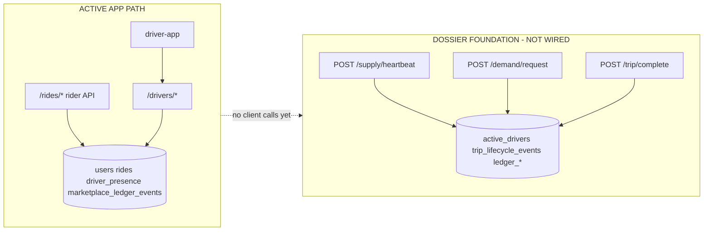

# HalfApp Dossier Spine Reconciliation

Date: 2026-05-22  
Order: `HALFAPP_DOSSIER_SPINE_RECONCILIATION_01`  
Status: authoritative map between the **active driver-app path** and the **dossier foundation spine**.

---

## Purpose

The dossier slice (`0006_dossier_dispatch_ledger_foundation`) implements backend-truth dispatch and double-entry ledger patterns from the architecture dossier. It is **mounted** on the API but **not** wired to `driver-app`. This document prevents two competing marketplace truths.

**Rule:** Until an explicit reconciliation PR merges contracts, the driver cockpit must use only `/drivers/*` and `/auth/*` (plus rider API where applicable). Do not call `/supply/*`, `/demand/*`, or `/trip/*` from production UI.

---

## Active app path today

| Layer | Path | Role |
|-------|------|------|
| Entry | `backend/main.py` | Mounts routers; runs Alembic on startup |
| Driver API | `backend/routes/drivers.py` (`prefix=/drivers`) | **Primary** marketplace truth for `driver-app` |
| Auth | `backend/routes/auth.py` (`prefix=/auth`) | Login, register, `GET /auth/me` |
| Rider API | `backend/routes/rider_rides.py` (`prefix=/rides`) | Create/cancel rides (API-only; no rider UI) |
| Notifications | `backend/routes/notifications.py` | Driver alerts |
| Internal | `backend/routes/internal.py` | Health/diagnostics |
| Client | `driver-app/src/utils/api.js` | Calls `/drivers/*` only (no dossier endpoints) |

**Data the active path owns:**

- `users`, `rides`, `driver_presence`, `ride_visibility`, `ride_claim_attempts`
- `marketplace_ledger` / `marketplace_ledger_events` (append-only **audit** events, not double-entry books)
- `metrics`, `events`, `notifications`

**Dispatch model (active):** Open board — `GET /drivers/available-rides`, atomic first claim via `POST /drivers/accept-ride/{ride_id}` (`OpenBoardDispatchPolicy` in `services/dispatch.py`). Not geospatial auto-match.

---

## Dossier spine (foundation, parallel)

| Layer | Path | Labels |
|-------|------|--------|
| Migration | `backend/alembic/versions/0006_dossier_dispatch_ledger_foundation.py` | `FOUNDATION` |
| Routes | `backend/routes/dossier_marketplace.py` | `BACKEND-TRUTH EXPERIMENTAL SPINE`, `NOT WIRED TO MAIN APP` |
| Services | `services/dossier_dispatch.py`, `services/dossier_ledger.py` | `FOUNDATION` |
| Tests | `backend/tests/test_dossier_dispatch_ledger_slice.py` | Contract proof only |

**Data the dossier path owns (separate tables):**

- `active_drivers` — supply geospatial rows (not `users` / `driver_presence`)
- `trip_lifecycle_events` — FSM audit (not `rides.status` transitions)
- `ledger_accounts`, `ledger_transactions`, `ledger_entries` — double-entry books (not `marketplace_ledger_events`)

**Postgres production features:** PostGIS `geometry`, GiST index, `FOR NO KEY UPDATE SKIP LOCKED`.  
**SQLite dev/test:** lat/lng + ordering; application-level ledger balance (no deferred PG trigger).

---

## Endpoint status labels

### Active production / dev app endpoints

Used by `driver-app` today. **PRIMARY APP PATH.**

| Endpoint | Concern |
|----------|---------|
| `GET/PUT /drivers/presence` | Driver online/offline truth |
| `POST /drivers/heartbeat` | Stale/disconnected derivation |
| `GET /drivers/available-rides` | Open-board pool |
| `POST /drivers/accept-ride/{ride_id}` | First-claim-wins |
| `GET /drivers/rides/{ride_id}/transparency` | Claim conflict proof |
| `POST /drivers/rides/{ride_id}/hide` | Per-driver dismissal |
| `POST /drivers/arrive-pickup/{ride_id}` | Lifecycle |
| `POST /drivers/start-ride/{ride_id}` | Lifecycle |
| `POST /drivers/complete-ride/{ride_id}` | Lifecycle + earnings summary |
| `GET /drivers/earnings` | Completed-trip summaries |
| `POST /auth/login`, `GET /auth/me` | Session |

Full list: `docs/CURRENT_TRUTH.md`, `docs/DORMANT_ROUTERS_INVENTORY.md`.

### Foundation endpoints — do not wire UI yet

| Endpoint | Labels | Concern |
|----------|--------|---------|
| `POST /supply/heartbeat` | `FOUNDATION`, `NOT WIRED TO MAIN APP`, `BACKEND-TRUTH EXPERIMENTAL SPINE` | Supply telemetry → `active_drivers` |
| `POST /demand/request` | same | Rider intent + geospatial match → `trip_lifecycle_events` |
| `POST /trip/complete` | same | FSM complete + double-entry settlement |

These are registered in `main.py` for tests and future reconciliation only.

---

## Contract map

| Concern | Active app path | Dossier spine path | Status | Future decision |
|---------|-----------------|--------------------|--------|-----------------|
| Auth / session | `POST /auth/login`, `GET /auth/me` | — | active only | unchanged |
| Driver presence | `GET/PUT /drivers/presence`, `POST /drivers/heartbeat` | `POST /supply/heartbeat` | **parallel** | Reconcile: one presence model (`driver_presence` vs `active_drivers`) before UI switch |
| Geospatial location | `POST /drivers/update-location` (profile/aux) | `POST /supply/heartbeat` | parallel | Dossier adds velocity/fraud checks; active path does not |
| Ride creation (demand) | `POST /rides/` (rider, `rider_rides.py`) | `POST /demand/request` | foundation | Dossier auto-matches; active path creates `rides` row in `requested` |
| Dispatch / visibility | `GET /drivers/available-rides` | — (match inside `/demand/request`) | **active** | Preserve open board until DISCO slice |
| Claim / assign driver | `POST /drivers/accept-ride/{ride_id}` | match inside `/demand/request` | **active** vs auto-dispatch | Do not merge without migration plan |
| Hide / dismiss | `POST /drivers/rides/{ride_id}/hide` | — | active only | — |
| Trip lifecycle FSM | `rides.status` + driver transition endpoints | `trip_lifecycle_events` | parallel | Map states before single truth |
| Trip complete | `POST /drivers/complete-ride/{ride_id}` | `POST /trip/complete` | foundation | Compare payloads; ledger only on dossier path |
| Earnings display | `GET /drivers/earnings` | — | active only | — |
| Audit ledger | `marketplace_ledger` + `marketplace_ledger_events` | — | active audit | Keep for ops/support |
| Financial ledger | — (no payments shipped) | `ledger_*` double-entry | **future** | Do not merge tables until payment slice |
| 409 claim conflict | Structured `detail` via `claim_conflict_detail()` | `409` on invalid FSM only | active documented | See below |

---

## Data model overlap — what must not be duplicated

| Concept | Active table(s) | Dossier table(s) | Rule |
|---------|-----------------|------------------|------|
| Driver identity | `users` (role=DRIVER) | `active_drivers.id` (opaque string UUID) | Do not mirror rows automatically |
| Online state | `driver_presence` | `active_drivers.status` | Cockpit reads `driver_presence` only |
| Ride record | `rides` | `trip_lifecycle_events.trip_id` (string) | Different ID spaces today |
| Assignment | `rides.driver_id` | `active_drivers.assigned_trip_id` | Active claim wins in app; dossier assigns in `/demand/request` |
| Audit events | `marketplace_ledger_events` | `trip_lifecycle_events` | Different schemas; do not write both from one UI action yet |
| Money | — | `ledger_entries` | Integer cents; append-only |

**Do not duplicate:** Writing the same business fact to both `rides` and `trip_lifecycle_events` from `driver-app` without a reconciliation layer.

---

## 409 claim conflict — canonical shape (active path)

Losing `POST /drivers/accept-ride/{ride_id}` returns **HTTP 409** with a **structured object** under FastAPI’s `detail` key (not a plain string):

```json
{
  "detail": {
    "detail": "Ride already claimed",
    "ride_id": 123,
    "claim_result": "lost",
    "truth_status": "backend_conflict"
  }
}
```

Implemented in `services/transparency.py` → `claim_conflict_detail()`.  
Enforced by:

- `tests/test_dispatch_auditability.py`
- `tests/test_ride_lifecycle.py`
- `tests/test_ride_transparency_and_claim_conflict.py`

**Do not revert** to the legacy string `"Ride already claimed by another driver."` without updating all conflict tests and transparency consumers.

---

## What must happen before UI wiring

1. **Single presence source** — decide `driver_presence` vs `active_drivers` (or sync layer).
2. **Single ride ID** — align `rides.id` with dossier `trip_id` or add mapping table.
3. **Dispatch policy** — open board vs geospatial auto-match; product choice required.
4. **Lifecycle matrix** — map `RideStatus` (`requested`…`completed`) to dossier FSM (`MATCHING`, `DRIVER_EN_ROUTE`, …).
5. **Ledger boundary** — when payments ship, migrate from audit-only to `ledger_*` with explicit cutover.
6. **Integration tests** — one spine e2e path; remove parallel writes.
7. **Update `driver-app/src/utils/api.js`** only after the above — never dual-call both spines.

---

## How `/drivers/*` relates to `/supply/*`, `/demand/*`, `/trip/*`



---

## Tests and suite status

| Suite | Command | Expected |
|-------|---------|----------|
| Full backend | `cd backend && python -m pytest -q` | All green |
| Dossier slice | `pytest tests/test_dossier_dispatch_ledger_slice.py` | 7 tests |
| 409 conflict | `pytest tests/test_dispatch_auditability.py tests/test_ride_lifecycle.py -k conflict` | structured `detail` |

---

## Next slice (confirmed)

After this reconciliation doc and green suite, the next **product** slice is:

**`HALFAPP_PUBLIC_FACE_AND_APP_SHELL_01`**

- Improve app entrance / first screen
- Keep auth working
- Preserve current cockpit (`/drivers/*` only)
- Do **not** wire dossier spine endpoints

---

## References

- `docs/HALFAPP_AGENT_ACTION_DIRECTIVES.md` — execution order
- `docs/CURRENT_TRUTH.md` — mounted routes (update when dossier merges)
- `docs/RIDE_LIFECYCLE_CONTRACT.md` — active FSM
- `backend/routes/dossier_marketplace.py` — foundation endpoint labels in code
