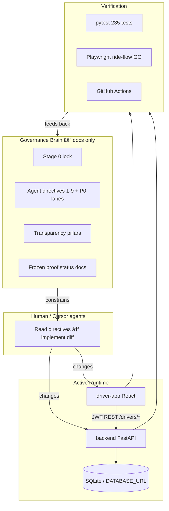
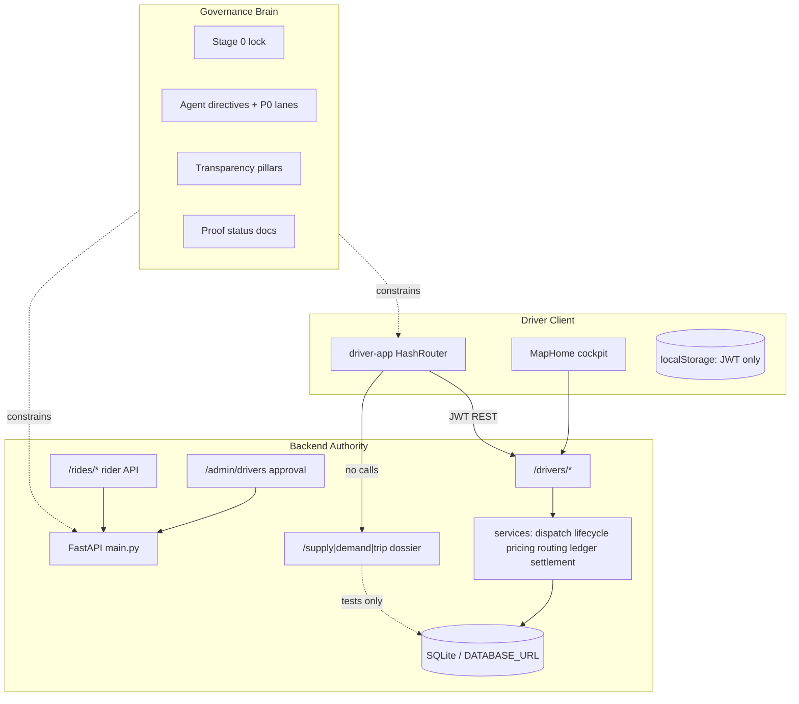

# HalfApp Driver — Master Program Report (Combined)

**Combined document IDs:** `HALFAPP_DRIVER_PROGRAM_ADVANCED_OVERVIEW_01` + `HALFAPP_COMPREHENSIVE_PROGRAM_REPORT_03`  
**Single file:** `docs/HALFAPP_DRIVER_PROGRAM_MASTER_REPORT_01.md`  
**Report date:** 2026-05-22  
**Verification snapshot:** `262 passed` backend pytest; `77 passed` driver-app unit tests; ride-flow E2E **GO**; trip audit read UI **GO**; OSRM runtime **NO_GO**; payments/PSP **NOT IMPLEMENTED**

> **Why these two reports are one document:** The **Advanced Overview** is the *decision layer* — where the driver product stands after the latest closed lanes, what is ready for demo or beta, what blocks launch, and the ordered next slices for expert research. The **Comprehensive Program Report** is the *reference layer* — how the governance brain, active `/drivers/*` spine, dossier parallel path, backend, driver app, proof lanes, and transparency pillars fit together in depth. They belong together so you can read top-to-bottom for strategy, then drill into architecture without switching files or reconciling two verdicts.

**How to read:** Start with **Book A** (Overview) for executive verdict, launch readiness, and next steps. Use **Book B** (Comprehensive) for brain mechanics, repository map, dual-spine analysis, backend/driver deep dives, and appendices.

**Authority order when facts conflict:** `backend/main.py` + tests → `driver-app/src/App.jsx` + build guards → 2026-05-22 status docs → this combined report → older materials.

---

# Book A — Advanced Program Overview

*Source: `HALFAPP_DRIVER_PROGRAM_ADVANCED_OVERVIEW_01` — post-lane product and launch assessment.*

**Document ID:** `HALFAPP_DRIVER_PROGRAM_ADVANCED_OVERVIEW_01`  
**Audience:** Advanced engineering reviewers, program owners, mobility-marketplace experts, and the program lead  
**Workspace:** `c:\Users\him\Desktop\halfapp-driver`  
**Report date:** 2026-05-22  
**Verification snapshot (this session):** `262 passed` backend pytest (~124s); `77 passed` driver-app unit tests; ride-flow UI proof **GO**; trip audit read UI **GO**; OSRM runtime proof **NO_GO** (frozen); payments/PSP **NOT IMPLEMENTED**

**Authority order when facts conflict:**

1. `backend/main.py` + OpenAPI + green tests  
2. `driver-app/src/App.jsx` + production build guards  
3. Status docs dated 2026-05-22 (`CURRENT_TRUTH.md`, lane reports, proof statuses)  
4. `docs/HALFAPP_COMPREHENSIVE_PROGRAM_REPORT_03.md` (program brain companion)  
5. Older overview docs and investor materials (verify before external use)

**This document does not authorize implementation.** It is a planning and research bridge for the next program stage.

---

## Executive verdict

HalfApp Driver is a **backend-owned, driver-only ride-hailing MVP** with a **real lifecycle spine**, **open-board dispatch with concurrency and audit proofs**, a **v0.1 integer-cent pricing ledger**, **honest routing metadata with explicit fallback**, and a **new read-only trip audit / receipt surface** that explains obligations without pretending money moved. It is **not** a finished marketplace, payment processor, geo-dispatch platform, rider product, or city-scale mobility OS.

The program’s distinguishing asset is **dual but coupled**:

1. **Runtime spine** — `backend/` + `driver-app/` that survives refresh, records claims and visibility, completes priced trips in Playwright, and exposes audit APIs the UI actually calls.  
2. **Governance brain** — documentation, contracts, phased acceptance reports, and agent directives that forbid claiming capabilities the backend cannot prove.

**Overall maturity:** Strong **prototype with closed P0 gates and a credible driver cockpit**; **not** production marketplace or public launch candidate.

**Strongest product value today:** A driver can go online, see a real backend ride request, accept under atomic claim rules, execute the full lifecycle on a map-first cockpit, complete with **locked integer-cent pricing**, and later open a **trip audit** that ties lifecycle, pricing, settlement obligation rows, marketplace ledger events, and route truth together — with copy that does **not** claim PSP payout or production OSRM.

**Weakest strategic gaps:** No payment execution; no production OSRM runtime proof; parallel dossier spine; SQLite-only concurrency proof for claims; no rider app; token revocation absent; repository sprawl that confuses reviewers.

**Recommended strategic posture for the next stage:** Treat the next phase as **computational honesty and launch-gate closure**, not screen expansion. Evolve **`/drivers/*` active spine first**; force a **dossier Path A vs B decision** before any marketplace feature that touches money, dispatch identity, or ledger tables — but **do not wire dossier from UI without a reconciliation plan**.

---

## What is now strong

### 1. Backend lifecycle and dispatch integrity (closed P0 lanes)

The active path enforces a formal ride state machine with structured `409` responses on invalid transitions (RIDE-001 **GO**). Open-board dispatch uses atomic first-claim-wins semantics with concurrency tests (RIDE-002 **GO**). A sequential dispatch cascade exists behind a feature flag (RIDE-003 **GO**). Driver approval gates online/accept behavior (DRIVER-002 **GO**). Presence and busy-scope guards protect lifecycle transitions (DRIVER-001B **GO**). JWT role middleware enforces driver/rider/admin boundaries on mounted routes (AUTH-001 **GO**).

**Why this matters:** These are the hardest marketplace invariants to retrofit. Reopening them without rescope would invalidate E2E proofs, audit narratives, and expert trust.

**Evidence:** `tests/test_ride_001_transition_guards.py`, `tests/test_ride_claim_lock_concurrency.py`, `tests/test_ride_003_dispatch_cascade.py`, `tests/test_driver_approval.py`, `docs/RIDE_001_STATE_MACHINE_GUARDS_REPORT.md`.

### 2. Test discipline and isolation

Per-test database wipe and a single-command full backend suite are stable (TEST-ISOLATION-01 **GO**). This session: **262 backend tests passed** in one pytest invocation. Driver-app unit suite: **77 tests passed**, including forbidden-phrase guards (no AI providers in `src/`, no payment/dossier false claims in cockpit layout scans).

**Why this matters:** The brain’s claims are enforceable by CI and local proof lanes; agents cannot silently regress lifecycle without failing tests.

### 3. v0.1 pricing ledger (integer cents, lock on complete)

`ride_pricing` stores quote and completion breakdown in integer cents. Trip completion sets `financial_locked`. The cockpit and ride-flow E2E assert commission, service fee ($1.50 fixture), tips, tolls, and driver total payout fields after complete and after page reload.

**Boundary (explicit):** This is **pricing truth**, not payment settlement, wallet balance, or payout execution.

**Evidence:** `tests/test_pricing_ledger_v01.py`, `docs/RIDE_FLOW_UI_PROOF_V0_2_STATUS.md`, `driver-app/src/utils/ridePricingDisplay.js`.

### 4. Map-first driver cockpit with E2E lock

`MapHome.jsx` is the operational center: Leaflet + OpenStreetMap tiles, bottom-sheet ride flow, backend-driven driver states, external Google Maps navigation links (no embed). Recent polish lane preserved full lifecycle; E2E re-locked after UI changes (HALFAPP_DRIVER_COCKPIT_RIDE_FLOW_E2E_LOCK_01 **GO**).

**Evidence:** `driver-app/tests/ride-flow-ui-proof.spec.ts` — 1 passed (~42s); `docs/HALFAPP_DRIVER_COCKPIT_RIDE_FLOW_E2E_LOCK_01_REPORT.md`.

### 5. Dispatch and marketplace audit trail

`ride_visibility`, `ride_claim_attempts`, `marketplace_ledger_events` (hash-chained append-only), and `GET /drivers/rides/{ride_id}/transparency` provide operational proof for open-board exposure, hide/dismiss, and claim conflicts. Drivers see friendly conflict messaging when another driver wins the claim.

**Evidence:** `tests/test_dispatch_auditability.py`, `tests/test_marketplace_ledger_events.py`, `driver-app/src/utils/rideTransparency.js`.

### 6. Production SECRET_KEY guard

Production-like environments fail fast on default/short/placeholder `SECRET_KEY` values without logging the secret (HALFAPP_PRODUCTION_SECRET_KEY_GUARD_01 **GO**).

**Evidence:** `backend/production_guards.py`, `tests/test_production_guards.py`.

### 7. Engineering Intelligence Safe Shell (LOCAL_CONTEXT_ONLY)

A dev-flagged `#/engineering-intelligence` route surfaces **local** program context (proof lane statuses, forbidden claims, next gaps) — **not** ride-product AI. It helps agents and owners align with truth boundaries without calling external models from the driver product path.

**Evidence:** `tests/test_engineering_intelligence_status.py`, `driver-app/src/utils/engineeringIntelligenceContext.js`.

### 8. Backend engineering-assistant gate repair

The optional `/engineering-assistant/*` proxy is **disabled by default** (`ENGINEERING_ASSISTANT_ENABLED` unset/false). Enabling requires explicit configuration and server API key — **not wired** to the Safe Shell or driver ride product.

**Why this matters:** Prevents accidental “the app has AI” narratives or undeclared external calls from production-shaped deployments.

### 9. Truth Sync / Backlog Reconciliation

`docs/CURRENT_TRUTH.md`, `docs/BACKLOG.md`, and `docs/PRODUCT_BOUNDARY_STAGE0.md` are reconciled to v0.1 reality with explicit **do not reopen** lanes and forbidden claims. Stale tickets (e.g. parallel `fare_ledger_entries`) are marked superseded.

### 10. Driver Trip Audit / Receipt Details UI (read-only)

Completed trips expose **Trip audit / receipt details** from Trips list → `GET /drivers/rides/{ride_id}/audit`. The UI aggregates lifecycle events, integer-cent pricing, `financial_locked`, settlement obligation rows, filtered marketplace ledger events, and route truth with `osrm_runtime_claim: not_proved`. Obligation language is enforced in copy and unit tests; forbidden PSP phrases are guarded.

**Evidence:** `docs/HALFAPP_DRIVER_AUDIT_READ_UI_01_REPORT.md`, `backend/services/ride_audit.py`, `driver-app/src/components/TripAuditReceipt.jsx`, `tests/test_driver_ride_audit.py`, `driver-app/tests/unit/tripAuditReceipt.test.js`.

### 11. Route snapshot read surface (honest fallback)

`GET /drivers/rides/{ride_id}/route-snapshots` and `RouteTruthDetails` in cockpit and audit show provider metadata and explicitly state OSRM runtime is **not proved** when applicable.

**Evidence:** `tests/test_route_snapshot_read_ui.py`, `backend/services/route_snapshots_read.py`, `driver-app/tests/unit/routeTruthDetails.test.js`.

### 12. The governance brain (program intelligence layer)

**“The brain”** is not an deployed ML service. It is the **program intelligence layer**: `docs/HALFAPP_AGENT_ACTION_DIRECTIVES.md`, Stage 0 boundary lock, transparency architecture, proof-lane reports with GO/NO_GO verdicts, and operating rules that require every driver-visible fact to trace to backend records and tests.

**Critical property:** The brain does not auto-enforce — tests, prod build guards, and proof lanes do. The brain **prevents illusion-driven engineering** when followed.

---

## What is still weak

### 1. No payment processing or payout execution

There is **no** Stripe, PSP capture, wallet, payout batch, refund processing, or bank movement. `settlement_entries` are **obligation rows** — backend-computed amounts that may inform a future settlement product, not money movement. UI and audit copy state this; marketing must not blur the line.

### 2. No production OSRM runtime proof

The OSRM self-hosted **code path** is unit-tested with mocked HTTP. **Runtime** proof on Docker/VPS (live road-network geometry, `used_fallback=false` in real runs) remains **NO_GO** per `docs/SELF_HOSTED_ROUTING_PROOF_V0_1_STATUS.md`. Until GO, distance/duration for quotes may honestly be `haversine_fallback` — not road-network truth.

### 3. Parallel dossier spine (architectural debt)

`POST /supply/heartbeat`, `POST /demand/request`, `POST /trip/complete` and dossier `ledger_*` tables implement an alternate marketplace model (geospatial auto-match, double-entry books). They are **mounted for foundation/tests** but **not** called from `driver-app/src/utils/api.js`. Two presence models, two lifecycle event stores, and two financial abstractions coexist.

**Risk:** Accidental UI wiring, dual-write, or expert confusion about “which ledger is truth.”

### 4. Postgres / production database proof gaps

Claim-race proofs run on SQLite in dev CI. Production concurrency, locking (`FOR NO KEY UPDATE SKIP LOCKED` on dossier path), and PostGIS behavior are **not** proven on a Postgres CI matrix for the **active** spine.

### 5. Token security incomplete

No refresh tokens, no revocation store, no structured session rotation. SECRET_KEY guard helps boot safety but does not solve stolen-token lifecycle.

### 6. CORS and observability partial

Production CORS requires explicit origins (partial hardening). Structured logging, request IDs, and operational telemetry are not first-class.

### 7. Repository sprawl and misread risk

Legacy `frontend/`, dormant routers (`admin`, `users`, legacy `rides`), dormant driver components, `video-gate/`, and dossier endpoints **look** like product. New reviewers or agents can mis-attribute behavior without reading Stage 0 docs.

### 8. Dispatch transparency gaps (vs production marketplace)

Open board is **honest** but not **complete**: no full candidate eligibility rounds, service-area membership proofs, or geo-fair exclusion reasons for drivers who never saw a ride.

### 9. Geocoding and ETA product gaps

Coordinates must be supplied; address labels are not proved locations. No marketed live ETA product; map visualization must not be read as routing proof.

### 10. Documentation drift on completed lanes

`docs/BACKLOG.md` P1 queue still lists “Driver audit read UI” and “Route snapshot read UI” as pending in places — **implementation has shipped** (audit UI GO, route read GO). Truth sync should update backlog classification to avoid duplicate work orders.

### 11. WebSocket / real-time presence

Presence is REST + heartbeat with stale/disconnected derivation — adequate for MVP, not a real-time gateway.

### 12. Rider side is API-only

`POST /rides/` and cancel exist; no rider app. Marketplace demand in demos is simulation or test harness — not organic rider demand.

---

## Driver UX assessment

### Map-first cockpit — current quality

**Architecture:** `/#/driver` → `MapHome` with `DriverCockpitShell`, `MapView`, `MarketplaceBottomSheet`, state-driven sheets (`sheet-online-idle`, `sheet-request-incoming`, through completed), and `RidePayoutSummary` / `TripTruthDetails` for pricing and expandable truth.

**What feels close to production quality:**

- Full ride loop with backend persistence across reload (E2E proven).  
- Clear driver state labels (Offline, Online, Incoming, To pickup, At pickup, In progress, Completed).  
- Pricing visible on incoming and completed with locked-state indicator.  
- Claim conflict surfaced with backend-derived transparency, not invented copy.  
- External navigation via Google Maps links — familiar driver pattern.  
- Production build rejects mock mode and guard bypass flags.  
- Lightweight Uber-like polish without claiming Uber parity (spacing, sheet behavior, trip details collapse).

**What still feels MVP / unfinished:**

- Hash-router web app, not native iOS/Android driver shell.  
- Geolocation permission UX varies by browser; location chip states need driver education.  
- Dev simulation dock and engineering intelligence route visible only in dev — but their **existence** in repo can confuse if flags leak.  
- Trips/Earnings/Notifications/Profile are functional but not at “daily driver OS” depth (filters, disputes, tax docs, etc.).  
- No turn-by-turn in-app navigation — by design (external Maps), but some drivers expect in-app voice nav.  
- Experimental traffic signal markers are optional and not commercial traffic — must stay labeled.

**What might confuse a real driver:**

| Confusion | Cause | Mitigation direction |
|-----------|--------|----------------------|
| “Why is my payout different from rider total?” | Integer-cent breakdown vs legacy `fare_amount` dollars | Audit page + Trip details; keep labels consistent |
| “Did I get paid?” | Obligation language vs bank deposit | Audit disclaimer is good; Earnings screen must never imply transfer |
| “Is this route accurate?” | Haversine fallback when OSRM down | Route truth section + `osrm_runtime_claim: not_proved` |
| “Another driver took it” | Open board 409 | Transparency endpoint messaging — adequate for beta |
| “Ride disappeared” | Hide/dismiss TTL | Needs clearer “hidden from your board” copy |
| “Simulation ride” | `lifecycle_reason=simulation` | Must stay visually distinct in demo/beta |
| Decline releases to pool | `accepted → requested` not terminal decline | Drivers used to Uber “decline” semantics — document behavior |

**Net UX verdict:** **Credible for internal demo and closed trusted-driver beta** on lifecycle + pricing honesty. **Not** yet credible for public launch or drivers who equate the app with instant bank payment.

---

## Trust / transparency assessment

### Trip Audit / Receipt Details flow

**Strengths:**

- Single read API aggregates lifecycle, pricing, settlements, ledger events, route truth — reduces frontend invention.  
- `AUDIT_COPY` in backend enforces `payment_execution: not_implemented` and obligation semantics.  
- Technical proof expander keeps hash/event IDs available without cluttering primary UX.  
- `tripAuditFormat.js` and unit tests guard forbidden phrases (PSP, “paid out”, production OSRM claims).  
- Route truth honestly shows fallback and `not_proved` OSRM runtime claim.  
- Link from completed trips in `TripsList` makes audit discoverable.

**Weaknesses / improvement targets for normal drivers:**

| Topic | Current state | Improvement |
|-------|---------------|-------------|
| **Pricing** | Integer-cent breakdown in audit | Plain-language “what rider paid vs what you earn” one-liner above cents table |
| **Settlement obligations** | “Recorded obligation, not paid out” | Short glossary: obligation vs payout vs charge |
| **Route truth** | Provider + fallback flags | Simple map icon: “straight-line estimate” vs “road network” when OSRM GO |
| **Ledger events** | Event types in technical section | Top 3 human events (accepted, completed, earning.calculated) in primary view |
| **Dispatch** | Transparency on conflict, not in audit | Optional “why you saw this ride” link from audit to transparency payload |
| **Refresh** | Reload fetches audit again | Stale indicator if ride still unlocking (edge: rare) |

**Obligation language clarity:** **Adequate for expert and careful beta drivers**; **not yet adequate for mass-market drivers** without a short onboarding tooltip or glossary.

**Is transparency a product advantage yet?** **Partially.** Experts and trust-oriented drivers can see more than typical gig apps show at accept time. Mass-market advantage requires **simpler primary narrative** and **same facts, less jargon** — without removing the technical expander.

---

## Architecture assessment

### Active spine (authoritative)

```
driver-app (React/Vite, HashRouter)
    → JWT /auth/*
    → /drivers/* only (api.js boundary)
backend/main.py
    → drivers, auth, rider_rides, notifications, internal
    → dossier_marketplace (mounted, not in driver-app)
SQLAlchemy + Alembic 0001–0015
    → rides, ride_pricing, driver_presence, visibility, claims, marketplace_ledger_events, settlement_entries, route_snapshots
```

### The brain’s role in architecture

The brain sets **execution order** (9 agent actions, P0 lanes), **forbidden claims**, and **per-feature success definition** (5 questions: record, endpoint, test, audit event, refresh/conflict behavior). It does not replace OpenAPI or tests.

**Strength:** Aligns multi-agent development with a single truth story.  
**Weakness:** Manual discipline required; stale docs (backlog P1) erode trust.

### Dossier parallel spine — practical risk

| Risk | Severity | Description |
|------|----------|-------------|
| Dual marketplace truth | **High** if wired carelessly | Two dispatch models, two presence stores, two ledger philosophies |
| Expert misread | **Medium** | Reviewers cite `/demand/request` as “the app” |
| Migration cost | **High** if Path B chosen late | Merging `rides` with dossier trip IDs and ledger tables |
| Feature delay | **Medium** if decision deferred | Every money/dispatch feature needs “which spine?” answer |
| Accidental UI call | **High** | One PR adding `/supply/heartbeat` to api.js breaks boundary |

**Recommendation:** **Keep evolving `/drivers/*` first.** Schedule a **time-boxed dossier decision** (Path A: active spine + borrow dossier patterns; Path B: merge) **before** payments slice or geo-dispatch — not necessarily before all polish. **Never** wire dossier from UI without `HALFAPP_DOSSIER_SPINE_RECONCILIATION_01` merge plan.

### Areas that must not be reopened (without explicit rescope)

- AUTH-001, RIDE-001, RIDE-002, RIDE-003, DRIVER-001B, DRIVER-002  
- TEST-ISOLATION-01, SECRET_KEY guard, Engineering Intelligence Safe Shell boundary  
- Claim-lock semantics, lifecycle guard matrix, approval gates  
- Driver-app dossier API boundary (`api.js` → `/drivers/*` only)  
- Forbidden claims list in `PRODUCT_BOUNDARY_STAGE0.md`

### Proof gaps that remain open

1. OSRM runtime on Docker/VPS  
2. Postgres claim-race suite for active spine  
3. OpenAPI contract drift CI (Ticket 1.3 partial)  
4. Token revocation/refresh design  
5. Full driver-facing dispatch round narrative (eligibility)  
6. Geocoding proof lane (if addresses become inputs)

---

## Launch readiness assessment

### Ready for internal demo

| Capability | Status |
|------------|--------|
| Driver login/register | Yes |
| Go online / presence | Yes |
| Simulated or test-harness rider request | Yes (simulation flag / Playwright rider API) |
| Accept → complete lifecycle | Yes (E2E) |
| Locked pricing display | Yes |
| Trip audit read-only | Yes |
| Claim conflict demo | Yes |
| Engineering intelligence status | Yes (dev flag) |

**Caveat:** Present with Stage 0 framing — no payments, no production OSRM, open board only.

### Ready for closed trusted-driver beta

| Requirement | Status |
|-------------|--------|
| Lifecycle correctness | **Ready** |
| Honest pricing copy | **Ready** with glossary improvements |
| Audit/receipt for disputes | **Ready** (read-only) |
| Production SECRET_KEY | **Ready** (guard shipped; ops must set real secret) |
| Real demand (rider app) | **Not ready** — API/test harness only |
| Real money movement | **Not ready** — by design |
| Road-network routing truth | **Not ready** — fallback honest |
| Mobile-native app | **Web MVP** — acceptable for tiny beta if expectations set |
| Support/runbooks | **Partial** — docs exist, ops tooling thin |
| Legal/compliance (payments, insurance) | **Out of scope** until PSP design |

**Beta verdict:** **Possible** for 5–20 trusted drivers in one city **if** ops seeds rides via API/simulation, drivers understand **no real payouts**, and routing claims stay honest.

### Blocks limited live pilot

1. No organic rider demand channel (rider UI).  
2. No payment capture — cannot close commercial loop.  
3. OSRM runtime NO_GO — distance-based pricing may be challenged.  
4. SQLite-proven concurrency only — pilot with money-adjacent obligations needs Postgres proof.  
5. No token revocation — session risk for lost devices.  
6. No ops admin on active API — manual DB/API support burden.  
7. Dossier decision unset — risk if pilot scope creeps into “use dossier ledger.”

### Blocks public launch

Everything in limited pilot, plus:

- PSP integration, payout execution, reconciliation, refunds, tax reporting  
- Production OSRM or contractual honesty about estimates  
- Postgres + HA + monitoring + on-call  
- Rider app and demand generation  
- Legal, insurance, background checks, city compliance  
- Native driver apps or PWA parity drivers expect  
- Geo-fair dispatch or explicit “open board” product positioning  
- Admin console, fraud, support tooling  
- Security audit (CORS, rate limits, penetration test)  
- Removal/quarantine of legacy surfaces from reviewer path

---

## Top 10 next slices

Ordered for **maximum honesty per engineering week** before surface expansion. Tags: **[P]** product polish, **[T]** trust/audit, **[R]** routing/OSRM, **[S]** security, **[$]** payments, **[A]** architecture.

### 1. OSRM runtime proof (Docker/VPS) — [R]

**Why first:** Routing truth underpins fare distance/duration, route snapshots, and audit credibility. Code path GO without runtime GO is the largest **honesty gap** visible to experts and drivers.

**Done when:** `SELF_HOSTED_ROUTING_PROOF_V0_1_STATUS` runtime verdict **GO**; live `route_provider=osrm_self_hosted`, `used_fallback=false` in proof script output; UI still honest when OSRM down.

**Do not:** Claim production OSRM in marketing until this lane is GO.

---

### 2. Postgres claim-race proof on active spine — [S][A]

**Why second:** SQLite locks ≠ production. Before pilot with real obligations or higher concurrency, prove `POST /drivers/accept-ride` under Postgres with parallel clients.

**Done when:** CI matrix (or documented manual proof) extends `test_ride_claim_lock_concurrency.py` against Postgres `DATABASE_URL`.

---

### 3. Dossier Path A vs Path B decision (document only, no UI wire) — [A]

**Why third:** Unblocks payments and dispatch evolution without dual-write surprises. Path A: evolve `/drivers/*`, borrow dossier patterns; Path B: merge spines with migration plan.

**Done when:** Signed decision doc + updated `HALFAPP_DOSSIER_SPINE_RECONCILIATION_01` with chosen path and **explicit non-goals**.

**Do not:** Wire dossier endpoints to `driver-app` in the same slice.

---

### 4. Truth sync backlog + transparency doc refresh — [T]

**Why fourth:** Audit UI and route read UI shipped; backlog still lists them pending. Stale brain docs cause duplicate work and agent thrash.

**Done when:** `BACKLOG.md`, `HALFAPP_TRANSPARENCY_ARCHITECTURE.md` “Do not claim yet” sections updated; P1 queue reflects audit GO.

---

### 5. Driver trust copy pass (glossary + primary audit narrative) — [T][P]

**Why fifth:** Transparency advantage requires **comprehension**, not more fields. Short obligation glossary; top-3 events on audit primary surface; Earnings screen alignment with audit language.

**Done when:** User-tested copy with 2–3 non-engineer drivers; unit tests still forbid PSP phrases.

---

### 6. OpenAPI contract drift CI — [S]

**Why sixth:** Prevents silent API/contract divergence as slices land. Ticket 1.3 partial → closed.

**Done when:** CI fails on OpenAPI diff vs `docs/RIDE_LIFECYCLE_CONTRACT.md` baseline.

---

### 7. Token revocation / refresh design (design + minimal implementation) — [S]

**Why seventh:** SECRET_KEY guard is necessary not sufficient for pilot device loss.

**Done when:** ADR + optional refresh token store or denylist; tests for revoked token 401.

---

### 8. CORS + rate limit production checklist — [S]

**Why eighth:** Low-cost hardening before any pilot URL is shared.

**Done when:** Deploy checklist documented; `test_production_guards.py` scenarios covered in staging.

---

### 9. PSP / settlement design OR hard no-payout product lock — [$][A]

**Why ninth:** Depends on dossier decision (slice 3). Integer-cent pricing exists; **execution** does not. Either design Stripe Connect (or equivalent) with settlement_entries mapping, or formally lock “no payout” in product boundary for next quarter.

**Do not:** Ship payment UI without execution backend and reconciliation tests.

---

### 10. Rider demand minimum (API hardening + harness, not full rider app) — [P]

**Why tenth (not earlier):** User constraint — **no rider app before driver truth gates stable.** Driver gates are now stable enough for **demand harness** improvement (scheduled rides API, ops scripts), not consumer rider UI.

**Done when:** Repeatable rider trip creation for beta without Playwright-only; still no rider mobile app.

**Explicitly deferred after 10:** Full rider app, nearest-driver dispatch, admin console, ride-product AI/LLM, dossier UI wiring.

---

## Better-than-Uber angle

### What HalfApp Driver can do better **at this stage**

| Advantage | How |
|-----------|-----|
| **Honest open board** | Does not fake closest-driver matching; claim attempts and visibility are recorded |
| **Structured conflict proof** | 409 + transparency payload vs opaque “ride unavailable” |
| **Integer-cent pricing ledger** | Locked breakdown at complete; auditable fields |
| **Post-trip audit surface** | Lifecycle + pricing + obligations + ledger events + route truth in one read API |
| **Explicit non-claims** | OSRM not proved, no payment execution — reduces legal/brand risk if communicated well |
| **Backend-owned presence** | Online/offline/stale from server, not pure UI fiction |
| **Governance brain** | Program can move fast without claiming unbuilt features — if docs stay synced |

### What not to copy from Uber/Lyft

| Uber pattern | Why avoid now |
|--------------|----------------|
| Opaque surge/explanation | Without full pricing policy audit UI |
| Fake precision ETA | No geocoding/ETA proof |
| Instant “paid” messaging | No PSP |
| Nearest-driver fiction | Open board is the honest model |
| In-app everything (nav, wallet, support AI) | Scope explosion |
| Decline = gone forever | HalfApp releases to pool — different contract |
| Heavy map animation as truth | Map is visualization; backend metadata is truth |

### Transparency as product advantage (not clutter)

**Principle:** **One primary sentence per screen**, technical proof behind expanders.

- **Accept sheet:** “You earn $X if you complete; rider pays $Y; route estimate is [straight-line / road network].”  
- **Complete sheet:** “Earnings locked on server; not yet sent to your bank.”  
- **Audit:** “This is what we recorded” — not “this is what you were paid.”  
- **Conflict:** “Another driver claimed first at [time]” — link to transparency IDs for support.

**Anti-pattern:** Showing ledger event hashes, policy versions, and provider strings on the main accept card — that is **expert mode**, belongs in Trip audit technical section (already started).

---

## Critical questions for expert research

Use these in the next-stage research session with marketplace, payments, and mobility experts.

### Marketplace and dispatch

1. Is **open-board first-claim** defensible for a driver-first brand, or must we commit to geo-fair rounds before public positioning?  
2. What **minimum dispatch audit** do regulators or driver associations expect in a pilot city?  
3. When a driver **declines** by releasing to pool (`accepted → requested`), what UX and liability patterns do peers use?

### Financial and legal

4. What is the **smallest PSP integration** that supports “obligation rows → actual payout” without building a full wallet?  
5. How should **integer-cent `ride_pricing`** relate to **double-entry dossier `ledger_*`** if Path B is chosen?  
6. What driver-facing language satisfies **“not paid yet”** without sounding like the platform is withholding fraudulently?

### Routing and pricing

7. What is acceptable **pricing on haversine_fallback** for beta — cap, disclaimer, or block?  
8. What **runtime proof bar** matches industry “self-hosted OSRM in production” claims?  
9. Do we need **geocoding proof** before any address-typed pickup, or coordinates-only for pilot?

### Architecture and scale

10. **Path A vs B** for dossier: borrow patterns only, or merge before payments?  
11. What **Postgres migration** risks exist in `ride_claim_attempts` and visibility TTL at 100 concurrent drivers?  
12. Is SQLite acceptable for **any** paid pilot, or hard gate on Postgres?

### Security and operations

13. What **token model** (refresh + revocation) is minimum for driver devices in beta?  
14. What **CORS and rate-limit** profile matches a single-city web driver app?  
15. What **observability** (metrics, ride funnel, claim latency) is required before pilot?

### Product strategy

16. Can **transparency** be a marketed pillar with **no rider app** yet, or does it require rider-side receipts too?  
17. What **trusted-driver beta** size and duration validates lifecycle before payments?  
18. What should we **not build for 12 months** to avoid Uber parity trap?

---

## Final recommendation

**Verdict:** HalfApp Driver has crossed from “prototype with docs” to **“prototype with provable spine and a map-first cockpit that completes priced trips honestly.”** Recent lanes (SECRET_KEY guard, Safe Shell, engineering-assistant gate, truth sync, cockpit polish, ride-flow E2E lock, trip audit UI) **close critical trust and engineering gates** without expanding into payments or production routing.

**Do next:**

1. Run **expert research** using the critical questions above — especially dossier Path A/B, OSRM runtime bar, and PSP-minimum for obligations → payouts.  
2. Execute slices **1–3** (OSRM runtime proof, Postgres races, dossier decision) before marketing, pilot money, or dossier wiring.  
3. Execute slices **4–5** (doc sync, driver trust copy) in parallel — low risk, high comprehension payoff.  
4. Keep **all product evolution on `/drivers/*`** until dossier reconciliation explicitly merges contracts.  
5. Do **not** build rider app, ride-product AI, or payment UI until slices 1–3 and 9 are resolved with explicit GO/NO_GO documents.

**Do not:**

- Claim payments, production OSRM, or dossier dispatch as live driver truth.  
- Reopen P0 lanes without rescope.  
- Revive legacy `frontend` or wire dossier from UI without a merge plan.  
- Chase Uber UI parity at the expense of backend proof.

**Success at the next stage** is not more screens — it is **a single spine story** that survives expert scrutiny: every driver-visible dollar and mile traces to a **named backend record**, a **test**, and an **honest label** when execution does not exist yet.

---

## Appendix A — Recent completed lanes (context)

| Lane | Verdict | Role |
|------|---------|------|
| Production SECRET_KEY guard | **GO** | Fail fast on unsafe production secrets |
| Engineering Intelligence Safe Shell | **GO**, LOCAL_CONTEXT_ONLY | Dev program context, no ride AI |
| Backend engineering-assistant gate repair | **GO**, disabled by default | No accidental external assistant in prod |
| Truth Sync / Backlog Reconciliation | **GO** | Docs aligned to v0.1 |
| Driver cockpit lightweight Uber polish | **GO** | UX polish without scope creep |
| Driver cockpit ride-flow E2E lock | **GO** | Full lifecycle preserved after polish |
| Driver Trip Audit / Receipt Details UI | **GO** | Read-only audit end-to-end |

---

## Appendix B — Verification commands

```powershell
cd c:\Users\him\Desktop\halfapp-driver\backend
py -3.11 -m pytest tests -q

cd c:\Users\him\Desktop\halfapp-driver\driver-app
npm test
npm run build
npm run test:e2e:ride-flow

cd c:\Users\him\Desktop\halfapp-driver
py -3.11 scripts\print_active_routes.py
```

---

## Appendix C — Key file index

| Concern | Path |
|---------|------|
| Active API mount | `backend/main.py` |
| Driver routes | `backend/routes/drivers.py` |
| Ride audit service | `backend/services/ride_audit.py` |
| Production guards | `backend/production_guards.py` |
| Driver app routes | `driver-app/src/App.jsx` |
| API boundary | `driver-app/src/utils/api.js` |
| Map cockpit | `driver-app/src/components/MapHome.jsx` |
| Trip audit UI | `driver-app/src/components/TripAuditReceipt.jsx` |
| Current truth | `docs/CURRENT_TRUTH.md` |
| Stage 0 boundary | `docs/PRODUCT_BOUNDARY_STAGE0.md` |
| Dossier reconciliation | `docs/HALFAPP_DOSSIER_SPINE_RECONCILIATION_01.md` |
| Agent directives (brain) | `docs/HALFAPP_AGENT_ACTION_DIRECTIVES.md` |
| Program report (brain detail) | `docs/HALFAPP_COMPREHENSIVE_PROGRAM_REPORT_03.md` |

---

## Appendix D — Product state deep dive

### What HalfApp Driver now truly does (end-to-end)

**Authentication and identity**

- Drivers register and log in via JWT (`POST /auth/register`, `POST /auth/login`).  
- `GET /auth/me` returns profile; driver role enforced on mounted routes.  
- Driver approval workflow gates going online and accepting rides when `driver_approval_status` is not approved.

**Presence and availability**

- Backend-owned presence: `GET/PUT /drivers/presence`, `POST /drivers/heartbeat`.  
- States include available, offline, paused, stale, disconnected (derived from heartbeat).  
- Going online may require coordinates and approval; busy drivers are scoped from accepting new rides while on active trip.

**Dispatch (open board)**

- Unassigned rides in `requested` appear on `GET /drivers/available-rides` with deterministic ordering metadata (policy version, rank).  
- `POST /drivers/accept-ride/{ride_id}` atomically assigns first successful claim; others receive structured `409` with transparency detail.  
- `POST /drivers/rides/{ride_id}/hide` dismisses a ride from the driver’s board with TTL visibility records.  
- Optional sequential cascade (RIDE-003) exists behind env flag — not the default open-board path.

**Lifecycle execution**

- Driver path: `requested → accepted → driver_arrived → in_progress → completed`.  
- Rider cancel: `requested|accepted → cancelled` via rider API.  
- Decline/release: `accepted → requested` (ride returns to pool — not terminal decline).  
- Each transition validated by backend guards; invalid transitions return structured errors.

**Pricing at quote and complete**

- `ride_pricing` row with integer cents: shareable fare, commission, service fee, tips, pass-through fees, customer total, driver payout components.  
- Quote on ride creation path; lock on complete (`financial_locked`).  
- UI shows payout summary on incoming and completed sheets; E2E asserts math including tip/toll fixtures.

**Routing metadata (not production OSRM claim)**

- `routing_service` selects provider; may stamp `osrm_self_hosted` in tests or `haversine_fallback` when OSRM unreachable.  
- `route_snapshots` rows written at quote/complete foundation points.  
- Ride row carries `route_provider`, `traffic_provider`, `used_fallback`, distance/duration used for pricing.

**Earnings and history**

- `GET /drivers/earnings` summarizes completed trips from backend records.  
- `GET /drivers/my-rides` lists trip history.  
- Trips list links completed rows to trip audit.

**Notifications**

- Notification routes exist for driver alerts; not a full push gateway product.

**Internal / test support**

- `GET /internal/system-health`, test user seeding for E2E (approval status, etc.).  
- Simulation: `POST /drivers/simulate-ride` when enabled — creates real `rides` row with `lifecycle_reason=simulation`.

**Rider side (API only)**

- `POST /rides/` creates demand; cancel endpoint exists.  
- No rider mobile/web UI in active product.

### What it still does not do

| Capability | Status |
|------------|--------|
| Payment capture / charge rider | NOT IMPLEMENTED |
| Driver payout to bank / wallet | NOT IMPLEMENTED |
| Refunds / adjustments product | NOT IMPLEMENTED |
| Production OSRM runtime | NOT PROVED |
| Live ETA product guarantee | NOT SHIPPED |
| Geocoding from address text | NOT PROVED |
| Nearest-driver geo dispatch | NOT SHIPPED (open board only) |
| Dossier auto-match in driver app | NOT WIRED |
| Rider app | NOT SHIPPED |
| Admin ops console on active API | NOT SHIPPED |
| Token refresh / revocation | NOT IMPLEMENTED |
| WebSocket real-time gateway | NOT IMPLEMENTED |
| Ride-product LLM / AI inference | NOT IMPLEMENTED |
| City-scale ops (zones, airports, fleet) | NOT SHIPPED |
| Full candidate eligibility audit UI | NOT SHIPPED |

### Strongest product value right now (one sentence for decks)

**“A driver can complete a backend-proven ride on a map-first cockpit, see integer-cent locked pricing, and audit exactly what the server recorded — without the platform pretending money moved or roads were routed when they were not.”**

---

## Appendix E — The brain: expanded reference for experts

### Brain inventory (what to read first)

| Priority | Document | Purpose |
|----------|----------|---------|
| 1 | `docs/CURRENT_TRUTH.md` | Short operational truth table |
| 2 | `docs/PRODUCT_BOUNDARY_STAGE0.md` | Forbidden claims + active surfaces |
| 3 | `docs/HALFAPP_AGENT_ACTION_DIRECTIVES.md` | Execution order, P0 lanes, operating rules |
| 4 | `docs/HALFAPP_TRANSPARENCY_ARCHITECTURE.md` | Five pillars: current vs target |
| 5 | `docs/RIDE_LIFECYCLE_CONTRACT.md` | API lifecycle contract |
| 6 | `docs/HALFAPP_DOSSIER_SPINE_RECONCILIATION_01.md` | Parallel spine map |
| 7 | `docs/BACKLOG.md` | Ticket classification (verify dates) |
| 8 | `docs/HALFAPP_COMPREHENSIVE_PROGRAM_REPORT_03.md` | Full program + brain mechanics (~750 lines) |

### Nine agent actions — condensed status

| # | Action | Status |
|---|--------|--------|
| 1 | Lock active product boundary | Largely done |
| 2 | Backend-owned driver presence | Done |
| 3 | Backend ride hide/dismiss | Done |
| 4 | Dispatch auditability | Done |
| 5 | Marketplace ledger events | Done |
| 6 | Migration discipline (Alembic) | Done |
| 7 | Financial ledger foundation | Done (pricing + obligation rows; no PSP) |
| 8 | Route snapshot foundation | Done (foundation + read UI) |
| 9 | Production hardening | Partial (rate limit, SECRET_KEY; revocation/logging remain) |

### Per-feature success definition (apply to every new slice)

1. Which **backend record** proves this?  
2. Which **endpoint** changed it?  
3. Which **test** covers it?  
4. Which **audit event** explains it?  
5. What happens on **refresh, retry, conflict, or disconnect**?

### Brain failure modes (when the brain is ignored)

| Failure mode | Symptom | Example |
|--------------|---------|---------|
| Illusion shipping | UI shows feature backend lacks | “Paid to your bank” without PSP |
| Spine drift | Two truths for same concern | Dossier + active both in api.js |
| Stale docs | Agents rebuild closed lanes | Re-implement claim lock “fix” |
| Mock in prod | Build flags leak | `VITE_ALLOW_OFFLINE_MOCK` in prod |
| Map as truth | Pretty polyline without provider | Draw route while `haversine_fallback` |
| Legacy revival | frontend/admin mounted | Breaks Stage 0 boundary |

### Relationship: brain vs runtime vs verification

```
Governance brain (docs)
    ↓ constrains
Human / Cursor agents
    ↓ implement
backend + driver-app + Alembic
    ↓ verified by
pytest (262) + driver unit (77) + Playwright ride-flow + prod build guards
    ↓ feeds back to
Proof lane reports (GO/NO_GO) + CURRENT_TRUTH updates
```

---

## Appendix F — Engineering truth matrix

| Foundation | Protected? | Proof | Do not reopen |
|------------|------------|-------|----------------|
| JWT + RBAC | Yes | AUTH-001 tests | Role bypass without rescope |
| Lifecycle FSM | Yes | RIDE-001 tests | Ad-hoc status writes |
| Atomic claim | Yes | RIDE-002 tests | Non-atomic accept |
| Cascade | Yes | RIDE-003 tests | Change timeout semantics silently |
| Driver approval | Yes | DRIVER-002 tests | Online without approval |
| Presence busy guard | Yes | DRIVER-001B tests | Accept while busy |
| Test isolation | Yes | conftest wipe | Shared DB between tests |
| SECRET_KEY prod guard | Yes | test_production_guards | Allow change_me in prod |
| Safe Shell boundary | Yes | engineering intelligence tests | External AI on ride path |
| Pricing integer cents | Yes | test_pricing_ledger_v01 | Float money fields |
| financial_locked | Yes | ride-flow E2E | Unlock after complete |
| Audit read API | Yes | test_driver_ride_audit | Write via audit endpoint |
| Obligation copy | Yes | tripAuditReceipt tests | PSP language in UI |
| api.js /drivers only | Yes | route surface / reviews | Dossier in driver-app |
| Prod build mock guard | Yes | assert-prod-truth.mjs | Mock in production build |

| Gap | Severity | Notes |
|-----|----------|-------|
| OSRM runtime | High for routing claims | Code GO, runtime NO_GO |
| Postgres races | High before paid pilot | SQLite only today |
| Dossier decision | High before payments | Parallel tables |
| OpenAPI drift CI | Medium | Manual scripts exist |
| Token revocation | Medium | JWT only until designed |
| Eligibility rounds | Low for MVP | Open board honest |
| Geocoding | Medium if addresses used | Coords-only today |

---

## Appendix G — Mounted API surface (driver-relevant)

**Auth:** `/auth/register`, `/auth/login`, `/auth/me`

**Drivers (primary):** presence, heartbeat, available-rides, accept-ride, hide, lifecycle transitions, my-rides, earnings, statistics, ride audit, route-snapshots, transparency, simulate-ride (when allowed), profile/location updates

**Rider:** `/rides/` create, cancel, action

**Notifications:** driver ride alerts, list/mark read

**Internal:** system-health, test-users (non-prod patterns)

**Dossier (foundation only — not driver-app):** `/supply/heartbeat`, `/demand/request`, `/trip/complete`

Verify live list: `py -3.11 scripts/print_active_routes.py`

---

## Appendix H — Lifecycle and data stores (quick reference)

**Ride statuses (storage):** `requested`, `accepted`, `driver_arrived`, `in_progress`, `completed`, `cancelled`

**Key tables (active path):** `users`, `rides`, `ride_pricing`, `driver_presence`, `ride_visibility`, `ride_claim_attempts`, `marketplace_ledger_events`, `settlement_entries`, `route_snapshots`, `events`, `notifications`

**Dossier tables (parallel):** `active_drivers`, `trip_lifecycle_events`, `ledger_accounts`, `ledger_transactions`, `ledger_entries`

**Do not conflate:** `marketplace_ledger_events` (audit) ≠ `ledger_entries` (dossier double-entry) ≠ `settlement_entries` (obligations) ≠ PSP money movement.

---

*End of HALFAPP_DRIVER_PROGRAM_ADVANCED_OVERVIEW_01*

---

# Book B — Comprehensive Program Report (Brain, Spine, and Next Step)

*Source: `HALFAPP_COMPREHENSIVE_PROGRAM_REPORT_03` — governance brain, runtime architecture, and proof posture in depth.*

**Document ID:** `HALFAPP_COMPREHENSIVE_PROGRAM_REPORT_03`  
**Supersedes for planning:** `HALFAPP_COMPREHENSIVE_PROGRAM_REPORT_02.md` (2026-05-22; keep for history)  
**Audience:** Advanced engineering reviewers, program owners, investors who read technical truth  
**Workspace:** `c:\Users\him\Desktop\halfapp-driver`  
**Report date:** 2026-05-22  
**Verification snapshot (this session):** `235 passed` backend pytest (~124s); `52 passed` driver-app unit tests; ride-flow UI proof **GO**; OSRM runtime proof **NO_GO** (frozen)

---

## How to read this document

This report is intentionally long (~750+ lines). It is the **big-picture bridge** between what exists today and what you should build next. It is written for readers who already understand marketplaces, ledgers, and distributed systems — but who need a single artifact that ties **governance (“the brain”)**, **runtime code**, and **honest gaps** together.

**Authority order when facts conflict:**

1. `backend/main.py` + OpenAPI + green tests  
2. `driver-app/src/App.jsx` + production build guards  
3. Status docs dated 2026-05-22 (`RIDE_FLOW_UI_PROOF_V0_2`, `SELF_HOSTED_ROUTING_PROOF_V0_1_STATUS`, P0 lane reports)  
4. `docs/CURRENT_TRUTH.md` and `docs/PRODUCT_BOUNDARY_STAGE0.md`  
5. Older overview docs and investor materials (verify before decks)

**Every major claim** should trace to a path, test name, or an explicit “not implemented” boundary.

---

# Part I — Executive Summary

## 1.1 One-paragraph verdict

HalfApp is a **driver-only ride-hailing MVP** with a **real backend-owned lifecycle**, **open-board dispatch with audit proofs**, and a **v0.1 foundation layer** (integer-cent pricing ledger, Leaflet/OSM in-app map, routing abstraction with honest fallback, route snapshot rows, settlement obligation rows). It is **not** a finished marketplace, payment processor, geo-dispatch platform, rider product, or city-scale mobility OS.

The program’s distinguishing asset is dual:

1. **Runtime spine** — `backend` + `driver-app` that survives refresh, records claims and visibility, and can complete a priced trip end-to-end in Playwright.tsx.  
2. **Governance brain** — documentation and agent directives that forbid claiming capabilities the backend cannot prove.

The **wrong next step** is screen expansion or reviving legacy `frontend`. The **right next step** is closing the gap between **what the backend can prove** (OSRM runtime, Postgres claim races, payments execution, audit UI projections) and **what production can honestly claim** — while deciding the fate of the parallel dossier spine before any new marketplace features.

## 1.2 Program maturity scorecard (2026-05-22)

| Dimension | Score (1–5) | Notes |
|-----------|-------------|-------|
| Driver lifecycle correctness | 5 | Formal state machine guards (RIDE-001 GO); structured 409 on invalid transitions |
| Dispatch honesty (open board) | 4 | Atomic claim (RIDE-002 GO); sequential cascade also implemented (RIDE-003 GO) |
| Marketplace audit trail | 4 | `marketplace_ledger_events` hash chain; no full candidate eligibility rounds |
| Driver presence truth | 4 | REST + heartbeat; approval gate (DRIVER-002 GO); no WebSocket gateway |
| Spatial / routing truth | 3 | OSRM code path + haversine fallback; **runtime OSRM blocked**; `route_snapshots` table exists but limited UI |
| Financial truth (pricing) | 4 | Integer-cent `ride_pricing` + lock on complete; `settlement_entries` obligation rows |
| Financial truth (payments) | 1 | No Stripe, PSP capture, payout execution, or refund processing |
| Production security | 2 | Rate limiting shipped; dev `SECRET_KEY` still default; CORS patterns permissive |
| Product boundary clarity | 4 | Stage 0 lock; some BACKLOG tickets stale |
| Repository hygiene / sprawl | 2 | Legacy frontend, dossier parallel spine, dormant components |
| Test discipline | 5 | 235 backend + 52 driver unit + ride-flow E2E GO; per-test DB isolation |

**Overall:** Strong **prototype with v0.1 proof lane and closed P0 gates**; not production marketplace.

## 1.3 What “success at the next step” means

Success is **computational honesty**, not more pixels:

- Every driver-visible fact answers: *which record, which endpoint, which test, which audit event, what on refresh/conflict/disconnect?*  
- Routing claims either cite **live OSRM proof** or honestly show `haversine_fallback`.  
- Money claims cite **`ride_pricing` integer cents** and **`settlement_entries` obligations**; never imply PSP settlement unless shipped.  
- **One marketplace spine** — dossier foundation merged or permanently quarantined; never dual-write from UI.  
- Governance docs updated when `main.py` or cockpit behavior changes.

---

# Part II — The Brain: Governance Intelligence Layer

## 2.1 Definition

In this repository, **“the brain”** is not a deployed ML service, LLM runtime, or autonomous agent process. It is the **program intelligence layer**: documents, contracts, checklists, phased acceptance reports, and ordered “agent action” directives that tell humans and coding agents **what to build, in what order, what to forbid, and how to verify truth**.

The brain exists because the codebase **looks larger than it is**. Dormant routers, legacy `frontend`, dossier endpoints, demo components, and isolated subsystems (`video-gate`, `wind/`) resemble finished product. The brain prevents **illusion-driven engineering**.

### What people sometimes mean by “brain” (disambiguation)

| Meaning | Location | Role |
|---------|----------|------|
| **Governance brain** (primary) | `docs/HALFAPP_*`, `docs/CURRENT_TRUTH.md`, agent directives | Constrains product truth and execution order |
| **Marketplace decision engine** | `backend/services/dispatch.py`, `claim_eligibility.py`, `lifecycle.py` | Rule-based SQL policy — not AI |
| **Session “conflict memory”** | `driver-app/.../ConflictTransparencyMemory.jsx` | UI display of backend 409 proof — not cognition |
| **Agent Brief Generator** | `driver-app/.../AgentBriefGenerator.jsx` | DEV-only prompt copier for Cursor agents |
| **video-gate agents** | `video-gate/core/agents/agent2.py` | Motion auditor for generated video — isolated from ride product |

There is **no** OpenAI/Anthropic integration, vector database, embedding store, or in-process LLM inference service in the ride-hailing spine.

## 2.2 Three coupled functions of the brain

| Function | Mechanism | Primary files |
|----------|-----------|---------------|
| **Truth boundary** | Active vs inactive surfaces; forbidden claims | `docs/PRODUCT_BOUNDARY_STAGE0.md`, `docs/CURRENT_TRUTH.md` |
| **Architecture target** | Five transparency pillars; current vs target | `docs/HALFAPP_TRANSPARENCY_ARCHITECTURE.md` |
| **Execution order** | Nine agent actions + P0 lane statuses | `docs/HALFAPP_AGENT_ACTION_DIRECTIVES.md` |

## 2.3 Core program principle (non-negotiable)

> **Every important driver-facing fact must come from durable backend truth, not frontend inference.**

Transparency is **earned** only when backend records prove lifecycle, dispatch, presence, route (when claimed), pricing (when claimed), and audit facts. UI polish without proof is **misleading**, not progress.

## 2.4 How the brain constrains engineering (data flow)



**Critical property:** The brain has **no automated enforcement**. An agent or developer can violate boundaries without checklist discipline. The defense is tests, prod build guards, route surface tests, and proof-lane documents with explicit GO/NO_GO verdicts.

## 2.5 Stage 0 truth lock

**Order:** `HALFAPP_STAGE0_TRUTH_BOUNDARY_LOCK_01` (2026-05-20)  
**Active surfaces only:** `backend/`, `driver-app/`

**Still forbidden without new implementation orders:**

- Real payments, wallets, payouts via PSP  
- Nearest-driver / geo auto-dispatch as **driver-app product truth**  
- Rider app UI  
- Full admin ops console on live API  
- City-scale mobility OS  

**v0.1 nuance:** Integer-cent **pricing ledger**, **route snapshots table**, **settlement obligation rows**, and **in-app Leaflet map** are real on the active path — but must not be confused with payment settlement or production OSRM.

## 2.6 Agent action directives — status matrix (2026-05-22)

From `docs/HALFAPP_AGENT_ACTION_DIRECTIVES.md`:

| # | Action | Status | Evidence |
|---|--------|--------|----------|
| 1 | Lock active product boundary | **Largely done** | README, CI route tests, prod build guards |
| 2 | Backend-owned driver presence | **Done** | `/drivers/presence`, heartbeat, stale derivation |
| 3 | Backend ride hide/dismiss | **Done** | `POST /drivers/rides/{id}/hide`, visibility TTL |
| 4 | Dispatch auditability | **Done** | Visibility, claim attempts, 409, transparency endpoint |
| 5 | Marketplace ledger events | **Done** | `marketplace_ledger_events`, hash chain |
| 6 | Migration discipline | **Done** | Alembic `0001`–`0015`, startup `run_migrations` |
| 7 | Financial ledger foundation | **Done (settlement boundary)** | `ride_pricing` lock + `settlement_entries`; no PSP execution |
| 8 | Route snapshot foundation | **Done (foundation)** | `route_snapshots` table; quote/complete rows; read API; OSRM runtime still **NO_GO** |
| 9 | Production hardening | **Partial** | Rate limit, simulation guards; revocation/structured logging remain |

### P0 closed lanes (do not reopen without explicit rescope)

| Lane | Verdict | Report |
|------|---------|--------|
| AUTH-001 | **GO** | JWT role claims middleware |
| RIDE-001 | **GO** | State machine guards, structured invalid transition 409s |
| RIDE-002 | **GO** | Atomic claim lock, 10-driver concurrency proof |
| RIDE-003 | **GO** | Sequential dispatch cascade, timeout, exhaustion cancel |
| DRIVER-001B | **GO** | Presence + busy scope guards |
| DRIVER-002 | **GO** | Driver approval workflow gates online/accept/dispatch |
| TEST-ISOLATION-01 | **GO** | 254 tests pass in one command; per-test DB wipe |

**Per-feature success definition (always apply):**

1. Which backend record proves this?  
2. Which endpoint changed it?  
3. Which test covers it?  
4. Which audit event explains it?  
5. What happens on refresh, retry, conflict, or disconnect?

## 2.7 Strategic brain documents (index)

| Document | Role |
|----------|------|
| `docs/HALFAPP_AGENT_ACTION_DIRECTIVES.md` | **Execution brain** — mission, 9 actions, P0 statuses, operating rules |
| `docs/HALFAPP_TRANSPARENCY_ARCHITECTURE.md` | Five pillars contract; current vs target |
| `docs/HALFAPP_EXPERT_PROGRAM_CRITICAL_OVERVIEW.md` | Candid verdict, weaknesses, phased roadmap |
| `docs/HALFAPP_DOSSIER_SPINE_RECONCILIATION_01.md` | Active `/drivers/*` vs dossier `/supply|demand|trip` |
| `docs/DORMANT_ROUTERS_INVENTORY.md` | Mounted vs unmounted API |
| `docs/RIDE_LIFECYCLE_CONTRACT.md` | Ride API + pricing view fields |
| `docs/RIDE_APP_FOUNDATION_V0_1.md` | v0.1 scope: pricing, map, nav |
| `docs/BACKLOG.md` | Ticketized epics — **reconciled** 2026-05-22 (`HALFAPP_TRUTH_SYNC_BACKLOG_RECONCILIATION_01`) |
| `docs/REVIEW_CHECKLIST.md` | PR merge gates |
| `docs/RIDE_FLOW_UI_PROOF_V0_2_STATUS.md` | End-to-end UI proof **GO** |
| `docs/SELF_HOSTED_ROUTING_PROOF_V0_1_STATUS.md` | OSRM code GO, runtime **NO_GO** |
| `docs/HALFAPP_TEST_ISOLATION_AND_P0_GATE_STABILIZATION_01_REPORT.md` | 235-test suite stabilization |

## 2.8 Acceptance and proof artifacts (operational brain)

These are **frozen verdicts** agents must respect:

| Lane | Verdict | Implication |
|------|---------|-------------|
| `RIDE_FLOW_UI_PROOF_V0_2` | **GO** | Cockpit can demo full priced lifecycle with locked ledger UI |
| `SELF_HOSTED_ROUTING_PROOF_V0_1` | Code **GO**, runtime **NO_GO** | Do not claim live OSRM until Docker/VPS proof |
| P0 chain (AUTH/RIDE/DRIVER) | **GO** | Do not modify claim-lock, cascade, approval without rescope |
| Phase 3 hardening | **PARTIAL** | Secrets, token revocation, observability |

## 2.9 Brain strengths

1. **Explicit forbidden claims** — rare for MVPs at this stage  
2. **Ordered execution** — prevents UI-first fantasy  
3. **Separation of current vs target** in transparency doc  
4. **Proof lanes** — ride-flow and routing status docs with GO/NO_GO  
5. **Dossier reconciliation doc** — prevents silent dual marketplace truth  
6. **Test-operationalized governance** — route surface tests, mock-off trust lane, 235-test isolation  
7. **Closed P0 lanes** — claim lock, cascade, approval cannot be casually rewritten  
8. **Agent Brief Generator** — dev-only structured prompt for next slices  

## 2.10 Brain weaknesses

1. **Doc drift risk** — BACKLOG epics 2–4 largely implemented but tickets still open  
2. **No automatic claim enforcement** — boundary violations possible without checklist  
3. **Two financial vocabularies** — `ride_pricing`/`settlement_entries` vs dossier `ledger_*` confuses newcomers  
4. **Investor docs** — may lag `RIDE_FLOW_UI_PROOF` and pricing ledger reality  
5. **Report supersession** — multiple comprehensive reports; must track `_03` as planning authority  
6. **Brain is docs-only** — no CI step that fails when UI copy violates forbidden claims  

## 2.11 What the brain does **not** include (in-tree)

Not present in `halfapp-driver` as shipped ride product:

- Command gateway / editor authority services  
- LSP diagnostics workbench integration  
- I2V / GPU editor pipelines for ride product  
- Autonomous agent runtime separate from Cursor/docs  
- Long-term AI memory or planning system  

If the **next program step** includes editor intelligence or LLM agents, treat it as a **sibling milestone** with its own truth contract — not an implied part of this repo.

---

# Part III — Product Definition and Boundaries

## 3.1 What HalfApp is (2026-05-22)

HalfApp is a **backend-backed driver marketplace prototype** that proves:

- Driver JWT auth with role guards (driver role on active path)  
- Open-board pool with **atomic first-claim-wins** (toggle: sequential cascade via env)  
- Full driver lifecycle through **completed** with **locked integer-cent pricing**  
- Rider **API-only** create/cancel  
- Backend presence, hide, visibility, append-only marketplace events  
- **v0.1** in-app map (Leaflet + OSM tiles), external Google Maps navigation only  
- Routing **abstraction** with provider metadata on rides and **`route_snapshots` rows**  
- **`settlement_entries`** obligation rows derived from locked pricing (not PSP execution)  
- Driver approval workflow before online/accept  
- Earnings/trip summaries projecting from completed rides and pricing rows  

## 3.2 What HalfApp is not

| Not this | Why |
|----------|-----|
| Uber/Lyft-scale dispatch | No geo eligibility engine on active driver path; dossier auto-match is parallel only |
| Payment processor | No PSP, capture, wallet, payout execution |
| Guaranteed OSRM production routing | Runtime proof blocked; fallback is honest but not road-network truth |
| Rider-facing app | No passenger UI in `App.jsx` |
| Full admin ops platform | Legacy admin routers unmounted; only driver approval API mounted |
| Complete mobility OS | Stage 0 forbids |
| Single financial spine | Dossier double-entry exists in parallel, not wired to UI |
| `video-gate` product | Isolated video QA tooling |
| `wind/` product | Separate robotics feasibility program |

## 3.3 Investor vs engineering truth

Engineering authority:

1. `backend/main.py` + OpenAPI  
2. `driver-app/src/App.jsx`  
3. pytest + Playwright ride-flow + trust configs  

Use `docs/INVESTOR_READINESS_STATUS.md` only after cross-checking `CURRENT_TRUTH.md` and proof status docs.

---

# Part IV — Repository Architecture

## 4.1 Top-level map

```
halfapp-driver/
├── backend/              # ACTIVE — FastAPI product API
├── driver-app/           # ACTIVE — React/Vite driver UI
├── docs/                 # ACTIVE — governance, contracts, proof reports (~53 files)
├── scripts/              # ACTIVE — route inventory (`print_active_routes.py`)
├── docker/osrm-portland/ # INFRA — OSRM compose + data (runtime proof lane)
├── .github/workflows/    # ACTIVE — CI
├── frontend/             # INACTIVE — legacy multi-role UI (no package.json)
├── video-gate/           # ISOLATED — video QA / ComfyUI orchestration
├── wind/                 # UNRELATED — robotics feasibility specs
└── HALFAPP_*.md          # acceptance / function maps (repo root)
```

## 4.2 System diagram (runtime + brain)



## 4.3 Technology stack

| Layer | Technology |
|-------|------------|
| API | FastAPI 0.x + Uvicorn |
| ORM | SQLAlchemy 2 |
| Migrations | Alembic revisions `0001`–`0015` |
| Auth | JWT HS256 + bcrypt |
| Rate limiting | In-memory middleware on auth paths |
| Driver UI | React 18 + Vite 7 + Tailwind 3 |
| In-app map | Leaflet 1.9 + OSM tiles |
| E2E | Playwright (trust, ride-flow, cockpit suites) |
| Routing infra | OSRM via `docker/osrm-portland` (optional) |
| CI | GitHub Actions — pytest, build, Alembic drift |
| Default DB | SQLite (`halfapp_local.db`); Postgres-compatible via `DATABASE_URL` |

---

# Part V — Dual Spine: Active Path vs Dossier Foundation

**Authoritative:** `docs/HALFAPP_DOSSIER_SPINE_RECONCILIATION_01.md`

This is one of the most important architectural facts for the **next step**.

## 5.1 Active app path (PRIMARY — `driver-app` uses this only)

| Concern | Implementation |
|---------|----------------|
| Entry | `backend/routes/drivers.py` (`/drivers/*`) |
| Auth | `/auth/*` |
| Rider demand | `POST /rides/` via `rider_rides.py` |
| Ride record | `rides` table + status FSM |
| Presence | `driver_presence` |
| Dispatch | Open board — `GET /drivers/available-rides`, `POST /drivers/accept-ride/{id}` |
| Sequential mode | `ride_dispatch_cascade.py` when `HALFAPP_OPEN_BOARD_DISPATCH=0` |
| Audit | `marketplace_ledger_events`, `ride_visibility`, `ride_claim_attempts`, `ride_dispatch_log` |
| Pricing | `ride_pricing` integer cents, `pricing_policy` |
| Settlement | `settlement_entries` obligation rows on pricing lock |
| Routes | `route_snapshots` + ride provider metadata fields |
| Approval | `driver_approvals` gates online/accept/dispatch |
| Complete | `POST /drivers/complete-ride/{id}` locks pricing |

**Client rule:** `driver-app/src/utils/api.js` calls `/drivers/*` and `/auth/*` only — **never** dossier endpoints in production UI.

## 5.2 Dossier foundation spine (PARALLEL — mounted, NOT wired to UI)

| Concern | Implementation |
|---------|----------------|
| Routes | `POST /supply/heartbeat`, `POST /demand/request`, `POST /trip/complete` |
| Migration | `0006_dossier_dispatch_ledger_foundation` |
| Supply | `active_drivers` (not `users` / `driver_presence`) |
| Lifecycle audit | `trip_lifecycle_events` |
| Money | `ledger_accounts`, `ledger_transactions`, `ledger_entries` (double-entry) |
| Dispatch model | Geospatial auto-match inside `/demand/request` |

**Labels in code:** `FOUNDATION`, `NOT WIRED TO MAIN APP`, `BACKEND-TRUTH EXPERIMENTAL SPINE`

## 5.3 Why two spines exist

The dossier slice implements patterns from architecture extraction docs — geospatial supply, demand matching, double-entry settlement — as a **rehearsal** for a future production architecture. The active path implements the **honest open-board MVP** the driver app actually uses.

**Risk if ignored:** Engineers wire cockpit to `/demand/request` and create **two ride truths** (`rides.id` vs dossier `trip_id`, two presence models, two ledgers).

## 5.4 Reconciliation prerequisites (before UI uses dossier)

1. Single presence source (`driver_presence` vs `active_drivers`)  
2. Single ride ID space or mapping table  
3. Dispatch policy choice — open board vs auto-match  
4. Lifecycle matrix alignment (`RideStatus` vs dossier FSM states)  
5. Ledger boundary — audit events vs double-entry books vs `settlement_entries`  
6. One integration E2E; no parallel writes from one UI action  

## 5.5 Strategic fork (must decide before scaling)

**Path A — Evolve active spine:** Keep open board; enrich geo via routing snapshots; add payments on `ride_pricing` + `settlement_entries`.  
**Path B — Merge dossier:** Reconcile IDs, presence, dispatch; migrate financial truth to `ledger_*`; deprecate duplicate tables.

**Do not** run Path A and Path B in production UI simultaneously.

---

# Part VI — Backend Deep Dive (Active Path)

## 6.1 Boot sequence (`backend/main.py`)

1. Import ORM models: `user`, `ride`, `metrics`, `ledger`, `ride_pricing`, `route_snapshot`, `settlement_entry`, `pricing_policy`, `presence`, `driver_approval`, `driver_status`, `ride_dispatch_log`, `dossier_marketplace`, notifications  
2. `run_migrations(engine)` — Alembic upgrade head  
3. FastAPI + CORS (`get_cors_origins()`) + `AuthRateLimitMiddleware`  
4. Mount routers: `auth`, `drivers`, `traffic_signals`, `internal`, `admin_driver_approval`, `notifications`, `rider_rides`, **`dossier_marketplace`**  
5. `GET /health`

## 6.2 Mounted routers (product-relevant)

| Router | Prefix | Used by driver-app |
|--------|--------|-------------------|
| `auth` | `/auth` | Yes |
| `drivers` | `/drivers` | Yes |
| `traffic_signals` | traffic overlay routes | Optional/experimental |
| `rider_rides` | `/rides` | No (rider/tests/helpers) |
| `notifications` | `/notifications` | Yes |
| `internal` | `/internal` | Diagnostics |
| `admin_driver_approval` | `/admin/drivers` | No (admin approval API; not full admin console) |
| `dossier_marketplace` | `/supply`, `/demand`, `/trip` | **No** |

## 6.3 Dormant routers (404 on live app)

`admin`, `admin_access`, legacy `rides`, `users`, `test` — enforced by `test_active_route_surface.py`.

## 6.4 Services layer (32 modules)

| Service | Responsibility |
|---------|----------------|
| `auth.py` | bcrypt, JWT, role guards |
| `lifecycle.py` | Status transitions, alias normalization, guard enforcement |
| `dispatch.py` | `OpenBoardDispatchPolicy`, atomic claim, visibility |
| `ride_dispatch_cascade.py` | Sequential dispatch, timeout, decline cascade, exhaustion cancel |
| `claim_eligibility.py` | Accept/decline/online guards (presence, approval, busy, suspended) |
| `presence.py` | Requested/effective presence, stale/disconnected |
| `driver_approval.py` | Approval workflow, pending/suspended gates |
| `driver_status_service.py` | Online/offline status model |
| `ledger.py` | `marketplace_ledger_events` append-only hash chain |
| `metrics.py` | Visibility rows, claim attempts, dispatch metadata |
| `pricing_service.py` | Integer-cent fare math, commission rules |
| `ride_pricing.py` | Persist/unlock/lock `ride_pricing` rows |
| `ride_settlement.py` | Generate `settlement_entries` from locked pricing |
| `route_snapshots.py` | Persist quote/complete route proof rows |
| `pricing_policy_loader.py` | Active policy from DB |
| `routing_service.py` | OSRM + haversine fallback, traffic buffer hooks |
| `map_route_foundation.py` | Stamp route provider fields on `Ride` |
| `osrm_self_hosted_provider.py` | HTTP OSRM client |
| `traffic_signals_service.py` | ODOT/WSDOT experimental signals |
| `v01_lifecycle.py` | Display lifecycle labels (`priced`, `driver_assigned`, …) |
| `transparency.py` | Claim conflict detail, dispatch proof assembly |
| `rate_limit.py` | Auth endpoint rate limiting |
| `rbac.py` | Role-based access helpers |
| `dossier_*` | Parallel foundation spine services |

## 6.5 Data model (active tables — conceptual)

### Core ride spine

- **`users`** — roles (customer/driver/admin); profile; last location  
- **`rides`** — lifecycle status; coordinates; distance/duration; route provider metadata; legacy `fare_amount`  
- **`ride_pricing`** — integer cents; `financial_locked` on complete  
- **`pricing_policy`** — versioned market policy rows  
- **`route_snapshots`** — quote/complete/accept/refresh/diagnostic roles; geometry hash, provider, fallback flag  
- **`settlement_entries`** — per-ride obligation rows (customer charge, driver payout, platform revenue, liabilities)  

### Dispatch and presence

- **`driver_presence`** — marketplace online state  
- **`driver_approvals`** — approval status workflow  
- **`driver_status`** — online/offline tracking  
- **`ride_visibility`** / **`ride_claim_attempts`** — dispatch audit  
- **`ride_dispatch_log`** — sequential cascade sent/accepted/declined/timeout events  

### Audit

- **`marketplace_ledger_events`** — append-only hash chain (not double-entry)  
- **`events`** / **`metrics`** — operational counters  

## 6.6 Alembic migration history (0001–0015)

| Revision | Focus |
|----------|-------|
| `0001` | Hardened initial schema |
| `0002` | Canonical ride status contract |
| `0003` | Driver presence and visibility hide |
| `0004` | Schema indexes |
| `0005` | Marketplace ledger events |
| `0006` | **Dossier** dispatch + double-entry foundation |
| `0007` | **v0.1** pricing + map foundation columns on rides |
| `0008` | Pricing policy + ledger columns |
| `0009` | Traffic signal aware |
| `0010` | **Route snapshots** foundation |
| `0011` | **Settlement entries** foundation |
| `0012` | Driver approvals foundation |
| `0013` | Driver status online/offline |
| `0014` | Dispatch cascade + terminal status |
| `0015` | Ride dispatch log reason |

## 6.7 Ride lifecycle (storage statuses)

```
requested → accepted → driver_arrived → in_progress → completed
                ↑ decline → requested (pool release; suspended drivers blocked)
requested|accepted → cancelled (rider API)
```

**Sequential dispatch mode** (`HALFAPP_OPEN_BOARD_DISPATCH=0`): rides assigned to one driver at a time with timeout cascade; exhaustion → `cancelled` + `lifecycle_reason=no_drivers_available`.

**v0.1 display mapping** (`v01_lifecycle_status`): e.g. `requested` + pricing row → `priced`; `accepted` → `driver_assigned`.

## 6.8 Pricing at quote and complete

- **Quote:** `quote_ride_pricing()` uses routing estimates + active policy  
- **Complete:** locks pricing; sets `financial_locked`; generates `settlement_entries`; emits `earning.calculated` ledger event  
- **Legacy:** `fare_amount` remains for compatibility — UI labels clarify driver payout vs customer total  

### v0.1 pricing formula (reference)

```
driverShareableRideFareCents = base + distance + time + wait (min fare applied)
platformCommissionCents = 20% of driverShareableRideFareCents
driverRidePayoutCents = 80% of driverShareableRideFareCents
platformServiceFeeCents = 150 ($1.50 — proven in ride-flow UI)
platformRevenueCents = platformCommissionCents + platformServiceFeeCents
customerTotalCents = shareable + serviceFee + passThroughFees + tipCents
```

Tips and pass-through fees excluded from commission.

## 6.9 Routing behavior

`routing_service.route()`:

1. Try OSRM if `ROUTING_PROVIDER=osrm_self_hosted`  
2. On failure, if `ROUTING_FALLBACK_ENABLED`, use `haversine_fallback` with `used_fallback=true`  
3. Optional traffic signal buffer when region matches  
4. Persist **`route_snapshots`** row on quote/complete paths  

**Runtime truth:** Without OSRM container on port 5000, proofs show `haversine_fallback` — honest, not road network.

## 6.10 Authorization model

| Actor | Capabilities |
|-------|--------------|
| Driver | `/drivers/*` lifecycle, presence, hide, earnings, transparency (when approved) |
| Customer | `POST /rides/`, cancel — API/tests only |
| Admin approval | `/admin/drivers/*` approval endpoints only |
| Full admin | Not on live mounted admin routers |

JWT in `localStorage` as `driver_token` — MVP only; no refresh/revocation.

## 6.11 409 conflict canonical shape

Losing claim returns structured `detail`:

```json
{
  "detail": {
    "detail": "Ride already claimed",
    "ride_id": 123,
    "claim_result": "lost",
    "truth_status": "backend_conflict"
  }
}
```

Implemented in `services/transparency.py`. UI: `ConflictTransparencyMemory.jsx`.

---

# Part VII — Driver App Deep Dive

## 7.1 Routing (`driver-app/src/App.jsx`)

| Route | Component |
|-------|-----------|
| `/`, `/login` | `HalfAppDriverPortalFrontPage` |
| `/driver` | `MapHome` cockpit |
| `/driver/trips`, `/rides`, `/trips` | `TripsList` |
| `/driver/earnings` | `Earnings` |
| `/driver/notifications` | `Notifications` |
| `/driver/profile` | `Profile` |

HashRouter for static hosting. `DevBanner`, `MockModeBanner` for truth labeling.

## 7.2 API client (`utils/api.js`)

- Central `DriverAPI`  
- `VITE_ALLOW_OFFLINE_MOCK` → localStorage — **not marketplace truth**  
- `scripts/assert-prod-truth.mjs` blocks mock/bypass on production build  

## 7.3 Cockpit (`MapHome.jsx` + marketplace sheet)

**Backend-backed:**

- Available/my rides, accept, arrive, start, complete  
- Presence read/write  
- Hide via backend  
- Pricing summaries via `RidePayoutSummary`, `RidePricingBreakdown`  
- Simulation when enabled  
- Conflict transparency on 409  

**Map (`MapView.jsx` + `mapProvider.js`):**

- Leaflet + OSM tiles  
- `data-route-provider`, `data-traffic-provider` attributes for tests  
- Visualization; route truth labels from backend metadata  

**External nav (`ExternalNavigationButtons.jsx`):**

- Opens Google Maps URL — no embed, no API key  

## 7.4 What the end-to-end UI proof covers

`docs/RIDE_FLOW_UI_PROOF_V0_2_STATUS.md` — **GO**:

- Portal → online → incoming request → quote with $1.50 service fee → accept → arrive → start → complete with tip/toll fixtures  
- Locked pricing after reload  
- Map provider accepts `haversine_fallback` when OSRM unavailable  
- External Google Maps opens in new window  

## 7.5 Environment flags

| Flag | Effect |
|------|--------|
| `VITE_ALLOW_OFFLINE_MOCK` | Fake API |
| `VITE_ENABLE_RIDE_SIMULATION` | Backend simulation rides |
| `VITE_ENABLE_GUARD_BYPASS` | E2E route guard (non-prod) |

## 7.6 Test suites (driver-app)

| Suite | Purpose | Count |
|-------|---------|-------|
| `npm test` | Unit tests (pricing, map, traffic markers) | 52 |
| `test:e2e:trust` | Mock-off contract with live backend | Playwright |
| `test:e2e:ride-flow` | Full priced lifecycle **GO** | Playwright |
| `test:e2e:cockpit` | Cockpit identity and map truth | Playwright |

## 7.7 Dormant components (do not wire without review)

`RideList.jsx`, `Dashboard.jsx`, `AdminDashboard.jsx`, diagnostic screens — exist but **not** in `App.jsx`.

---

# Part VIII — Transparency Architecture (Five Pillars)

Reference: `docs/HALFAPP_TRANSPARENCY_ARCHITECTURE.md`

## 8.1 Pillar 1 — Anti-black-box ledger

**Implemented:**

- `marketplace_ledger_events` with hash chain, idempotency, correlation  
- Event types: ride lifecycle, dispatch visibility/claims, presence, earning.calculated  
- `ride_pricing` integer-cent breakdown with lock on complete  
- `settlement_entries` obligation rows  

**Not implemented:**

- Driver-facing audit UI projections over ledger  
- Full candidate evaluation rounds  
- Unified narrative across dossier `ledger_*` and active spine  

## 8.2 Pillar 2 — Open dispatch

**Implemented:**

- Open board `Open Board v1` + optional sequential cascade  
- Deterministic ordering metadata  
- Visibility + claim attempt rows + structured 409  
- `GET /drivers/rides/{id}/transparency`  
- `ride_dispatch_log` for cascade audit  

**Not implemented:**

- FIFO regional queue as product  
- Geo eligibility proofs on active driver path  
- Nearest-driver with recorded candidate geometry  

## 8.3 Pillar 3 — Spatial truth

**Implemented:**

- Backend coordinates on rides  
- Routing service with provider metadata  
- **`route_snapshots` table** with quote/complete rows  
- Map displays provider attributes honestly  
- Traffic signal experimental layer  

**Partial:**

- OSRM runtime unproven on dev host  
- No driver UI for snapshot history  
- No geocoding proof from addresses  

## 8.4 Pillar 4 — Passenger lifecycle

**Implemented:** Driver path + rider cancel API  

**Not implemented:** Rider app, rich passenger comms product  

## 8.5 Pillar 5 — Local-first scale

**Current:** SQLite dev; `DATABASE_URL` override; single-region MVP  

**Not implemented:** Multi-city ops, WebSocket presence gateway, horizontal dispatch partitions  

---

# Part IX — Proof Lanes and Verification Posture

## 9.1 Backend tests (38 modules, 235 tests)

Verified 2026-05-22: **235 passed in ~124s** (per-test DB isolation via `conftest.py`).

Representative coverage:

| Area | Test files |
|------|------------|
| Lifecycle | `test_ride_lifecycle.py`, `test_ride_state_machine.py`, `test_lifecycle_contract.py`, `test_ride_001_transition_guards.py` |
| Dispatch | `test_dispatch_auditability.py`, `test_ride_transparency_and_claim_conflict.py`, `test_ride_claim_lock_concurrency.py` |
| Cascade | `test_ride_003_dispatch_cascade.py` |
| Approval | `test_driver_approval.py`, `test_driver_001b_presence_busy_guard.py` |
| Auth/RBAC | `test_auth_jwt_middleware.py`, `test_rbac.py`, `test_security_001_rate_limit.py` |
| v0.1 foundation | `test_v01_foundation.py`, `test_pricing_ledger_v01.py`, `test_route_snapshots_foundation.py`, `test_ride_settlement_ledger.py` |
| Routing | `test_routing_service.py`, `test_osrm_self_hosted_routing.py` |
| Ride flow API | `test_ride_flow_ui_proof.py` |
| Dossier slice | `test_dossier_dispatch_ledger_slice.py` |
| Integrity | `test_database_integrity.py`, `test_active_route_surface.py`, `test_production_guards.py` |

```powershell
cd c:\Users\him\Desktop\halfapp-driver\backend
py -3.11 -m pytest tests -q
# 235 passed
```

## 9.2 Test isolation (critical infrastructure win)

`HALFAPP_TEST_ISOLATION_AND_P0_GATE_STABILIZATION_01` — **GO**:

- Per-test DB wipe (no order-dependent failures)  
- Dispatch mode reset (`HALFAPP_OPEN_BOARD_DISPATCH` 0 vs 1)  
- Rate-limit bucket reset  
- FastAPI dependency override clear  
- Migration reference data reseed after wipe  

Without this, the 235-test suite was unreliable (65+ failures from shared state). The brain’s P0 lanes are now **trustworthy in CI**.

## 9.3 OSRM self-hosted proof (runtime frozen)

`docs/SELF_HOSTED_ROUTING_PROOF_V0_1_STATUS.md`:

- Code path **GO**  
- Runtime **NO_GO** — Docker unavailable on Windows dev host  
- Do not claim production routing until Portland legs show `route_provider=osrm_self_hosted`, `used_fallback=False`

## 9.4 Recommended verification ritual

```powershell
cd c:\Users\him\Desktop\halfapp-driver
py -3.11 scripts\print_active_routes.py

cd backend
py -3.11 -m pytest tests -q

cd ..\driver-app
npm run build
npm test
npm run test:e2e:trust
npm run test:e2e:ride-flow
```

## 9.5 CI

`.github/workflows/halfapp-driver-ci.yml` — backend pytest, driver production build, Alembic drift check.

---

# Part X — Strengths (Preserve These)

## 10.1 Architectural

1. **Honest scope documentation** — Stage 0 + proof status docs  
2. **Real lifecycle spine** — DB survives refresh; E2E proven  
3. **Closed P0 gates** — claim lock, cascade, approval, auth  
4. **Modular dispatch policy** — open board + sequential cascade via env  
5. **Atomic open-board claims** — correct concurrency pattern  
6. **Append-only marketplace events** — audit foundation  
7. **Integer-cent pricing + settlement obligations** — major financial foundation  
8. **Route snapshots table** — durable spatial proof rows  
9. **Routing honesty** — explicit fallback provider ID  
10. **Alembic discipline** — fifteen revisions, CI drift  
11. **Prod build guards** — mock/bypass blocked in release builds  
12. **Dossier quarantine doc** — prevents accidental dual spine wiring  
13. **235-test isolated suite** — trustworthy CI signal  
14. **Driver approval gate** — production-realistic onboarding control  

## 10.2 Demonstration strengths

- End-to-end priced trip in Playwright with screenshot artifact  
- Transparency endpoint for dispatch narratives  
- Simulation creates labeled backend rows  
- Internal health endpoint  
- DEV Agent Brief Generator for structured next-slice planning  

---

# Part XI — Weaknesses and Risk Register

## 11.1 Critical (P0)

| ID | Risk | Mitigation |
|----|------|------------|
| R1 | Default `SECRET_KEY=change_me` | Env secret + boot guard (partial — `production_guards.py` exists) |
| R2 | Dual marketplace spines | Do not wire dossier UI until reconciliation decision |
| R3 | OSRM runtime down → haversine only | Label UI; complete runtime proof on Linux/VPS |
| R4 | Simulation endpoint in prod | Env-gate `simulate-ride` |
| R5 | BACKLOG doc stale | **Mitigated** — `HALFAPP_TRUTH_SYNC_BACKLOG_RECONCILIATION_01` |

## 11.2 High (P1)

| ID | Risk | Impact |
|----|------|--------|
| R6 | No payment settlement execution | Pricing + settlement rows ≠ money movement |
| R7 | SQLite vs Postgres claim races | Behavior may differ under load — need Postgres suite |
| R8 | No token revocation | Stolen JWT valid until expiry |
| R9 | CORS permissive patterns | Cross-origin risk when deployed |
| R10 | Legacy `frontend` confusion | Wrong product decisions |
| R11 | Settlement/settlement UI gap | Backend rows exist; driver cannot audit obligations in UI |

## 11.3 Medium (P2)

| ID | Risk |
|----|------|
| R12 | Dormant `RideList` re-wired without review |
| R13 | Demo messages in Notifications tab |
| R14 | Traffic signals mistaken for paid traffic APIs |
| R15 | `fare_amount` legacy coexistence — misread totals |
| R16 | Two dispatch modes (open vs sequential) — env confusion |
| R17 | Brain has no automated UI-copy lint |

## 11.4 Weakness by domain (summary)

| Domain | Weakness |
|--------|----------|
| Dispatch | Open board primary; dossier auto-match not productized; no geo fairness |
| Money | Obligation rows yes; PSP/payout execution no |
| Spatial | Snapshots exist; OSRM runtime unproven; no geocoding |
| Presence | REST heartbeat only |
| Security | Dev secrets; no refresh/revocation |
| Product | No rider/admin UI on live API |
| Observability | Limited structured request tracing |
| Governance | BACKLOG partially stale; no claim-enforcement automation |

---

# Part XII — What Exists vs What Does Not (2026-05-22)

## 12.1 Exists on active path (may claim with tests)

- [x] Driver JWT auth with role guards  
- [x] Full ride lifecycle state machine with transition guards  
- [x] Open-board dispatch + atomic accept  
- [x] Sequential dispatch cascade (env toggle)  
- [x] Structured HTTP 409 on claim conflict and invalid transitions  
- [x] Backend presence + heartbeat + stale/disconnected  
- [x] Driver approval workflow (pending/suspended gates)  
- [x] Backend ride hide with TTL  
- [x] Ride coordinates in API  
- [x] `marketplace_ledger_events` append-only  
- [x] Claim attempt audit rows + dispatch log  
- [x] Transparency endpoint  
- [x] Rider create/cancel API  
- [x] Notifications API  
- [x] Integer-cent `ride_pricing` ledger with lock on complete  
- [x] `settlement_entries` obligation rows on complete  
- [x] `route_snapshots` table with quote/complete persistence  
- [x] Pricing policy versioning  
- [x] In-app Leaflet/OSM map with provider metadata  
- [x] External Google Maps navigation  
- [x] Routing service with OSRM + haversine fallback (code tested)  
- [x] v0.1 lifecycle display labels  
- [x] Alembic migrations through `0015`  
- [x] Auth rate limiting  
- [x] CI + prod build guards  
- [x] Playwright ride-flow proof **GO**  
- [x] Traffic signals API (experimental)  
- [x] 235-test isolated backend suite  

## 12.2 Exists in tree but inactive or parallel

- [ ] Full admin API (`routes/admin.py`) — unmounted  
- [ ] Legacy `frontend` multi-role app  
- [ ] Dossier endpoints — mounted for **tests/foundation only**  
- [ ] Dossier double-entry `ledger_*` — not driver earnings UI  
- [ ] Dormant driver diagnostic components  
- [ ] `video-gate` ride integration  
- [ ] `wind/` robotics program  

## 12.3 Partially exists (claim with qualifiers only)

- [~] **Financial ledger** — pricing + settlement obligations yes; PSP/payout execution no  
- [~] **Route truth** — snapshots + ride metadata yes; OSRM runtime no; no driver snapshot UI  
- [~] **OSRM routing** — code yes; **runtime proof no** on current dev host  
- [~] **Traffic awareness** — experimental signals, not commercial APIs  
- [~] **Earnings** — projection from completed rides; not payout batches  
- [~] **Production hardening** — rate limit + guards yes; secrets/revocation incomplete  
- [~] **Admin ops** — driver approval API only; not full console  

## 12.4 Does not exist (forbidden to claim)

- [ ] Payment processing / Stripe / wallet  
- [ ] Payout execution / settlement batch product  
- [ ] Full platform fee reconciliation with tax authority  
- [ ] Nearest-driver matching on driver-app path  
- [ ] Rider mobile/web app  
- [ ] Full admin console on live API  
- [ ] WebSocket real-time presence gateway  
- [ ] Geocoding from address strings with proof  
- [ ] City-scale mobility OS  
- [ ] Driver audit screen UI (ledger projections)  
- [ ] LLM / ML inference for ride product  
- [ ] Editor LSP / command gateway (not in repo)  

---

# Part XIII — Isolated Subsystems (Not the Ride Brain)

## 13.1 `video-gate/` — video QA orchestration

Separate Python subsystem: Wan2.1 video generation via ComfyUI + **Agent 2** motion auditor (OpenCV optical flow).

| Component | Path | Role |
|-----------|------|------|
| Orchestrator loop | `video-gate/core/orchestrator/loop.py` | Generate → audit → promote/retry |
| Agent 2 | `video-gate/core/agents/agent2.py` | Motion auditor (PASS/WARN/REJECT) |
| ComfyUI client | `video-gate/core/orchestrator/comfyui.py` | External generation API |
| Gate CLI | `video-gate/gate/cli.py` | Standalone quality gate |

**Not wired** to backend or driver-app. ~51 tests pass in isolation. This is real agent/orchestration code — but for media QA, not ride dispatch.

## 13.2 `wind/` — robotics feasibility

Separate engineering program (locomotion specs, validation matrices). Unrelated to HalfApp ride product.

## 13.3 `frontend/` — legacy archive

Multi-role UI (driver, rider, admin). No `package.json`; calls unmounted API routes. **Archive candidate.**

---

# Part XIV — Recommended Roadmap (Next Steps)

## 14.1 Immediate (weeks 0–2): runtime proof + truth sync

| Priority | Work | Outcome |
|----------|------|---------|
| P0 | OSRM runtime proof on Docker-capable host | Can claim `osrm_self_hosted` in prod-like env |
| P0 | Production `SECRET_KEY` enforcement | Safer deploy |
| P0 | Reconcile `BACKLOG.md` + `CURRENT_TRUTH.md` with v0.1 reality | **Done** — see `HALFAPP_TRUTH_SYNC_BACKLOG_RECONCILIATION_01_REPORT.md` |
| P1 | Postgres claim-race test suite | Dispatch truth under real DB |
| P1 | Dossier fate decision document | Path A vs Path B before new features |

## 14.2 Near-term (weeks 2–6): close honesty gaps

| Order | Work | Outcome |
|-------|------|---------|
| 1 | **Driver audit read UI** | Projections over `marketplace_ledger_events` + pricing + settlement |
| 2 | **Route snapshot UI** (read-only) | Show provider/fallback honestly |
| 3 | Settlement clarity in cockpit | Show obligations vs “paid” language lock |
| 4 | CORS + token refresh/revocation policy | Action 9 completion |
| 5 | Structured logging + request IDs | Action 9 completion |

## 14.3 Medium-term: payments or explicit lock

Either:

- **Design PSP integration** on `settlement_entries` with idempotent capture/payout states, OR  
- **Hard product lock** — all UI copy forbids payout/settled language permanently until PSP ships  

Do not leave ambiguous middle ground in investor demos.

## 14.4 Surface expansion (only after honesty gates)

- Rider app  
- Full admin on mounted routers with RBAC tests  
- Payment UI tied to settlement ledger + PSP  
- FIFO/geo dispatch experiments with recorded candidates  

## 14.5 Suggested 90-day narrative

| Month | Focus |
|-------|-------|
| 1 | OSRM runtime GO, Postgres races, dossier decision, BACKLOG sync |
| 2 | Audit read UI + route snapshot UI + settlement copy lock |
| 3 | PSP design OR hard no-payout lock; begin Path A or B execution |

---

# Part XV — Open Questions for Program Owners

1. **Production database:** PostgreSQL confirmed? When do claim tests run against it exclusively?  
2. **Dossier fate:** Merge into active spine (Path B) or keep as R&D sandbox permanently (Path A)?  
3. **OSRM hosting:** Local Docker vs VPS (`docker/osrm-portland`) for production?  
4. **Rider product:** Is API-only rider enough for next funding gate?  
5. **Payments scope:** Execute on `settlement_entries` this quarter, or hard-lock copy?  
6. **Dispatch roadmap:** Open board forever, or enable sequential cascade as default?  
7. **Legacy frontend:** Archive/delete deadline?  
8. **Traffic signals:** Productize or keep experimental?  
9. **Brain automation:** Should CI fail on forbidden UI/marketing claims?  
10. **video-gate / wind:** Stay in monorepo or extract to sibling repos?  

---

# Part XVI — Appendix A: Key File Index

## Governance / brain

- `docs/PRODUCT_BOUNDARY_STAGE0.md`  
- `docs/CURRENT_TRUTH.md`  
- `docs/HALFAPP_AGENT_ACTION_DIRECTIVES.md`  
- `docs/HALFAPP_TRANSPARENCY_ARCHITECTURE.md`  
- `docs/HALFAPP_EXPERT_PROGRAM_CRITICAL_OVERVIEW.md`  
- `docs/HALFAPP_DOSSIER_SPINE_RECONCILIATION_01.md`  
- `docs/RIDE_APP_FOUNDATION_V0_1.md`  
- `docs/RIDE_LIFECYCLE_CONTRACT.md`  

## Runtime spine

- `backend/main.py`  
- `backend/routes/drivers.py`  
- `backend/services/dispatch.py`  
- `backend/services/ride_dispatch_cascade.py`  
- `backend/services/ledger.py`  
- `backend/services/ride_pricing.py`  
- `backend/services/ride_settlement.py`  
- `backend/services/route_snapshots.py`  
- `backend/services/routing_service.py`  
- `backend/routes/dossier_marketplace.py`  
- `driver-app/src/App.jsx`  
- `driver-app/src/components/MapHome.jsx`  
- `driver-app/src/utils/api.js`  
- `driver-app/src/utils/ridePricingDisplay.js`  

## Proof / infra

- `docs/RIDE_FLOW_UI_PROOF_V0_2_STATUS.md`  
- `docs/SELF_HOSTED_ROUTING_PROOF_V0_1_STATUS.md`  
- `docs/RUNTIME_PROOF_PROCEDURE.md`  
- `docker/osrm-portland/README.md`  
- `driver-app/tests/ride-flow-ui-proof.spec.ts`  

---

# Part XVII — Appendix B: Lifecycle States

| Storage `status` | v0.1 display (when applicable) | Terminal? |
|------------------|--------------------------------|-----------|
| `requested` | `requested` or `priced` | No |
| `accepted` | `driver_assigned` | No |
| `driver_arrived` | `driver_arriving` | No |
| `in_progress` | `in_progress` | No |
| `completed` | `completed` | Yes |
| `cancelled` | `cancelled` | Yes |

Decline: `accepted` → `requested` (not terminal; blocked if driver suspended).

---

# Part XVIII — Appendix C: Marketplace Event Types

From `backend/services/ledger.py`:

- `ride.created`, `ride.accepted`, `ride.arrived_pickup`, `ride.started`, `ride.completed`, `ride.cancelled`, `ride.hidden`  
- `presence.changed`, `presence.heartbeat`  
- `dispatch.ride_visible`, `dispatch.claim_attempted`, `dispatch.claim_won`, `dispatch.claim_lost`, `dispatch.claim_released`  
- `earning.calculated`  

Do not invent parallel event names in UI.

---

# Part XIX — Appendix D: Settlement Entry Types

From `backend/models/settlement_entry.py` (obligations — not PSP execution):

- `customer_charge_obligation`  
- `driver_payout_obligation`  
- `platform_commission`, `platform_service_fee`, `platform_revenue`  
- `tip_payable_to_driver`  
- Liability placeholders: city, airport, toll, accessibility, tax  

Statuses: `pending`, `ready`, `manually_marked_paid`, `cancelled`, `disputed_placeholder`

---

# Part XX — Final Expert Closing

HalfApp has crossed several important lines since the first comprehensive report:

- It can **prove** a full driver ride loop in the browser with **locked integer-cent pricing**.  
- It has **closed P0 gates** for auth, claim lock, state machine, dispatch cascade, and driver approval.  
- It runs a **reliable 235-test backend suite** with per-test isolation.  
- It persists **route snapshots** and **settlement obligation rows** — foundation layers that did not exist in early MVP docs.  
- It still refuses to pretend it is Uber-scale dispatch or a bank.

The **brain** is what keeps that honesty from eroding as the repo grows. Treat `HALFAPP_AGENT_ACTION_DIRECTIVES.md` and proof status docs as part of the product, not paperwork.

The **next step** is not ambiguous:

1. Complete runtime OSRM proof or permanently label fallback in production configs.  
2. Decide dossier merge vs quarantine (**Path A vs Path B**) before any new marketplace features.  
3. Build read-only audit projections (ledger + settlement + route snapshots) before new dashboards.  
4. Either design PSP execution on `settlement_entries` or hard-lock all payout language.  
5. Run Postgres concurrency proofs and production secret enforcement.  
6. Reconcile stale BACKLOG tickets so the brain matches implemented reality.

The program earns the right to grow when every important pixel answers the five proof questions — and when dual spines, stale docs, and runtime blockers are visible to experts, not hidden behind impressive UI.

---

**End of report** — `HALFAPP_COMPREHENSIVE_PROGRAM_REPORT_03`

*Update this document when `main.py`, P0 lanes, proof statuses, or dossier reconciliation materially change.*

