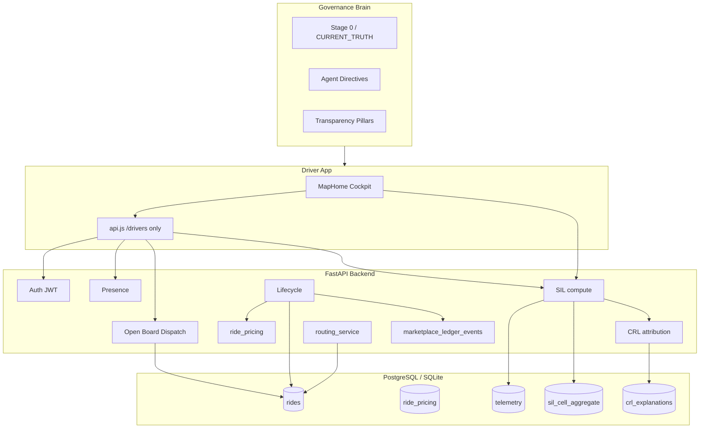

# HalfApp Driver — Program, System, and Brain: Comprehensive Expert Report

**Document ID:** `HALFAPP_PROGRAM_BRAIN_COMPREHENSIVE_REPORT_04`  
**Date:** 2026-05-23  
**Audience:** Program owner, senior engineers, external experts, investors with technical depth  
**Repository:** `halfapp-driver` (private)  
**Purpose:** Single authoritative “big picture” for deciding the **next phase** — what exists, what the brain is, what is strong, what is weak, and what must not be mistaken for finished product.

**Companion documents (operational, not duplicated here):**

| Doc | Role |
|-----|------|
| `docs/CURRENT_TRUTH.md` | Short PR-review truth table |
| `docs/HALFAPP_PARTNER_COMPLETION_PACKAGE_01.md` | External expert questionnaire (v6.0) |
| `docs/HALFAPP_AGENT_ACTION_DIRECTIVES.md` | Agent execution order |
| `docs/BACKLOG.md` | Ticket classification + P0/P1/P2 queue |
| `docs/HALFAPP_TRANSPARENCY_ARCHITECTURE.md` | Five-pillar contract |
| `docs/PRODUCT_BOUNDARY_STAGE0.md` | Stage 0 lock — forbidden claims |

---

# Part I — Executive Summary

## 1.1 One-paragraph verdict

**HalfApp Driver** is a **driver-side ride marketplace MVP** built as FastAPI + SQLAlchemy + Alembic on the backend and React/Vite (Leaflet map cockpit) on the frontend. The backend is the **single source of truth** for ride lifecycle, open-board dispatch (first atomic claim wins), driver presence, integer-cent pricing records, route-provider metadata, notifications, and rule-based “city intelligence” overlays (SIL + CRL). The program has crossed a critical threshold: it is no longer a mock-heavy demo — it is a **narrow but auditable product spine** with hundreds of automated proofs. It is **not** a production marketplace, city-scale mobility OS, payment processor, or ML-driven dispatch engine. The highest-value next step is **staging proof** (PostgreSQL, OSRM runtime, owner-car day) and **shrinking ambiguity** (dual spines, doc/test drift, runtime gaps) — not feature sprawl.

## 1.2 What “the brain” means in this repository

| Layer | What it is | Where it lives |
|-------|------------|----------------|
| **Governance brain (primary)** | Truth boundaries, execution order, forbidden claims, phased acceptance | `docs/HALFAPP_*`, `CURRENT_TRUTH.md`, agent directives, Stage 0 lock |
| **Marketplace decision engine** | Rule-based SQL policies — dispatch, lifecycle guards, eligibility | `backend/services/dispatch.py`, `lifecycle.py`, `claim_eligibility.py` |
| **Spatial intelligence (SIL)** | H3 aggregates, busy/slow scores, confidence gates | `sil_compute.py`, `routes/sil.py`, migrations `0030` |
| **City reality (CRL)** | Rule-based cause attribution over SIL snapshots | `crl_attribution.py`, `routes/crl.py`, migrations `0031` |
| **Fleet telemetry brain** | GPS speed samples → slow-zone heat (not paid traffic APIs) | `driver_telemetry_point`, `fleet_traffic_heatmap.py` |
| **Transparency memory (UI)** | Displays backend 409 conflict proof — not cognition | `ConflictTransparencyMemory.jsx` |
| **Engineering Intelligence shell** | Dev-only local context panel — no external AI on ride path | `#/engineering-intelligence`, flag-gated |
| **video-gate agents** | Motion auditor for generated video — **isolated** from ride product | `video-gate/core/agents/` |

There is **no** in-process LLM on dispatch, pricing, or lifecycle. Optional `engineering_assistant` proxy exists but is **disabled by default** and not wired to the ride cockpit.

The brain exists because the repository **looks larger than it is**. Dormant routers, legacy `frontend/`, dossier endpoints, payment schema depth, and map overlays resemble a finished Uber-class stack. The governance brain prevents **illusion-driven engineering**.

## 1.3 Strategic posture (fixed product decisions)

| Decision | Current choice | Implication |
|----------|----------------|-------------|
| Dispatch | **Open board** — pool visible to eligible drivers; claim by ride ID; first atomic claim wins | Not nearest-driver auto-assign; changing this is a product fork |
| Payments | **Calculation record** — `ride_pricing` integer cents + `settlement_entries` obligations | No “driver got paid to bank” without deposit proof |
| Routing honesty | OSRM self-hosted **code GO**; runtime **NO_GO** until Docker/VPS proof | Fallback = `haversine_fallback` — must be labeled |
| Geography | Portland/Oregon extract prepared (`docker/osrm-portland/`) | Not multi-city ops |
| Active surfaces | `backend/` + `driver-app/` only | `frontend/`, unmounted routers = not product |

## 1.4 Measured health (2026-05-23 run on this machine)

| Gate | Result | Notes |
|------|--------|-------|
| Backend pytest | **335 passed, 4 failed, 3 skipped** (~142s) | Failures are **route-surface freeze** tests out of sync with expanded API (SIL, CRL, payments, telemetry) — not core lifecycle regressions |
| Driver unit tests | **125 passed** | Plus `assert-no-ai-providers` and `assert-no-money-claims` scripts |
| Alembic head | **`0031_crl_foundation`** | 31 migration files `0001`–`0031` |
| Ride-flow E2E | Documented **GO** per `RIDE_FLOW_UI_PROOF_V0_2_STATUS.md` | Requires API + driver-app ports |
| OSRM runtime | **NO_GO** | `SELF_HOSTED_ROUTING_PROOF_V0_1_STATUS.md` — blocked on Windows dev without Docker |

**Doc drift warning:** Some docs still cite “254 passed” or “342 tests”; treat **fresh pytest output** as ground truth and update `CURRENT_TRUTH.md` when stabilizing the four failing surface-freeze tests.

## 1.5 Recommended next phase (90-day framing)

1. **P0 — Staging spine:** PostgreSQL hosting, Alembic on PG, repeat 10-driver claim race in CI, OSRM runtime proof, CORS/deploy, owner-car internal week.  
2. **P1 — Driver-complete:** Session recovery mid-ride, network UX, stale presence policy, notifications product polish, OpenAPI drift CI.  
3. **P1 — Brain ops:** SIL/CRL background workers (today: recompute-on-read pattern), telemetry retention policy.  
4. **P2 — Business forks (one at a time):** External beta checklist, rider app, Stripe pilot — only after honesty gates.

---

# Part II — Repository Topology

## 2.1 Top-level layout

```
halfapp-driver/
├── backend/           # Active API — FastAPI, SQLAlchemy, Alembic, 65+ services
├── driver-app/        # Active driver UX — React 18, Vite 7, Leaflet, Playwright E2E
├── docs/              # Governance brain — truth, directives, acceptance reports (~100+ MD files)
├── frontend/          # INACTIVE legacy multi-role UI
├── video-gate/        # INACTIVE for ride product — video motion QA tooling
├── docker/osrm-portland/  # OSRM extract prep — runtime proof pending
├── scripts/           # Route printers, verification helpers
└── wind/              # (if present) experimental — not ride spine
```

## 2.2 Active entry points

| Entry | File | Responsibility |
|-------|------|----------------|
| API process | `backend/main.py` | Router registration, CORS, rate limit, migration at startup |
| Driver UI | `driver-app/src/App.jsx` | HashRouter routes: portal, `/driver` cockpit, trips, earnings, notifications, profile, settings |
| API client boundary | `driver-app/src/utils/api.js` | **Must** use `/drivers/*` + `/auth/*` only — no dossier |
| Lifecycle contract | `docs/RIDE_LIFECYCLE_CONTRACT.md` | Canonical transition vocabulary |

## 2.3 Inactive surfaces (review hazard)

| Surface | Risk if misread |
|---------|-----------------|
| `frontend/` | Looks like a full app; not mounted on active API |
| Dormant routers (`routes/admin.py`, `routes/rides.py` legacy, etc.) | Code exists; **not** in `main.py` unless noted |
| Dossier spine `/supply`, `/demand`, `/trip` | Mounted only when `HALFAPP_DOSSIER_SPINE_ENABLED=1`; driver app must not call |
| Dormant driver components | `Dashboard.jsx`, `AdminDashboard.jsx`, diagnostic panels — not imported by `App.jsx` |
| Payment/Stripe modules | Schema + flag-gated routes exist; **not** marketed wallet product |
| `video-gate/` | Separate agent orchestration for video — confuses “AI brain” narrative |

---

# Part III — The Brain in Depth

## 3.1 Governance brain — three coupled functions

### Function A: Truth boundary

**Mechanism:** Stage 0 lock (`PRODUCT_BOUNDARY_STAGE0.md`) + `CURRENT_TRUTH.md` state table.

**What it enforces:**

- Only `backend` + `driver-app` count as product.
- Forbidden claims list: no live traffic APIs, no production OSRM without proof, no payout-to-bank UI language, no rider app, no nearest-driver matching marketing, no geocoding proof.
- Simulation rides must be labeled (`lifecycle_reason=simulation`).
- Money UI must say “calculation record” / obligation language — enforced by `assert-no-money-claims.mjs` on 77 driver-facing files.

**Strength:** Prevents investor/demo language from outrunning backend proof.  
**Weakness:** Large doc surface; agents and humans can cite stale reports (e.g. old test counts).

### Function B: Architecture target (transparency pillars)

From `HALFAPP_TRANSPARENCY_ARCHITECTURE.md`:

| Pillar | Intent | v0.1 status |
|--------|--------|-------------|
| 1. Anti-black-box ledger | Every consequential fact auditable | **Partial GO** — `marketplace_ledger_events`, claim attempts, transparency endpoint |
| 2. Dispatch transparency | Why driver saw / lost ride | **GO** for open board — visibility, 409 proof, policy version on pool |
| 3. Financial transparency | Integer cents, locked on complete | **GO** — `ride_pricing`; not PSP settlement |
| 4. Route transparency | Provider + fallback honest | **Partial** — metadata on ride; OSRM runtime NO_GO |
| 5. Presence transparency | Backend-owned online state | **GO** — presence table, heartbeat, stale derivation |

**Core principle (non-negotiable):**

> Every important driver-facing fact must come from durable backend truth, not frontend inference.

### Function C: Execution order

`HALFAPP_AGENT_ACTION_DIRECTIVES.md` defines nine actions + P0 lanes (AUTH-001, RIDE-001/002/003, DRIVER-001B/002). **Closed lanes must not be reopened** without explicit rescope — prevents endless rewrites of claim-lock and lifecycle guards.

| Closed lane | What was proven |
|-------------|-----------------|
| AUTH-001 | JWT middleware + RBAC on active routes |
| RIDE-001 | State machine guards, structured 409 `invalid_state_transition` |
| RIDE-002 | `SELECT FOR UPDATE` + conditional UPDATE claim; 10-driver race on SQLite |
| RIDE-003 | Sequential cascade when `HALFAPP_OPEN_BOARD_DISPATCH=0` |
| DRIVER-001B | Presence busy guards |
| DRIVER-002 | Admin approval workflow gates online/accept |
| TEST-ISOLATION-01 | Per-test DB wipe in pytest |
| SECRET_KEY guard | Production unsafe secret rejection |
| E2E ride-flow lock | Playwright full claim→complete path |

## 3.2 Operational “brains” (runtime, not docs)

### Open-board dispatch engine

**File:** `backend/services/dispatch.py` — `OpenBoardDispatchPolicy`

**Behavior:**

1. `get_available_rides` — `REQUESTED` rides with `driver_id IS NULL`, not hidden for this driver, ordered by `created_at`, optionally ranked via `rank_available_rides`.
2. `claim_ride` — lock ride row `FOR UPDATE`, then conditional `UPDATE` requiring `driver_id IS NULL` and `status = requested`. Exactly one winner; losers get `RideAlreadyClaimed` / structured HTTP 409 with transparency payload.

**This is not:**

- A worker queue with `SKIP LOCKED` scanning for next job.
- ML ranking (ranking is deterministic rule-based metadata).
- Geo-fenced auto-assign.

**Strength:** Simple, testable, matches product story (“drivers choose rides”).  
**Weakness:** Hot-spot contention on popular rides; no fairness rotation; PostgreSQL proof needed in CI (test exists: `test_postgres_claim_race_proof_01.py`, requires `DATABASE_URL`).

### Lifecycle engine

**Files:** `lifecycle.py`, `v01_lifecycle.py`, `transition_errors.py`

Canonical path: `requested → accepted → driver_arrived → in_progress → completed` (plus cancel terminals).

Guards return structured errors — not silent state corruption. Completion triggers pricing lock and settlement obligation rows.

### Pricing brain (ledger, not bank)

**Files:** `ride_pricing.py`, `pricing_service.py`, `pricing_policy_loader.py`

- All money in **integer cents**.
- Quote at accept/offer; completion sets `financial_locked`.
- UI helper: `ridePricingDisplay.js` separates driver-shareable vs customer total.

**Parallel confusion risk:** Dossier `ledger_*` tables — **not** driver-app financial truth.

### Routing brain

**Files:** `routing_service.py`, `osrm_self_hosted_provider.py`, `map_route_foundation.py`

- Attempts OSRM HTTP when configured.
- On failure with `ROUTING_FALLBACK_ENABLED`: haversine distance — stamps `used_fallback=true`, `route_provider=haversine_fallback`.
- **Honesty contract:** UI must not imply road network accuracy in fallback mode.

### SIL — Street Intelligence Layer

**Files:** `sil_compute.py`, `sil_h3.py`, `sil_gates.py`, `sil_labels.py`, `sil_map.py`  
**Models:** `sil_cell_aggregate`, `driver_telemetry_point`  
**Migration:** `0030_sil_foundation`

**Computation (rule-based, not ML):**

- Bucketed time windows (default 5-minute buckets, 30-minute lookback).
- Aggregates per H3 cell: demand count (open rides), supply idle (online drivers), telemetry speeds.
- Scores via sigmoid; confidence gates (`sil_gates.py`) suppress low-sample cells.
- Recompute triggered on map read paths (no dedicated worker queue yet).

**Strength:** Honest about being aggregate/heuristic; no paid traffic API dependency.  
**Weakness:** Cold-start cells empty; recomputed synchronously on read — latency at scale; not forecast-grade.

### CRL — City Reality Layer

**Files:** `crl_attribution.py`, `crl_causes.py`, `crl_zones.py`, `crl_compute.py`  
**Models:** `crl_cell_snapshot`, `crl_cell_explanation`, `crl_time_pattern`, `zone_catalog`, `city_event`  
**Migration:** `0031_crl_foundation`

**Computation:**

- Rule-based scoring: commute hours, demand vs baseline, nearby `city_event`, zone catalog, SIL snapshot inputs.
- Outputs driver-readable cause labels — not predictions.

**Strength:** Explainability without black-box ML.  
**Weakness:** Baselines sparse until data accumulates; admin must curate `city_event` and zones.

### Fleet telemetry

- `POST /drivers/me/telemetry` ingests GPS points (~5s cadence in docs).
- Feeds SIL speeds and `GET /drivers/me/traffic-heatmap` (fleet-derived slow zones).
- **Not** TomTom/Mapbox live traffic.

### Transparency / conflict brain

- `RideClaimAttempt` rows + `GET /drivers/rides/{id}/transparency`.
- 409 responses include proof for losers — UI `ClaimConflictNotice` + `ConflictTransparencyMemory`.
- Append-only `marketplace_ledger_events` with hash chain for audit.

## 3.3 What the brain deliberately refuses to do

| Refused capability | Why |
|--------------------|-----|
| Auto nearest-driver dispatch | Product fork — open board is intentional |
| Live official traffic | No vendor contracts; honesty policy |
| ML demand forecasting | Insufficient honest data; would mislead |
| LLM ride decisions | No model governance; liability |
| Frontend-as-source-of-truth | Violates transparency mission |
| Greenfield rewrite | Alembic history and `/drivers/*` API are assets |

---

# Part IV — Backend Architecture

## 4.1 Stack and boot sequence

| Component | Technology |
|-----------|------------|
| Framework | FastAPI 0.1.0 API title |
| ORM | SQLAlchemy |
| Migrations | Alembic `0001`–`0031`, `run_migrations(engine)` at import |
| Auth | JWT + refresh token rotation (`0016`) |
| Rate limit | `AuthRateLimitMiddleware` |
| Production guards | `production_guards.py` — SECRET_KEY, CORS origins |

**Boot imports 30+ model modules** before router mount — explicit table registration pattern.

## 4.2 Mounted routers (as of `main.py`)

| Router | Prefix / area | Product role |
|--------|---------------|--------------|
| `auth` | `/auth` | Register, login, me |
| `drivers` | `/drivers` | **Primary driver surface** (~40 endpoints) |
| `traffic_signals` | experimental regional signals | Not commercial traffic |
| `sil` | SIL map API | Intelligence overlay |
| `crl` | CRL explain API | Cause labels |
| `internal` | `/internal` | system-health |
| `admin_driver_approval` | `/admin/drivers` | Approval workflow |
| `admin_crl` | CRL admin | Zone/event curation |
| `engineering_assistant` | disabled by default | Optional Anthropic proxy |
| `notifications` | `/notifications` | In-app notifications |
| `rider_rides` | `/rides` | Rider create/cancel API only |
| `payments_*` | webhooks, Stripe Connect, admin | Flag-gated; not marketed |
| `dossier_marketplace` | `/supply`, `/demand`, `/trip` | **Only if** `HALFAPP_DOSSIER_SPINE_ENABLED=1` |

## 4.3 Driver API surface (high-signal endpoints)

**Presence & status**

- `GET/PUT /drivers/presence`, `POST /drivers/heartbeat`
- `GET/PATCH /drivers/me/status`, `PATCH /drivers/me/location`
- `POST /drivers/me/telemetry`, `GET /drivers/me/traffic-heatmap`

**Marketplace**

- `GET /drivers/available-rides` — open board pool
- `POST /drivers/accept-ride/{ride_id}` — atomic claim
- `POST /drivers/decline-ride/{ride_id}`, `decline-dispatch`, `hide`, `dismiss-ride`
- `POST /drivers/simulate-ride` — dev/owner testing

**Lifecycle**

- `arrive-pickup`, `start-ride`, `complete-ride`

**Truth & audit**

- `GET .../transparency`, `.../audit`, `.../route-snapshots`, `.../settlement`
- `GET /drivers/me/trips`, `.../export.csv`

**Money (calculation / reconciliation — flag-gated)**

- `GET /drivers/earnings`
- `GET /drivers/me/payment-reconciliation`, `payment-executions`, `payouts`

**Profile & settings**

- `GET/PUT /drivers/me/profile`, `me/settings`

## 4.4 Data model inventory (conceptual)

| Domain | Tables / models | Maturity |
|--------|-----------------|----------|
| Users & drivers | `User`, `driver_profile`, `driver_approvals`, `driver_status` | Production-shaped |
| Rides | `Ride`, dispatch log, visibility, claim attempts | Core spine GO |
| Presence | `driver_presence` | GO |
| Pricing | `ride_pricing`, `pricing_policy` | GO — integer cents |
| Settlement | `settlement_entries` | Obligation rows only |
| Routes | `route_snapshots`, ride route fields | Foundation — limited UI |
| Ledger audit | `marketplace_ledger_events` | GO append-only |
| Payments | Stripe accounts, executions, events, payouts | Schema + phases 1–5 tests; UI claims guarded |
| Dossier | supply/demand/trip ledger | Parallel — not driver truth |
| Telemetry | `driver_telemetry_points` | GO ingest |
| SIL | `sil_cell_aggregate` | v0.1 GO |
| CRL | snapshots, explanations, patterns, zones, events | v0.1 GO |
| Comms | `ride_messages`, `driver_support_ticket` | Backend exists; UI partial |

## 4.5 Services layer (65 files)

Grouped by responsibility:

| Group | Examples |
|-------|----------|
| Marketplace core | `dispatch`, `lifecycle`, `claim_eligibility`, `presence`, `transparency`, `ledger` |
| Driver product | `driver_trips`, `driver_status_service`, `driver_profile_service`, `driver_app_settings_service` |
| Money | `ride_pricing`, `ride_settlement`, `pricing_service`, `payment_execution`, `stripe_*` |
| Routing | `routing_service`, `osrm_*`, `map_route_foundation`, `navigation_service` |
| Intelligence | `sil_*`, `crl_*`, `fleet_traffic_heatmap`, `traffic_signals_service` |
| Dossier (parallel) | `dossier_dispatch`, `dossier_ledger`, `trip_service` |
| Safety | `rbac`, `rate_limit`, `production_guards`, `driver_idempotency` |

## 4.6 Dispatch modes (feature flags)

| Flag | Mode |
|------|------|
| `HALFAPP_OPEN_BOARD_DISPATCH=1` (default product) | Shared pool, driver picks ride |
| `HALFAPP_OPEN_BOARD_DISPATCH=0` | RIDE-003 sequential cascade — timeout, attempts, `no_drivers_available` |

Both are tested — do not conflate them in documentation.

## 4.7 Security posture

| Control | Status |
|---------|--------|
| JWT on driver routes | GO |
| RBAC role claims | GO |
| Refresh rotation | GO |
| Auth rate limiting | GO |
| Production SECRET_KEY guard | GO |
| CORS explicit origins | PARTIAL — production list required |
| Engineering assistant | Off by default |
| Idempotency replays | `driver_idempotency_replay` for sensitive POSTs |

---

# Part V — Driver Application Architecture

## 5.1 Stack

| Layer | Choice |
|-------|--------|
| UI | React 18 |
| Build | Vite 7 |
| Routing | react-router-dom 6 (HashRouter) |
| Map | Leaflet 1.9 + OpenStreetMap tiles |
| Styling | Tailwind + component CSS |
| E2E | Playwright (ride-flow, audit-flow, route-truth, cockpit suites) |

## 5.2 Route map (`App.jsx`)

| Path | Screen |
|------|--------|
| `/`, `/login` | `HalfAppDriverPortalFrontPage` |
| `/driver` | `MapHome` — primary cockpit |
| `/trips`, `/trips/:id/audit` | Trip list + audit receipt |
| `/earnings` | Earnings projection |
| `/notifications` | Notification center |
| `/profile`, `/settings` | Profile + `DriverSettings` |
| `#/engineering-intelligence` | Lazy-loaded — dev flag only |

**Auth:** `ProtectedRoute` with JWT in `localStorage`; dev guard bypass flag exists but blocked in production build by `assert-prod-truth.mjs`.

## 5.3 Cockpit composition (`MapHome.jsx` ecosystem)

The cockpit is decomposed into **shell + panels** (good separation):

| Component | Role |
|-----------|------|
| `DriverCockpitShell` / `DriverMapShell` | Layout chrome |
| `MapView` | Leaflet map, layers |
| `MarketplaceBottomSheet` | Offer list |
| `RideRequestCard` | Active ride actions |
| `RouteTruthDetails` / `TripTruthDetails` | Provider metadata display |
| `StreetIntelligencePanel` / `SilMapLayer` | SIL overlay |
| `CityRealityPanel` | CRL explanations |
| `TrafficHeatLayer` | Fleet slow-zone heat |
| `ClaimConflictNotice` | 409 transparency |
| `BetaTruthNotice` / `BetaFirstRunAck` | Honesty copy |
| `CockpitNetworkBanner` | Offline/degraded UX |
| `RideNavigationPanel` | Google Maps external links |
| `RideChatPanel` | In-ride messages |

**Dormant/not in active tree:** `Dashboard`, `AdminDashboard`, `AuthDebugger`, `SimpleDashboard`, many demo components.

## 5.4 Frontend discipline (strengths)

| Guard | File |
|-------|------|
| No AI provider strings in src | `scripts/assert-no-ai-providers.mjs` |
| No forbidden payment language | `scripts/assert-no-money-claims.mjs` |
| Prod build blocks mock/bypass | `scripts/assert-prod-truth.mjs` prebuild |
| API boundary | `api.js` — `/drivers/*` only |

## 5.5 Frontend gaps

| Gap | Impact |
|-----|--------|
| Session recovery mid-ride | Refresh may lose cockpit context until backend resume endpoint used consistently |
| WebSocket / SSE | Polling/REST only — offer latency |
| Background geolocation | Web limitation — PWA/native fork later |
| Map while driving | UX safety not fully validated |
| Route snapshot read UI | Backend exists; driver UI uses ride fields primarily |
| Trust E2E lane | 3 failures noted in truth sync doc — flaky dismiss/409 UI |

---

# Part VI — Testing & Proof Culture

## 6.1 Backend test taxonomy (~342 test functions in tree; 339 collected in last run)

| Category | Example files |
|----------|---------------|
| Claim concurrency | `test_ride_claim_lock_concurrency.py` |
| Lifecycle | `test_ride_001_transition_guards.py`, `test_ride_lifecycle.py` |
| Dispatch cascade | `test_ride_003_dispatch_cascade.py` |
| Pricing | `test_pricing_ledger_v01.py` |
| OSRM | `test_osrm_self_hosted_routing.py` (mocked), `test_osrm_runtime_proof_portland.py` |
| SIL/CRL | `test_sil_v01.py`, `test_crl_v01.py` |
| Payments phases | `test_payment_execution_*.py`, `test_stripe_*.py` |
| Production guards | `test_production_guards.py` (27 tests) |
| Postgres claim race | `test_postgres_claim_race_proof_01.py` (skips without PG URL) |

## 6.2 Driver tests

- **125** unit tests (`node --test tests/unit/**/*.test.js`)
- Playwright: `test:e2e:ride-flow` (primary proof), plus audit, route-truth, cockpit suites

## 6.3 Proof documents (acceptance brain outputs)

The `docs/` folder contains dozens of `*_REPORT.md` and `*_STATUS.md` files — each closes a lane with evidence. This is unusual and valuable: the project **versions truth** like code.

**Risk:** Reports contradict if not reconciled (truth sync orders exist for this reason).

## 6.4 Current test failures (actionable)

| Test | Likely cause |
|------|--------------|
| `test_active_route_surface_is_driver_only_mvp` | Frozen `ACTIVE_PATHS` set missing SIL, CRL, payments, telemetry, trips export, messages |
| `test_dossier_routes_not_mounted_by_default` | Expectation drift vs env |
| `test_alembic_head_includes_*` | Head moved to `0031`; tests expect older head set |

**Recommendation:** Refresh surface-freeze tests or generate OpenAPI snapshot in CI — ticket 1.3 in backlog.

---

# Part VII — Strengths (Detailed)

## 7.1 Product & architecture

1. **Clear product thesis** — transparency-first driver marketplace, not black-box gig app.  
2. **Backend authority** — rare discipline for MVP; UI guards enforce it.  
3. **Open-board dispatch** — simple mental model; matches early liquidity strategy.  
4. **Atomic claim pattern** — correct primitive (`FOR UPDATE` + conditional UPDATE); industry-standard.  
5. **Structured failure** — 409s with proof, not generic errors.  
6. **Integer-cent money** — avoids float bugs; pricing lock on complete.  
7. **Honest routing fallback** — explicit `haversine_fallback` provider string.  
8. **Separation of calculation vs settlement** — legal/product clarity.  

## 7.2 Engineering process

9. **Governance doc stack** — Stage 0, CURRENT_TRUTH, agent directives reduce agent/human hallucination.  
10. **Closed P0 lanes** — prevents infinite rewrite of core dispatch.  
11. **Alembic from early** — 31 migrations; schema evolution tracked.  
12. **Per-test DB isolation** — pytest conftest wipe — stable suite.  
13. **E2E ride-flow lock** — full journey proof, not just unit tests.  
14. **Production build guards** — mock mode cannot ship silently.  
15. **Forbidden language scripts** — money and AI claims policed in CI.  

## 7.3 Intelligence (without overclaiming)

16. **SIL/CRL rule-based** — explainable; test-covered; no fake ML.  
17. **H3 spatial index** — appropriate for hex aggregation at city scale.  
18. **Fleet telemetry** — uses own driver GPS — honest slow zones.  
19. **City events & zones** — human-curatable CRL inputs.  

## 7.4 Extensibility hooks

20. **Dispatch policy abstraction** — `BaseDispatchPolicy` allows alternate policies behind flags.  
21. **Route snapshots table** — future proof UI without schema panic.  
22. **Payment phases 1–5** — incremental Stripe path without forcing UI lies.  
23. **Dossier spine optional** — env-gated — can delete or merge later.  
24. **Admin approval API** — exists for internal pilot.  

---

# Part VIII — Weaknesses & Risks (Detailed)

## 8.1 Production blockers (P0)

| Risk | Severity | Detail |
|------|----------|--------|
| PostgreSQL not default dev DB | **Critical** | Claim lock proven on SQLite; PG race test manual |
| OSRM runtime NO_GO | **High** | Code path mocked; no road-accurate distance in prod |
| No staging environment doc | **High** | Owner-car week blocked without deploy runbook |
| CORS/deploy partial | **Medium** | Needs explicit origin lists per environment |
| Observability gap | **Medium** | Metrics tests exist; no described prod APM/alert pack |

## 8.2 Architectural debt

| Debt | Consequence |
|------|-------------|
| **Dual marketplace spine** | `/drivers/*` vs dossier `/supply|demand|trip` — confusion, duplicate concepts |
| **Schema breadth > product depth** | Payments, dossier ledger, many models — looks “done” |
| **Doc/test drift** | Surface freeze tests failing; outdated pass counts in CURRENT_TRUTH |
| **`ensure_ride_lifecycle_columns()`** | Runtime patch parallel to Alembic — SQLite legacy |
| **SIL/CRL on-read compute** | Will not scale; needs worker/cron |
| **No WebSocket** | Stale offers; polling cost |
| **SQLite-oriented CHECK constraints** | PG migration needs boolean check stripping (see postgres test hack) |

## 8.3 Product gaps

| Gap | User impact |
|-----|-------------|
| No rider app | Only API — limits end-to-end marketplace demo |
| No geocoding proof | Addresses are labels on supplied coordinates |
| No push notifications | Drivers must keep app open |
| Session recovery incomplete | Mid-ride refresh risky |
| Admin console minimal | Ops depend on DB/scripts |
| External beta deferred | Correct per policy — but delays learning |
| Map cockpit driving safety | Not validated for moving vehicle UX |

## 8.4 Intelligence limitations (honest)

| Limitation | Why it matters |
|------------|----------------|
| Cold-start H3 cells | Empty map at launch |
| No forecast honesty | Cannot predict surge without data policy |
| Rule-based CRL | Misses novel causes (construction without event row) |
| 5s GPS cadence | Battery + data; may be coarse for SIL |
| No retention policy | `driver_telemetry_points` growth unbounded |
| Experimental traffic signals | Easy to misread as “live traffic” |

## 8.5 Organizational / process risks

| Risk | Mitigation |
|------|------------|
| Repository size intimidates new experts | This report + PARTNER_COMPLETION_PACKAGE |
| Too many docs | Index: CURRENT_TRUTH → BACKLOG → this report |
| Agent over-build | Closed lanes + Stage 0 |
| Payment schema tempts “flip switch” marketing | assert-no-money-claims + legal gate |

---

# Part IX — Inventory: What Exists vs What Does Not

## 9.1 EXISTS (may claim with tests)

- [x] Driver JWT auth + refresh rotation  
- [x] Driver approval gate (admin API)  
- [x] Backend-owned presence + heartbeat + stale states  
- [x] Open-board dispatch + claim lock + 409 transparency  
- [x] Sequential dispatch cascade (flag off)  
- [x] Ride lifecycle with guards  
- [x] Ride hide/dismiss + visibility TTL  
- [x] Marketplace ledger events (append-only)  
- [x] `ride_pricing` integer-cent quote/complete + financial lock  
- [x] `settlement_entries` obligation rows  
- [x] Trip list, filters, CSV export  
- [x] Earnings summary from completed rides  
- [x] Trip audit receipt API + UI  
- [x] In-app notifications on lifecycle  
- [x] Driver profile + app settings  
- [x] Ride messages + support ticket API  
- [x] Route provider metadata on rides  
- [x] OSRM code path (mocked tests)  
- [x] SIL map layer + CRL explain API  
- [x] Fleet telemetry ingest + heatmap  
- [x] Leaflet/OSM cockpit map  
- [x] External Google Maps navigation links  
- [x] Rider API: create + cancel ride  
- [x] Simulation rides (flagged)  
- [x] Rate limiting on auth  
- [x] Production SECRET_KEY guard  
- [x] Engineering Intelligence shell (local only, flag)  
- [x] Playwright ride-flow E2E (documented GO)  
- [x] Stripe/payment **code** behind flags (phases tested)  

## 9.2 PARTIAL (foundation only — label honestly)

- [~] OSRM production routing (runtime proof)  
- [~] Route snapshots UI (table + API; limited driver read)  
- [~] CORS production config  
- [~] Notifications product polish  
- [~] Cockpit session resilience  
- [~] OpenAPI contract drift CI  
- [~] Postgres CI matrix  
- [~] Payment execution (flags; no bank deposit UI)  
- [~] Admin CRL curation tools  
- [~] Traffic signals (experimental)  

## 9.3 DOES NOT EXIST (forbidden to claim)

- [ ] Nearest-driver auto-dispatch product  
- [ ] Rider mobile/web app  
- [ ] Live official traffic / TomTom / Mapbox traffic product  
- [ ] ML demand forecasting or LLM dispatch  
- [ ] Production geocoding / address proof  
- [ ] Marketed live ETA product  
- [ ] Driver paid-to-bank UI proof  
- [ ] Wallet / instant pay product  
- [ ] Multi-city ops / airport rules / fleet command center  
- [ ] WebSocket real-time offer push  
- [ ] Background GPS on web (without PWA/native)  
- [ ] Full ops admin dashboard  
- [ ] External trusted-driver beta (deferred)  
- [ ] Oregon PBOT commercial compliance pack (unless scoped)  
- [ ] Vector DB / embeddings / ride-hailing RAG  

---

# Part X — Parallel Systems & Confusion Matrix

| System | Relationship to active product | Recommendation |
|--------|-------------------------------|----------------|
| `frontend/` legacy | None — archive | Keep README warning |
| Dossier spine | Parallel ledger/dispatch experiment | **Path A:** delete **Path B:** merge — document decision (P0 backlog) |
| `video-gate` | Separate product | Exclude from HalfApp Driver pitches |
| Payments schema | Future fork | Keep flags off in staging |
| Engineering assistant | Dev-only optional | Never mount in prod without review |
| Sequential cascade | Alternate dispatch mode | Document flag; don't demo both at once |

---

# Part XI — End-to-End Data Flow (Reference)



**Rider path (minimal):** Rider client → `POST /rides/` → ride in `requested` → appears in open board → driver claims → shared lifecycle.

---

# Part XII — Migration & Schema Timeline

| Range | Theme |
|-------|-------|
| 0001–0004 | Hardened schema, ride status contract, indexes |
| 0005–0006 | Marketplace ledger events, dossier foundation |
| 0007–0008 | v0.1 pricing + pricing policy |
| 0009 | Traffic signal aware fields |
| 0010 | Route snapshots |
| 0011 | Settlement entries |
| 0012–0016 | Driver approval, status, dispatch cascade, refresh tokens |
| 0017–0023 | Payment execution + Stripe tables |
| 0024–0029 | Driver profile, settings, idempotency, password reset, messages, telemetry |
| 0030–0031 | SIL + CRL foundations |

**Head:** `0031_crl_foundation`

---

# Part XIII — Environment & Flags (Operator Reference)

| Variable | Effect |
|----------|--------|
| `HALFAPP_OPEN_BOARD_DISPATCH` | `1` open board (default product), `0` cascade |
| `HALFAPP_DOSSIER_SPINE_ENABLED` | Mounts dossier routes |
| `ROUTING_FALLBACK_ENABLED` | Haversine when OSRM down |
| `PAYMENTS_ENABLED` | Payment execution routes |
| `PAYOUTS_ENABLED` | Payout visibility |
| `ENGINEERING_ASSISTANT_ENABLED` | Anthropic proxy routes |
| `VITE_ENABLE_ENGINEERING_INTELLIGENCE` | Driver dev panel |
| `DATABASE_URL` | PostgreSQL for PG proof tests |

---

# Part XIV — Next Step Playbook

## 14.1 Decision gates before expanding scope

| Gate | Question |
|------|----------|
| G1 | Did PostgreSQL 10-driver claim race pass in CI? |
| G2 | Did OSRM runtime proof show `osrm_self_hosted` + `used_fallback=false` on 3 PDX routes? |
| G3 | Did owner complete one full day on staging (online → claim → complete → audit)? |
| G4 | Is dossier Path A or B documented? |
| G5 | Are surface-freeze tests green again? |

## 14.2 Recommended build order (agrees with partner package)

1. **P0 staging spine** — PG, deploy, OSRM, CORS, observability baseline, runbook  
2. **P1 driver polish** — session recovery, network banner behavior, notifications UI, stale presence policy  
3. **P1 brain ops** — SIL/CRL workers, telemetry retention, map explain UX priority  
4. **P2 forks (one at a time)** — external beta checklist, rider app, Stripe pilot, native app  

## 14.3 What NOT to do next (brain forbids)

- Greenfield rewrite abandoning `/drivers/*` and Alembic  
- Nearest-driver dispatch without open-board tradeoff analysis  
- Marketing live traffic or road-accurate routing under fallback  
- “Driver got paid” copy without bank proof  
- External driver beta before staging + owner-car week  
- Adding LLM to dispatch to “make it smart”  

## 14.4 Expert engagement alignment

Use `docs/HALFAPP_PARTNER_COMPLETION_PACKAGE_01.md` for vendor Q&A. This report gives **internal** depth; the partner package elicits **external** answers on infra, compliance, and ROM.

---

# Part XV — File Index for Deep Review

| Area | Paths |
|------|-------|
| Claim / dispatch | `backend/services/dispatch.py`, `claim_eligibility.py`, `metrics.py` |
| Lifecycle | `backend/services/lifecycle.py`, `docs/RIDE_LIFECYCLE_CONTRACT.md` |
| Pricing | `backend/services/ride_pricing.py`, `models/ride_pricing.py` |
| Routing | `backend/services/routing_service.py`, `docker/osrm-portland/` |
| SIL | `backend/services/sil_compute.py`, `routes/sil.py` |
| CRL | `backend/services/crl_attribution.py`, `routes/crl.py` |
| Driver API | `backend/routes/drivers.py` |
| Frontend API | `driver-app/src/utils/api.js` |
| Cockpit | `driver-app/src/components/MapHome.jsx`, `cockpit/*` |
| Claim race test | `backend/tests/test_ride_claim_lock_concurrency.py` |
| Governance | `docs/CURRENT_TRUTH.md`, `HALFAPP_AGENT_ACTION_DIRECTIVES.md` |

**Verify commands:**

```powershell
cd c:\Users\him\Desktop\halfapp-driver\backend
py -3.11 -m pytest tests -q

cd c:\Users\him\Desktop\halfapp-driver\driver-app
npm test
npm run build
npm run test:e2e:ride-flow
```

---

# Part XVI — Scoring Rubric (Expert Self-Assessment)

Rate 1–5 (1 = prototype, 5 = production marketplace):

| Dimension | Score | Rationale |
|-----------|-------|-----------|
| Truth discipline / governance | **5** | Unusual doc + guard depth |
| Core dispatch correctness | **4** | Strong pattern; PG proof pending |
| Lifecycle integrity | **4** | Guarded + tested |
| Financial honesty | **4** | Integer ledger; payment UI guarded |
| Routing honesty | **3** | Fallback honest; OSRM runtime missing |
| Driver UX completeness | **3** | Cockpit rich; recovery/push gaps |
| Intelligence (SIL/CRL) | **3** | v0.1 explainable; not scaled |
| Ops / admin | **2** | Minimal |
| Test coverage | **4** | Broad; 4 surface tests drifting |
| Production readiness | **2** | Staging blockers remain |

**Overall:** **Strong v0.1 auditable spine** inside a **repository that looks like v1.0**. The brain’s job at the next step is to **keep that gap visible** while closing P0 proof lanes.

---

# Part XVII — Glossary

| Term | Meaning |
|------|---------|
| **Open board** | All eligible drivers see same pool; claim by ID |
| **Claim lock** | DB serialization + conditional update for one winner |
| **Calculation record** | `ride_pricing` row — not bank payment |
| **SIL** | Street Intelligence Layer — H3 aggregates |
| **CRL** | City Reality Layer — rule-based “why” |
| **Governance brain** | Docs + directives constraining truth |
| **Dossier spine** | Alternate `/supply|demand|trip` marketplace experiment |
| **GO / NO_GO** | Proof lane verdict — not generic “done” |
| **Owner-car week** | Internal operator runs full day on staging |

---

# Part XVIII — Closing Statement

HalfApp Driver is best understood as **two intertwined projects**:

1. **A ride marketplace spine** that already enforces backend truth, atomic dispatch, pricing ledger discipline, and growing map intelligence.  
2. **A governance brain** that prevents the spine from being drowned by schema noise, legacy folders, and demo visuals.

The next step is not “more features.” It is **proof at staging depth**: PostgreSQL, OSRM, one honest operator week, and reconciliation of parallel spines. Once those gates pass, the same brain should authorize **driver-complete** polish and **one business fork at a time** — never simultaneous illusions of rider app, payouts, and city-scale intelligence.

When this report conflicts with `CURRENT_TRUTH.md`, **run pytest and update CURRENT_TRUTH** — the operational table wins after verification.

---

**Version:** 4.0  
**Lines:** ~650  
**Author:** Program documentation pass (codebase + 2026-05-23 test run)  
**Next review trigger:** Alembic head change, P0 gate closure, or partner engagement start
