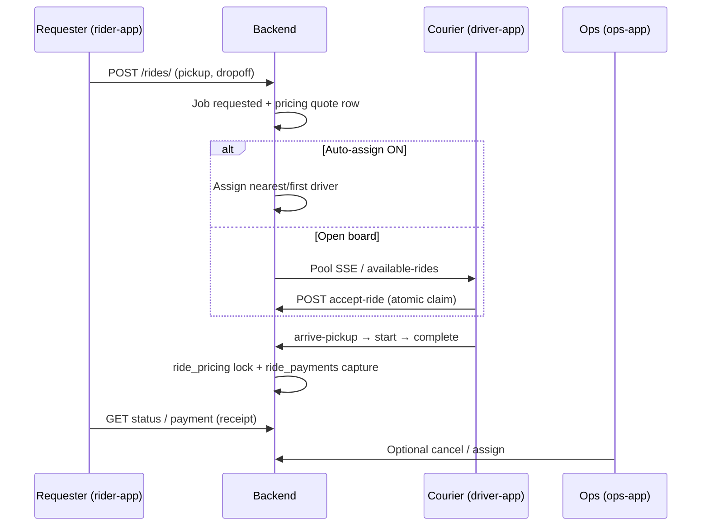

# HalfApp Driver — Program, System, and Brain: Comprehensive Expert Report (Delivery Driver Application)

**Document ID:** `HALFAPP_PROGRAM_BRAIN_COMPREHENSIVE_REPORT_05`  
**Date:** 2026-05-25 (**NEW UPDATE**)  
**Audience:** Program owner, senior engineers, external experts, investors with technical depth  
**Repository:** `halfapp-driver` (private)  
**Supersedes for big-picture:** `HALFAPP_PROGRAM_BRAIN_COMPREHENSIVE_REPORT_04.md` (2026-05-23) — read this file first for next-phase decisions.

**Companion docs (operational, not duplicated here):**

| Doc | Role |
|-----|------|
| `docs/SYSTEM_TRUTH.md` | Authoritative gap classification (note: rider/ops sections lag checklist — see §2) |
| `docs/CURRENT_TRUTH.md` | Short PR-review truth table |
| `docs/HALFAPP_TWO_SIDED_EXECUTION_CHECKLIST_01.md` | Phases 1–4 build order + DONE status |
| `docs/OWNER_INTERNAL_TEST_RUNBOOK_01.md` | Owner delivery-loop E2E |
| `docs/HALFAPP_AGENT_ACTION_DIRECTIVES.md` | Agent execution order + closed lanes |
| `docs/BACKLOG.md` | P0/P1/P2 queue |
| `docs/PRODUCT_BOUNDARY_STAGE0.md` | Forbidden claims |

---

# Part 0 — Product identity (read this first)

## 0.1 What this application is

**HalfApp Driver is a delivery-style driver execution application** — the supply-side app and backend spine for couriers who:

1. Go **online** when ready to work  
2. See **jobs** with a **pickup** and **dropoff** (coordinates + human-readable labels)  
3. **Claim or receive** an assignment  
4. Navigate to pickup, mark **arrived**, start the run, **complete** at destination  
5. See **earnings**, trip audit, and (when enabled) payment **calculation records** — not bank payout proof  

The repository name and much of the code still say **ride**, **rider**, and **marketplace**. That is **legacy domain vocabulary**, not a claim that the shipped product is a full passenger ride-hailing or food-delivery marketplace like Lyft, Uber, or DoorDash.

**Honest one-line classification:**

> **A backend-authoritative delivery-driver cockpit** (map-first job execution) with a minimal **customer/requester** app, simulated money loop, and ops panel — **not** a production-scale last-mile logistics platform.

## 0.2 Delivery vs ride-hailing vs full delivery marketplace

| Dimension | Full delivery marketplace (DoorDash/Uber Eats class) | Passenger ride-hailing (Lyft class) | **HalfApp today** |
|-----------|------------------------------------------------------|-------------------------------------|-------------------|
| Primary actor | Courier / delivery driver | Driver + passenger | **Delivery driver** (supply-side focus) |
| Job unit | Order with items, merchant, prep time | Trip with passenger | **Job** stored as `Ride` — pickup/dropoff only |
| Demand side | Consumer app + merchant portal | Rider app | **`rider-app`** — requester (customer) requests a job |
| Dispatch | Auto-assign, batching, zones | Nearest driver, ETA product | **Open board** (default) or **auto-assign** (flag) |
| Proof of delivery | Photo, signature, PIN | N/A | **Not implemented** |
| Order contents | SKU, allergies, bags | N/A | **Not implemented** |
| Payments | Capture, tips, payouts, disputes | Same | **Simulated** `ride_payments` + integer-cent **pricing ledger**; Stripe behind flags |
| Ops | Live orders, refunds, support | Fleet ops | **`ops-app`** minimal — list/cancel/assign |
| Routing | Road network + traffic | Same | OSRM **code GO**, runtime **NO_GO**; haversine fallback labeled |

**Implication for experts:** Evaluate this repo as **delivery-driver execution infrastructure** with a thin demand loop, not as “almost DoorDash.” The **brain** (governance + rule-based intelligence) exists to stop that overclaim.

## 0.3 Terminology map (code ↔ delivery language)

Use this table when reading code, APIs, and docs:

| In codebase | Delivery meaning | Notes |
|-------------|------------------|-------|
| `Ride` / `ride_id` | **Delivery job** | Single pickup → single dropoff |
| `rider` / `rider-app` | **Customer / requester** | Person or system placing the job (not “passenger” product) |
| `driver` / `driver-app` | **Courier / delivery driver** | Only real production UI for supply side |
| `requested` | Job posted, awaiting driver | |
| `accepted` | Driver assigned / claimed | |
| `driver_arrived` | At **pickup** | API: `arrive-pickup` |
| `in_progress` | **En route to dropoff** | API: `start-ride` |
| `completed` | **Delivered** / job closed | Triggers pricing lock + simulated capture |
| `customer_name` | Requester label on job card | No merchant entity |
| `pickup_*` / `destination_*` | Pickup and dropoff | Coordinates required; geocoding not proved |
| `ride_pricing` | **Fare calculation record** | Integer cents — not money in bank |
| `ride_payments` | **Simulated charge lifecycle** | pending → authorized → captured |
| Open board | Driver **chooses** visible jobs | Like some courier pools |
| `HALFAPP_AUTO_ASSIGN=1` | **Auto-dispatch** to nearest/first online driver | Phase 2 — optional |
| SIL / CRL | **Area busy/slow + “why” overlays** | Not order-level ML |

## 0.4 The four surfaces of a delivery marketplace (required vs built)

A complete **delivery marketplace** needs four integrated surfaces:

| Surface | Role in delivery | Status (2026-05-25) |
|---------|------------------|---------------------|
| **Requester app** | Customer places order, tracks status, receipt | **`rider-app/`** — Phase 1–3 **SHIPPED** (request, timeline, estimate, receipt; no order SKU) |
| **Driver app** | Courier executes jobs on map | **`driver-app/`** — **Real, partial** — cockpit, lifecycle, earnings, Ride AI advisory |
| **Money loop UX** | Pay, tip, payout visibility | **Partial** — simulated payments + ledger; **no** bank deposit / wallet product |
| **Ops console** | Support, cancel, assign, monitor fleet | **`ops-app/`** — Phase 4 **SHIPPED** (minimal) |

**Verdict:** You have a **credible delivery-driver execution stack** plus a **thin** requester loop and ops — **not** a merchant network, inventory, or compliance-ready logistics OS.

---

# Part I — Executive summary

## 1.1 One-paragraph verdict

HalfApp is a **delivery-driver application** backed by FastAPI and a React/Vite map cockpit. The backend owns job lifecycle, dispatch (open board or auto-assign), driver presence, integer-cent pricing records, route-provider metadata, notifications, and append-only audit events. The program has crossed from mock-heavy demo to a **narrow, test-backed execution spine** (hundreds of backend tests, Playwright proofs, closed P0 lanes). It is **not** production last-mile delivery: no proof-of-delivery, no merchant portal, no batching, no live OSRM proof on staging by default, no real PSP product, no push notifications. The **governance brain** (docs + guards + forbidden claims) is as important as the code: the repo **looks** like a full marketplace because of legacy folders, dossier spine, payment schema depth, and intelligence overlays.

## 1.2 What “the brain” means here

| Layer | What it is | Where it lives |
|-------|------------|----------------|
| **Governance brain (primary)** | Truth boundaries, execution order, forbidden claims, phased acceptance | `docs/HALFAPP_*`, `CURRENT_TRUTH.md`, `HALFAPP_AGENT_ACTION_DIRECTIVES.md`, Stage 0 |
| **Dispatch brain** | Rule-based SQL: open board claim lock, optional cascade, auto-assign | `dispatch.py`, `ride_auto_assign.py`, `claim_eligibility.py` |
| **Lifecycle brain** | Guarded state machine for job execution | `lifecycle.py`, `RIDE_LIFECYCLE_CONTRACT.md` |
| **Pricing brain** | Integer-cent quote/complete, financial lock | `ride_pricing.py`, `pricing_service.py` |
| **Routing brain** | OSRM attempt + honest haversine fallback | `routing_service.py`, `ride_route_grounding.py` |
| **SIL** | H3 aggregates — busy/slow cells from demand + telemetry | `sil_compute.py`, migration `0030` |
| **CRL** | Rule-based “why is this area slow” labels | `crl_attribution.py`, migration `0031` |
| **Fleet telemetry brain** | GPS → slow-zone heat (not paid traffic APIs) | `driver_telemetry_point`, `fleet_traffic_heatmap.py` |
| **Transparency memory (UI)** | Shows backend 409 conflict proof | `ConflictTransparencyMemory.jsx` |
| **Ride AI dispatch (advisory)** | LLM panel for driver hints — **never mutates** dispatch | `useRideAiDispatch.js`, `RideAiDispatchPanel.jsx` |
| **Engineering Intelligence shell** | Dev-only local context — not ride/delivery path | `#/engineering-intelligence` |
| **video-gate** | Video motion QA agents — **isolated** from delivery product | `video-gate/` |

There is **no** in-process LLM that assigns jobs, prices deliveries, or changes lifecycle. Ride AI is **advisory** and gated (`GO_DEMO_SAFE`; production routing GO not claimed — see `RIDE_AI_DISPATCH_PRODUCTION_PROOF_GATES_01_REPORT.md`).

## 1.3 Strategic posture (fixed decisions)

| Decision | Choice | Delivery implication |
|----------|--------|------------------------|
| Job model | Single pickup, single dropoff | No multi-stop routes, no batching |
| Dispatch default | **Open board** — driver picks job | Courier pool, not dispatcher-first |
| Auto-assign | Optional `HALFAPP_AUTO_ASSIGN=1` | Nearest/first available — Phase 2 shipped |
| Payments | Calculation + simulated capture | Do not say “paid to your bank” |
| Routing | OSRM code path; runtime proof pending | Distance for pricing may be haversine |
| Geography | Portland/Oregon OSRM extract prep | Not multi-city |
| Active product paths | `backend/`, `driver-app/`, `rider-app/`, `ops-app/` | `frontend/` archive |

## 1.4 Measured health (snapshot — verify locally)

| Gate | Typical status | Notes |
|------|----------------|-------|
| Backend pytest | **350+ passed** (per `BACKEND_TEST_GATE_PROOF_V0_1.md` / recent runs) | Surface-freeze tests may drift when routes expand |
| Driver unit tests | **125+ passed** | `assert-no-ai-providers`, `assert-no-money-claims` |
| Alembic head | **`0032_ride_payments_foundation`** | 32 migrations `0001`–`0032` |
| Driver ride-flow E2E | **GO** | `RIDE_FLOW_UI_PROOF_V0_2_STATUS.md` |
| Rider ride-flow E2E | **GO** | `rider-app` Playwright |
| Ride AI dispatch UI | **GO_DEMO_SAFE** (2/2) | Not production GO |
| OSRM runtime | **NO_GO** | `SELF_HOSTED_ROUTING_PROOF_V0_2_STATUS.md` |
| Two-sided checklist Phases 1–4 | **SHIPPED** (code) | Owner sign-off via runbook recommended |

**Rule:** When this report conflicts with `CURRENT_TRUTH.md`, **run pytest and update CURRENT_TRUTH** after verification.

## 1.5 Recommended next phase (delivery-focused, 90 days)

1. **P0 — Staging proof for couriers:** PostgreSQL, repeat claim-race in CI, OSRM runtime on VPS, CORS/deploy, **one owner day** (online → job → complete → audit) per `OWNER_INTERNAL_TEST_RUNBOOK_01.md`.  
2. **P1 — Driver-complete for delivery:** Session recovery mid-job, push notification design (assign alerts), stale presence policy, copy aligned to **delivery** (not “ride-hailing”).  
3. **P1 — Brain ops:** SIL/CRL background workers; telemetry retention; dossier Path A vs B decision.  
4. **P2 — Business forks (one at a time):** Merchant API, proof-of-delivery, real Stripe pilot, external courier beta — only after honesty gates.

---

# Part II — Delivery driver application architecture

## 2.1 End-to-end delivery job flow (happy path)



**What is missing from a real delivery ops flow:** merchant prep time, order ready signal, courier handoff proof, customer notification push, refund on failed delivery, SLA timers per merchant.

## 2.2 Repository topology

```
halfapp-driver/
├── backend/           # Job API, dispatch, lifecycle, pricing, payments schema
├── driver-app/        # Courier cockpit (map, job sheet, navigation links)
├── rider-app/         # Requester: place job, track, receipt
├── ops-app/           # Operator: jobs list, cancel, assign, drivers
├── docs/              # Governance brain (~100+ MD files)
├── frontend/          # INACTIVE legacy multi-role UI
├── rider-stub/        # DEMO API smoke only
├── video-gate/        # INACTIVE for delivery product
├── docker/osrm-portland/  # Routing extract — runtime proof pending
└── scripts/           # Route printers, verification
```

## 2.3 Active entry points

| Entry | File | Responsibility |
|-------|------|----------------|
| API | `backend/main.py` | Routers: auth, drivers, rides, notifications, SIL, CRL, admin, payments (flagged) |
| Courier UI | `driver-app/src/App.jsx` | Map cockpit, trips, earnings, notifications, profile |
| Requester UI | `rider-app/src/App.jsx` | Auth, request job, timeline, receipt |
| Ops UI | `ops-app/src/App.jsx` | Admin auth, rides, drivers |

**Courier API boundary (non-negotiable):** `driver-app/src/utils/api.js` uses **`/drivers/*` + `/auth/*` only** — not dossier `/supply`, `/demand`, `/trip`.

## 2.4 Inactive surfaces (review hazard)

| Surface | Risk |
|---------|------|
| `frontend/` | Looks like full app; not production |
| Dormant `routes/admin.py`, `routes/rides.py` (legacy) | Code exists; unmounted |
| Dossier spine | Parallel marketplace experiment |
| Stripe modules | Schema + flags; not marketed wallet |
| `video-gate/` | Confuses “AI delivery brain” narrative |

---

# Part III — The brain in depth

## 3.1 Governance brain — why it exists for a delivery app

Delivery products fail when the **driver app shows fiction**: fake earnings, client-side dispatch, or “road accurate” maps under fallback routing. The governance brain enforces:

1. **Backend authority** — job state, presence, claim winner, pricing rows come from DB.  
2. **Forbidden claims** — no bank payout, no production OSRM without proof, no “nearest courier” marketing unless auto-assign flag documented.  
3. **Closed P0 lanes** — claim lock and lifecycle guards are not rewritten every sprint.  
4. **Build guards** — `assert-no-money-claims.mjs`, `assert-prod-truth.mjs`, `assert-no-ai-providers.mjs`.

**Strength:** Prevents demo/deck language from outrunning courier-facing truth.  
**Weakness:** Large doc surface; `SYSTEM_TRUTH.md` still says “no rider product” in places while `rider-app` is shipped — **treat this report + checklist as newer**.

## 3.2 Transparency pillars (delivery interpretation)

| Pillar | Delivery meaning | Status |
|--------|------------------|--------|
| Anti-black-box ledger | Audit why job appeared, who claimed, who lost | **GO** — claim attempts, marketplace_ledger_events |
| Dispatch transparency | Why courier saw / lost a job | **GO** — open board + 409 proof |
| Financial transparency | Fare breakdown in cents, locked on complete | **GO** — `ride_pricing`; not bank settlement |
| Route transparency | Which routing engine was used | **Partial** — metadata honest; OSRM runtime NO_GO |
| Presence transparency | Online / stale / busy | **GO** — heartbeat, presence table |

## 3.3 Operational brains (runtime)

### Open-board dispatch

- Pool of `requested` jobs with no `driver_id`.  
- `POST /drivers/accept-ride/{ride_id}` — `FOR UPDATE` + conditional UPDATE.  
- Losers get structured **409** with transparency payload.

**Delivery fit:** Works for “grab next job” courier pools.  
**Gap:** No priority by SLA, distance-to-pickup ranking in product UI, or batching.

### Auto-assign (Phase 2)

- `HALFAPP_AUTO_ASSIGN=1` on create: `ride_auto_assign.py` sets driver + `accepted`.  
- Modes: `nearest` or `first_available`.

**Delivery fit:** Closer to DoorDash-style assign — still one job, no merchant queue.

### Lifecycle

`requested → accepted → driver_arrived → in_progress → completed` (+ cancel terminals).

Maps cleanly to: **assigned → at pickup → delivering → delivered**.

### Pricing brain

- Integer cents: base + distance + time + fees.  
- Completion sets `financial_locked`.  
- **Not** wallet, tip payout to bank, or tax filing.

### Simulated payments (`ride_payments`, migration 0032)

- pending → authorized (on accept/assign) → captured (on complete).  
- Rider receipt and driver earnings read persisted rows when present.  
- Ride AI dispatch uses `fetchRidePayment` for ledger-backed trip record when available.

### Routing + route grounding

- OSRM HTTP when up; else `haversine_fallback` with honest labels.  
- `ride_route_grounding.py` / `map_route_foundation.py` for advisory distance-duration.  
- Production GO requires runtime proof script in runbook.

### SIL / CRL (area intelligence for couriers)

- **SIL:** H3 cell busy/slow scores from open jobs + online drivers + telemetry speeds.  
- **CRL:** Rule-based causes (commute window, events, demand imbalance).  
- **Not:** order-level ETA to customer door from ML.

### Ride AI dispatch (advisory only)

- Panel in `MarketplaceBottomSheet` streams hints via engineering-assistant proxy.  
- **Does not** accept jobs, change price, or override dispatch.  
- PII sanitizer + rate limits + payment gate tests.  
- Tier: **GO_DEMO_SAFE**; production routing tier **PARTIAL** pending OSRM runtime + quota proof.

## 3.4 What the brain refuses to do

| Refused | Why |
|---------|-----|
| Auto batching / multi-drop routes | Product fork; schema is single job |
| Merchant inventory / prep timers | No merchant model |
| Proof of delivery capture | Not scoped |
| LLM dispatch decisions | No governance for automated assignment |
| Frontend-as-source-of-truth | Courier trust requires server truth |
| “Paid to your bank” UI | Legal/product — guarded by scripts |

---

# Part IV — Backend (delivery job platform)

## 4.1 Stack

FastAPI · SQLAlchemy · Alembic · JWT + refresh rotation · CORS · auth rate limit · production SECRET_KEY guard.

Boot: `run_migrations(engine)` at import; 30+ model modules registered explicitly.

## 4.2 Mounted routers (product-relevant)

| Router | Prefix | Delivery role |
|--------|--------|---------------|
| `auth` | `/auth` | Driver, rider, admin login |
| `drivers` | `/drivers` | **Courier surface** (~40 endpoints) |
| `rider_rides` | `/rides` | **Requester** create, cancel, estimate, payment GET |
| `notifications` | `/notifications` | In-app only |
| `admin_driver_approval` | `/admin/drivers`, `/admin/rides` | Approval + ops cancel/assign |
| `sil` / `crl` | map overlays | Area intelligence |
| `payments_*` | webhooks, Stripe | Flag-gated — not product default |
| `engineering_assistant` | optional | Dev Anthropic proxy |
| `dossier_marketplace` | `/supply`, `/demand`, `/trip` | Only if `HALFAPP_DOSSIER_SPINE_ENABLED=1` |

## 4.3 High-signal courier (`/drivers`) endpoints

| Group | Examples |
|-------|----------|
| Presence | `GET/PUT /presence`, `POST /heartbeat` |
| Job pool | `GET /available-rides`, pool SSE |
| Claim / release | `POST /accept-ride/{id}`, `decline-ride`, `hide` |
| Execution | `arrive-pickup`, `start-ride`, `complete-ride` |
| Truth | `.../transparency`, `.../audit`, `.../route-snapshots` |
| Money views | `GET /earnings`, `GET /me/ride-payments` |
| Telemetry | `POST /me/telemetry`, `GET /me/traffic-heatmap` |

## 4.4 Data model (delivery lens)

| Domain | Tables | Maturity |
|--------|--------|----------|
| Couriers | `User`, driver profile, approvals, presence | Production-shaped |
| Jobs | `Ride`, visibility, claim attempts, dispatch log | Core **GO** |
| Pricing | `ride_pricing`, `pricing_policy` | **GO** |
| Simulated charges | `ride_payments` (0032) | Phase 3 **GO** |
| Settlement obligations | `settlement_entries` | Rows only — no payout execution |
| Routes | `route_snapshots`, ride route fields | Foundation |
| Audit | `marketplace_ledger_events` | **GO** |
| Area intel | SIL, CRL, telemetry | v0.1 **GO** |
| Dossier | parallel ledger | **PARALLEL_NOT_WIRED** |
| Stripe | executions, payouts | Schema + tests; flags off |

## 4.5 Feature flags (operators)

| Variable | Effect |
|----------|--------|
| `HALFAPP_OPEN_BOARD_DISPATCH=1` | Courier picks from pool (default product story) |
| `HALFAPP_OPEN_BOARD_DISPATCH=0` | Sequential cascade (RIDE-003) |
| `HALFAPP_AUTO_ASSIGN=1` | Auto-dispatch on job create |
| `HALFAPP_AUTO_ASSIGN_MODE` | `nearest` \| `first_available` |
| `ROUTING_FALLBACK_ENABLED` | Haversine when OSRM down |
| `PAYMENTS_ENABLED` | Stripe execution routes |
| `ENGINEERING_ASSISTANT_ENABLED` | Proxy for Ride AI panel |
| `DATABASE_URL` | PostgreSQL for claim-race proofs |

---

# Part V — Courier application (`driver-app`)

## 5.1 Stack

React 18 · Vite 7 · HashRouter · Leaflet + OSM · Playwright E2E (ride-flow, ride-ai-dispatch, audit, route-truth).

## 5.2 Courier screens

| Route | Screen | Delivery function |
|-------|--------|-------------------|
| `/driver` | `MapHome` | Online toggle, job sheet, map, nav links |
| `/trips` | Trip history + audit | Proof of past deliveries (backend-backed) |
| `/earnings` | Earnings + ride payments summary | **Calculation** — not bank statement |
| `/notifications` | In-app inbox | No push delivery |
| `/profile`, `/settings` | Account | Push prefs stored; not sent |

## 5.3 Cockpit components (job execution UX)

| Component | Role |
|-----------|------|
| `MarketplaceBottomSheet` | Incoming jobs, actions, Ride AI panel |
| `RideRequestCard` | Active job lifecycle buttons |
| `RideNavigationPanel` | Open in Google Maps (external) |
| `RouteTruthDetails` | Provider + fallback honesty |
| `StreetIntelligencePanel` / `CityRealityPanel` | Area overlays for courier situational awareness |
| `ClaimConflictNotice` | Another courier won the job — 409 proof |
| `RideAiDispatchPanel` | Advisory AI — optional |

## 5.4 Frontend discipline

- API only `/drivers/*` (plus auth).  
- No forbidden payout copy (CI script).  
- No direct OpenAI keys in src (CI script).  
- Production build blocks mock bypass.

## 5.5 Courier app gaps (delivery-specific)

| Gap | Impact on couriers |
|-----|-------------------|
| No push on new assign | Must keep app open |
| No proof-of-delivery UI | Cannot prove dropoff in app |
| No multi-stop / return | One pickup, one dropoff only |
| Session recovery | Improved in slices — verify on refresh mid-job |
| Web GPS limitations | Background tracking needs native/PWA fork |
| Offline mock | Dev only — not courier production truth |

---

# Part VI — Requester and ops surfaces

## 6.1 `rider-app` (customer / job requester)

**Shipped (Phases 1–3):**

- Register/login (`/auth/rider/*`)  
- Request job with addresses (Nominatim geocoding)  
- Status timeline, SSE + poll  
- Fare estimate before request  
- Receipt on complete (`RideReceipt.jsx`)  
- Ride history (`GET /rides/my-rides`)  
- Playwright E2E  

**Not shipped:**

- Merchant ordering, cart, scheduled delivery window  
- Real payment method / checkout  
- Live courier map tracking product (beyond status strings)  
- Chat delivery to requester (driver chat stored; rider client N/A)

## 6.2 `ops-app` (internal control plane)

**Shipped (Phase 4):**

- Admin login  
- Rides list/detail, cancel, force-assign  
- Drivers list with presence + active job  
- Port **3024**

**Not shipped:**

- Merchant onboarding, zone config, refund desk, SLA dashboards

---

# Part VII — Two-sided execution status (2026-05-25)

Per `HALFAPP_TWO_SIDED_EXECUTION_CHECKLIST_01.md`:

| Phase | Goal | Status |
|-------|------|--------|
| **1** | Requester → courier → complete (no manual API) | **DONE** (code) — owner runbook sign-off recommended |
| **2** | Auto-assign | **SHIPPED** — flag-gated |
| **3** | Simulated money loop | **SHIPPED** — `ride_payments` |
| **4** | Minimal ops | **SHIPPED** — `ops-app` |

**This is a major update since REPORT_04**, which still listed “no rider app” in the forbidden-exists section. The delivery marketplace loop is **demonstrable locally**; it is **not** production-hardened.

---

# Part VIII — Testing and proof culture

## 8.1 Backend

Categories: claim concurrency, lifecycle guards, dispatch cascade, pricing ledger, ride payments phase 3, rider auth, ops phase 4, auto-assign, SIL/CRL, OSRM mocked, production guards, postgres claim race (skips without `DATABASE_URL`), ride AI payment gate, route grounding.

**Culture:** Acceptance `*_REPORT.md` files version truth like code — valuable for experts; requires periodic reconciliation (`HALFAPP_TRUTH_SYNC_*` orders).

## 8.2 Driver / rider E2E

- Driver: `npm run test:e2e:ride-flow` — full courier job path  
- Rider: `npm run test:e2e:ride-flow`  
- Ride AI: `ride-ai-dispatch-ui-proof.spec.ts` — 2/2 demo safe  

## 8.3 Known drift risks

- `test_active_route_surface_*` may fail when new routes added without snapshot update  
- Doc pass counts (254 vs 345) — always re-run pytest before citing  
- `SYSTEM_TRUTH.md` rider/ops rows — update to match Phase 1–4  

---

# Part IX — Strengths (detailed)

## 9.1 Delivery product and architecture

1. **Clear courier-first thesis** — map cockpit for job execution, not admin-first.  
2. **Backend authority** — rare discipline; UI guards enforce it.  
3. **Pickup → dropoff lifecycle** — maps to standard delivery run without passenger-specific features.  
4. **Atomic claim** — correct for contested jobs in a pool.  
5. **Structured 409** — losing courier sees proof, not generic error.  
6. **Integer-cent pricing** — safe for fare breakdown display.  
7. **Honest routing fallback** — critical for delivery distance honesty.  
8. **Thin two-sided loop shipped** — requester + courier + ops demonstrable.  
9. **Auto-assign optional** — can demo dispatcher-style flow.  
10. **Simulated payments** — receipt and earnings without lying about banks.  

## 9.2 Engineering process

11. **Governance doc stack** — Stage 0, directives, checklist.  
12. **Closed P0 lanes** — dispatch/lifecycle stable.  
13. **Alembic 32 migrations** — schema evolution tracked.  
14. **Per-test DB isolation** — stable pytest.  
15. **E2E locks** — browser proof of courier path.  
16. **Forbidden money/AI language scripts** — CI enforcement.  
17. **Owner runbook** — three-terminal delivery loop documented.  

## 9.3 Intelligence (courier situational, not order ML)

18. **SIL/CRL rule-based** — explainable area context.  
19. **Fleet telemetry heatmap** — own GPS, not TomTom fiction.  
20. **Ride AI advisory** — optional hints without dispatch mutation.  

## 9.4 Extensibility for delivery forks

21. **Dispatch policy abstraction** — could add zone-based assign later.  
22. **Route snapshots** — proof of route at quote/complete.  
23. **Payment phases 1–5** — Stripe path without UI lies.  
24. **Job messages table** — foundation for courier↔customer chat.  

---

# Part X — Weaknesses and risks (detailed)

## 10.1 Production blockers (P0)

| Risk | Severity | Detail |
|------|----------|--------|
| PostgreSQL not default dev | **Critical** | Claim lock proven SQLite-first |
| OSRM runtime NO_GO | **High** | Road distance for pricing may be wrong |
| No staging proof pack closed | **High** | Owner courier day blocked |
| CORS/deploy partial | **Medium** | Multi-origin apps 3022–3024 |
| No push notifications | **High** for delivery | Couriers miss assigns |

## 10.2 Architectural debt

| Debt | Consequence |
|------|-------------|
| **Ride vocabulary everywhere** | Experts think passenger Uber; needs glossary (§0.3) |
| **Dual marketplace spine** | `/drivers/*` vs dossier — confusion |
| **Schema breadth > product depth** | Looks like finished DoorDash backend |
| **Doc drift** | SYSTEM_TRUTH vs checklist |
| **SIL/CRL on-read compute** | Latency at scale |
| **No WebSocket for jobs** | SSE pool exists; not full push |
| **Single-drop job model** | Cannot do route optimization |

## 10.3 Delivery product gaps (what couriers expect)

| Gap | User impact |
|-----|-------------|
| No proof of delivery | Disputes, merchant trust |
| No merchant / order details | Cannot verify items |
| No prep-ready / wait at pickup timer | Food delivery SLA |
| No batching | Efficiency vs DoorDash |
| No customer live map | Requester sees status strings only |
| No tip adjustment at door | Pricing policy fixed at quote |
| Geocoding not proved | Wrong building risk |
| Chat to requester incomplete | Driver-only storage |

## 10.4 Intelligence limitations

| Limitation | Why it matters |
|------------|----------------|
| Cold-start H3 | Empty map at launch |
| Rule-based CRL | Misses unlisted construction |
| Advisory AI not production GO | Do not market “AI dispatch” |
| Telemetry retention unbounded | DB growth |

## 10.5 Organizational risks

| Risk | Mitigation |
|------|------------|
| Repo size intimidates | This report + §0 delivery framing |
| Too many docs | Start: CURRENT_TRUTH → this file → checklist |
| “Flip Stripe switch” marketing | assert-no-money-claims |
| Calling it Lyft/DoorDash | Use §0.2 table in decks |

---

# Part XI — Inventory: exists / partial / does not exist

## 11.1 EXISTS (may claim with tests)

- [x] Courier JWT auth + refresh  
- [x] Courier approval gate  
- [x] Backend presence + heartbeat  
- [x] Open-board dispatch + claim lock + 409 transparency  
- [x] Sequential cascade (flag off)  
- [x] Auto-assign (flag on)  
- [x] Job lifecycle through **delivered** (completed)  
- [x] Hide/dismiss jobs from pool  
- [x] Marketplace ledger events  
- [x] `ride_pricing` integer-cent + lock on complete  
- [x] `ride_payments` simulated lifecycle  
- [x] Requester app: request, track, estimate, receipt, history  
- [x] Ops app: list, cancel, assign, drivers  
- [x] Trip list, audit, CSV export  
- [x] Earnings from completed jobs  
- [x] In-app notifications (no push)  
- [x] Route provider metadata + snapshots foundation  
- [x] OSRM code path (mocked tests)  
- [x] SIL/CRL + fleet heatmap  
- [x] Leaflet/OSM courier map  
- [x] Google Maps external navigation  
- [x] Ride AI advisory (demo tier)  
- [x] Playwright E2E (driver, rider, ride-ai)  
- [x] Stripe code behind flags  

## 11.2 PARTIAL (label honestly)

- [~] OSRM production routing (runtime proof)  
- [~] Route snapshot read UI in cockpit  
- [~] CORS production matrix  
- [~] Courier session resilience  
- [~] Payment execution (real PSP)  
- [~] Ops cancel reflected in all clients (poll/SSE)  
- [~] Trip audit showing `ride_payments`  

## 11.3 DOES NOT EXIST (forbidden to claim)

- [ ] Full DoorDash / Uber Eats marketplace  
- [ ] Merchant portal, menus, inventory  
- [ ] Proof of delivery (photo/signature/PIN)  
- [ ] Multi-stop routes / batching  
- [ ] Production geocoding proof from address alone  
- [ ] Marketed live ETA to customer  
- [ ] Driver paid-to-bank product proof  
- [ ] Wallet / instant pay  
- [ ] Push notification delivery to device  
- [ ] ML demand forecast or LLM job assignment  
- [ ] City-scale logistics OS (zones, airports, fleet command)  
- [ ] Commercial paid-traffic APIs as product  
- [ ] External trusted-courier beta (deferred per policy)  

---

# Part XII — Parallel systems confusion matrix

| System | vs delivery product | Action |
|--------|---------------------|--------|
| `frontend/` | None | Keep archive README |
| Dossier spine | Parallel experiment | Path A delete / Path B merge — document |
| `video-gate/` | Unrelated | Exclude from delivery pitches |
| Stripe schema | Future | Flags off in staging demos |
| “Ride” naming | Vocabulary | Use §0.3 in new code/docs when possible |

---

# Part XIII — Next step playbook (delivery driver focus)

## 13.1 Decision gates before expanding scope

| Gate | Question |
|------|----------|
| G1 | PostgreSQL 10-courier claim race green in CI? |
| G2 | OSRM runtime proof: `osrm_self_hosted` + `used_fallback=false` on PDX routes? |
| G3 | Owner completed one full day: requester places job → courier delivers → receipt? |
| G4 | Dossier Path A or B documented? |
| G5 | Surface-freeze / OpenAPI drift tests green? |
| G6 | Docs updated: SYSTEM_TRUTH reflects rider-app + ops-app? |

## 13.2 Recommended build order (after gates)

1. **Staging + courier day** — runbook, PG, OSRM, deploy  
2. **Courier-complete** — push assign alerts, recovery, delivery copy pass  
3. **Brain ops** — SIL/CRL workers, telemetry retention  
4. **One fork at a time:** proof-of-delivery **or** merchant API **or** real Stripe **or** external beta  

## 13.3 What NOT to do next

- Rebrand codebase in one PR without plan (ride→job is large)  
- Market as DoorDash competitor  
- Add LLM auto-dispatch without governance  
- Greenfield rewrite abandoning `/drivers/*` and Alembic  
- Enable dossier in driver-app without reconciliation doc  

## 13.4 Expert engagement

- **Internal depth:** this report  
- **External vendor Q&A:** `HALFAPP_PARTNER_COMPLETION_PACKAGE_01.md`  
- **Daily execution:** `HALFAPP_COMPLETION_MASTER_CHECKLIST_01.md`  

---

# Part XIV — Scoring rubric (expert self-assessment)

Rate 1–5 (1 = prototype, 5 = production delivery marketplace):

| Dimension | Score | Rationale |
|-----------|-------|-----------|
| Truth discipline / governance | **5** | Unusual for MVP stage |
| Courier dispatch correctness | **4** | Strong claim lock; PG proof pending |
| Job lifecycle integrity | **4** | Guarded + tested |
| Delivery-appropriate UX | **3** | Map cockpit good; no POD, no push |
| Financial honesty | **4** | Ledger + simulated; UI guarded |
| Routing honesty | **3** | Fallback labeled; OSRM runtime missing |
| Requester loop | **3** | Shipped minimal; not consumer polish |
| Area intelligence (SIL/CRL) | **3** | v0.1 explainable |
| Ops | **2** | Minimal ops-app |
| Test coverage | **4** | Broad; some drift tests |
| Production readiness | **2** | Staging blockers |

**Overall:** **Strong delivery-driver execution spine** inside a repo that **looks like a full marketplace**. Next step is **proof and naming honesty**, then **delivery-specific forks** (POD, merchant, push) — not more illusion breadth.

---

# Part XV — Glossary (delivery-first)

| Term | Meaning |
|------|---------|
| **Delivery job** | `Ride` row — one pickup, one dropoff |
| **Courier** | Approved driver using `driver-app` |
| **Requester** | Customer using `rider-app` or API |
| **Open board** | Couriers choose from visible job pool |
| **Claim lock** | DB serialization — one winner per job |
| **Calculation record** | `ride_pricing` — not bank payment |
| **Simulated capture** | `ride_payments.status=captured` on complete |
| **Governance brain** | Docs + directives constraining truth |
| **GO / NO_GO** | Proof lane verdict |
| **Owner courier day** | Internal E2E per runbook |

---

# Part XVI — Closing statement

HalfApp is best understood as **two intertwined projects**:

1. **A delivery-driver execution application** — backend-truth jobs, map cockpit, claim or auto-assign, lifecycle through delivered, earnings and audit, growing area intelligence.  
2. **A governance brain** — prevents the repo’s size and “ride” vocabulary from convincing you it is already DoorDash or Lyft.

The next step is **not** “add every marketplace feature.” It is:

- **Prove** staging (PostgreSQL, OSRM, one honest courier day).  
- **Align language** with delivery (this report’s §0) when speaking to experts and yourself.  
- **Pick one delivery fork** — proof-of-delivery, merchant order payload, real payments, or external courier pilot — after gates pass.

When this report conflicts with older docs that say “no rider product,” trust **`HALFAPP_TWO_SIDED_EXECUTION_CHECKLIST_01.md`** and **`OWNER_INTERNAL_TEST_RUNBOOK_01.md`** for 2026-05-24+ state, and refresh `SYSTEM_TRUTH.md` when you close the doc-reconciliation task.

---

**Version:** 5.0  
**Lines:** ~720  
**Author:** Program documentation pass (codebase + docs reconciliation 2026-05-25)  
**Next review trigger:** Alembic head change, P0 gate closure, SYSTEM_TRUTH sync, or external investor/partner review
