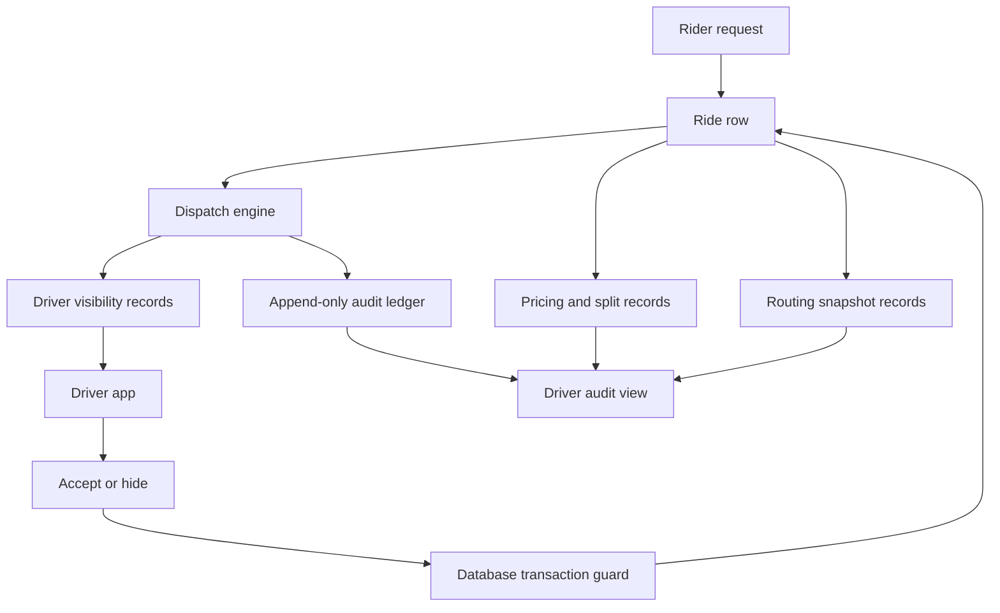

# HalfApp Transparency Architecture

Date: 2026-05-22 (v0.1 status sync: `HALFAPP_TRUTH_SYNC_V0_1_DOC_RECONCILIATION_01`)  
Prior: 2026-05-18

Status: architecture contract — separates **implemented v0.1** from **target** contracts

This document turns the five HalfApp transparency pillars into a system contract for the active FastAPI backend and React driver app. It is not a claim that every feature below exists today. It separates current truth from target contracts so future database, endpoint, and UI tasks can be checked against the mission of absolute marketplace transparency.

## Source Boundaries

Current active product surfaces:

- `backend`: FastAPI app mounted from `backend/main.py`.
- `driver-app`: React/Vite driver app routed by `driver-app/src/App.jsx`.
- `docs/RIDE_LIFECYCLE_CONTRACT.md`: current ride lifecycle contract.

Do not use dormant or legacy surfaces as product truth unless they are explicitly revived, registered, and tested. That includes legacy `frontend`, inactive backend routers, and dormant driver UI files.

Current implemented truth (v0.1 active path):

- Driver auth, driver profile, location update, ride lifecycle, earnings summaries, rider create/cancel, and notifications are backend-backed.
- **`driver-app` uses `/drivers/*` only** — it does not call dossier `/supply`, `/demand`, or `/trip` (see `HALFAPP_DOSSIER_SPINE_RECONCILIATION_01.md`).
- `Ride` stores lifecycle status, pickup/dropoff labels, backend-provided coordinates, distance, duration, **route provider metadata** (`route_provider`, `traffic_provider`, `used_fallback`, etc.), legacy `fare_amount`, timestamps, and `lifecycle_reason`.
- **`ride_pricing`** stores integer-cent quote/completion breakdown; completion sets `financial_locked`.
- `User` stores driver profile fields, legacy availability compatibility, last latitude/longitude, and `last_location_at`.
- `driver_presence` stores backend-owned requested/effective presence state, heartbeat, and stale/disconnected derivation.
- `ride_visibility` stores exposure and hide/dismissal with TTL.
- `ride_claim_attempts`, `events`, and `marketplace_ledger` / **`marketplace_ledger_events`** store open-board dispatch audit (append-only events with hash chain).
- `GET /drivers/available-rides` returns open-board pool with deterministic ordering metadata.
- `GET /drivers/rides/{ride_id}/transparency` exposes driver-authorized dispatch proof.
- `POST /drivers/accept-ride/{ride_id}` — atomic first-claim-wins; structured HTTP 409 on conflict.
- **`routing_service`** provides distance/duration estimates; OSRM code path tested; runtime OSRM proof may be **NO_GO** (`SELF_HOSTED_ROUTING_PROOF_V0_1_STATUS.md`).
- **Driver app map:** Leaflet + OSM tiles — visualization; route truth labels come from backend metadata.

Do not claim yet:

- Full candidate eligibility rounds or geo-fair dispatch.
- **Payment settlement**, wallet, PSP capture, payout execution, or refund processing.
- **Production OSRM** unless runtime proof status is GO.
- **`route_snapshots`** durable rows exist for quote/complete; accept/refresh/diagnostic roles reserved; no driver UI yet.
- Live ETA / geocoding / commercial traffic as product truth.
- Driver-facing audit UI over ledger projections.
- WebSocket presence gateway.
- Dossier auto-match as driver-app dispatch truth.

## System Shape

The backend remains the source of truth. The driver app renders only backend-provided state or clearly labeled local-only UI preference. Anything that affects dispatch, money, routing, presence, or ride lifecycle must create a durable backend record.

## Pillar 1: Radical Transparency And The Anti-Black-Box Ledger

### Current Truth

The current `rides` row is a lifecycle record, not a complete audit ledger. It can prove basic state, assignment, timestamps, distance, duration, fare amount, and last lifecycle reason. It cannot prove the candidate driver set, why a driver was skipped, when a ride was visible to each driver, the exact fare split, or which routing calculation produced distance/duration.

The current `lifecycle_reason` field is useful but too narrow for transparency because it stores only a single last explanation. It should not be overloaded as a full audit history.

### Implemented Foundation

The backend now has an append-only `marketplace_ledger_events` table for consequential marketplace facts in the active ride and dispatch flow. The first slice writes immutable events for:

- `ride.created`
- `dispatch.ride_visible`
- `ride.hidden`
- `dispatch.claim_attempted`
- `dispatch.claim_won`
- `dispatch.claim_lost`
- `ride.accepted`
- `dispatch.claim_released`
- `ride.cancelled`
- `ride.completed`
- `presence.changed`
- `presence.heartbeat`
- `earning.calculated`

### v0.1 ledger distinction (do not conflate)

| Store | Role on active driver path |
| --- | --- |
| `marketplace_ledger_events` | Append-only **marketplace audit** events (dispatch, lifecycle, presence, earning.calculated) |
| `ride_pricing` | Integer-cent **pricing/quote/completion** ledger; locked on complete |
| `ledger_*` (dossier) | **Parallel foundation** double-entry books — **not** driver-app financial truth until reconciliation |

Future slices still need candidate evaluation, durable route snapshots, payout/refund append streams, and driver-facing audit projections.

| Field | Purpose |
| --- | --- |
| `id` | Immutable event ID. |
| `event_type` | Stable event name, for example `dispatch.claim_won`. |
| `ride_id` | Related ride, nullable only for driver-only presence events. |
| `driver_id` | Related driver when applicable. |
| `actor_id` | User ID or system actor ID. |
| `occurred_at` | Server timestamp. |
| `idempotency_key` | Prevents duplicate event creation on retries. |
| `correlation_id` | Groups events from one request or dispatch round. |
| `source` | Service/component that wrote the event. |
| `payload_json` | Structured event details. |
| `previous_event_hash` | Optional hash chain link for tamper-evidence. |
| `event_hash` | Hash of event content and previous hash. |

Driver-facing audit views must be projections over this ledger, not handwritten explanations invented by the UI. A driver should be able to open a ride and see:

- When the ride entered the marketplace.
- Whether the driver was eligible to see it.
- Which dispatch rule was used.
- Whether the ride was visible, hidden, claimed by someone else, expired, cancelled, or accepted.
- The exact money split and the calculation basis.
- The route/distance/duration source used for the quote and settlement.

### Do Not Claim Yet

Do not say "transparent dispatch" for geo-fairness or "auditable fare split" for **settlement/payout** until those rows exist. **v0.1 `ride_pricing`** may support auditable **quote/completion breakdown** when `financial_locked` — still not payment truth.

UI copy should cite backend lifecycle, `ride_pricing` cents, and route `route_provider` — not wallet or production OSRM unless proved.

### First Implementation Slice

Keep `marketplace_ledger_events` as an internal projection first before building a full driver or admin audit screen.

## Pillar 2: Open Dispatch And Queue Engine

### Current Truth (v0.1)

**Active driver app dispatch truth is open-board only** on `/drivers/*`:

- `GET /drivers/available-rides` — shared pool, deterministic ordering metadata.
- `POST /drivers/accept-ride/{ride_id}` — atomic first-claim-wins.

**Dossier auto-match** (`POST /demand/request` geospatial match) is **not** active driver-app dispatch truth. It lives on the parallel foundation spine — mounted for tests, not wired to `driver-app`.

There is no hidden nearest-driver assignment on the active path. The implementation records visibility, ordering policy, hide TTL, claim attempts, and structured `409` conflicts. It does not yet record full candidate eligibility sets or production-grade regional queues.

### Dispatch Options

| Option | Transparency strength | Autonomy strength | Risk |
| --- | --- | --- | --- |
| FIFO regional queue | Easy to explain: first eligible driver in region gets first chance. | Medium; drivers may still feel pushed. | Requires exact queue membership, TTLs, and region definitions. |
| Open marketplace board | Strong autonomy: drivers pull rides themselves. | High; no forced assignment. | Race conditions and fast-click competition must be handled openly. |
| Verifiable closest-driver smoke test | Easy to audit when geometry is real. | Low to medium; still feels algorithmic. | Requires trusted routing/location freshness before use. |
| Hybrid open board plus deterministic ordering | Strong balance for MVP: open board, transparent sort order, no hidden penalty. | High. | Needs visibility ledger and clear conflict messages. |

### Recommended Initial Contract

Use a hybrid open board with deterministic ordering as the first transparent dispatch contract.

The board remains driver-pull, not platform-push. The backend returns rides visible to a driver with a declared ordering rule. Example ordering:

1. Region or service area match.
2. Ride creation time ascending.
3. Optional route-ready rides before route-pending rides.
4. Stable `ride_id` tie-breaker.

This should be explicit in the response:

- `dispatch_policy_id`
- `dispatch_policy_name`
- `ordered_by`
- `visibility_reason`
- `server_time`
- `ride_visibility_event_id`

If proximity is introduced later, it must be named and bounded, for example `closest_driver_smoke_test_v1`, and every candidate must have recorded input coordinates, freshness checks, distance method, and rank.

### Race-Condition Contract

Accept must be guarded by a database transaction or atomic conditional update. The winning condition is:

- `ride.id == requested ride`
- `ride.status == "requested"`
- `ride.driver_id is null`
- driver is currently eligible and not blocked by a visibility dismissal

If two drivers claim the same ride:

- One transaction changes the ride to `accepted` and sets `driver_id`.
- The other receives a conflict response such as HTTP 409, not a vague failure.
- Both attempts create ledger events: `dispatch.claim_won` and `dispatch.claim_lost`.
- The losing driver sees "Another driver claimed this ride at <time>" with the ledger event ID.

For SQLite development, transaction behavior should be tested carefully. For PostgreSQL production, prefer row-level locking or conditional `UPDATE ... WHERE status='requested' AND driver_id IS NULL` with affected-row count checks.

### Do Not Claim Yet

Do not claim FIFO fairness or nearest-driver matching. The backend now records dispatch policy, visibility, ordering facts, and claim conflicts for the open board, but it does not yet record full candidate eligibility rounds or prove geospatial fairness.

### First Implementation Slice

Implemented slice:

- Available rides return deterministic ordering metadata: policy ID/name, ordering rule, visibility reason, rank, score, explanation, visibility row ID, and correlation ID.
- Available ride reads create or update `ride_visibility` records.
- Accept uses an atomic first-claim-wins update.
- Wins, conflicts, unavailable attempts, and not-found attempts write claim records, events, and marketplace ledger entries.
- `GET /drivers/rides/{ride_id}/transparency` can answer who saw the ride, who attempted to claim, who won, who lost, and why a failed claim returned `409`.

## Pillar 3: Spatial Truth And Real-World Geometries

### Current Truth (v0.1)

The ride contract includes backend-provided pickup/dropoff coordinates. The driver app must not invent hardcoded city coordinates or market live ETA as guaranteed product truth.

### v0.1 spatial layers (distinguish carefully)

| Layer | What it is | What it is not |
| --- | --- | --- |
| **Leaflet/OSM map** | In-app visualization of coordinates + markers | Geocoding proof, road-network route proof, or ETA product |
| **`routing_service`** | Backend provider estimate path for distance/duration | Immutable audit history by itself (snapshots persist outcomes) |
| **`osrm_self_hosted`** | Production-like routing when OSRM container is up and runtime proof **GO** | Automatic truth on all dev machines (runtime may be **NO_GO**) |
| **`haversine_fallback`** | Honest fallback when OSRM unreachable; `used_fallback=true` on ride + snapshots | Road-network route truth |
| **`route_snapshots`** | Durable `quote` / `complete` rows per ride; `GET /drivers/rides/{id}/route-snapshots` | Production OSRM proof; full geometry polyline history |

The backend stamps **route provider metadata** on rides (`map_route_foundation`, `routing_service`). Pricing quotes consume routing estimates. Experimental **traffic signal** buffering may adjust duration — not commercial Mapbox/Google traffic APIs.

There is **no** geocoding-from-address proof. Text labels are not proved locations.

### Contract Target

Introduce provider-agnostic route snapshots. The routing engine can be OSRM, Valhalla, GraphHopper, a commercial maps API, or another provider, but the backend contract must record the exact calculation context.

Recommended table: `route_snapshots`

| Field | Purpose |
| --- | --- |
| `id` | Route snapshot ID. |
| `ride_id` | Related ride. |
| `route_role` | `quote`, `dispatch_preview`, `driver_to_pickup`, `trip_actual`, or `settlement`. |
| `engine_name` | Routing provider or engine. |
| `engine_version` | Version, profile, or API version. |
| `profile` | `driving`, `bike`, `walk`, etc. |
| `origin_latitude` / `origin_longitude` | Exact origin sent to engine. |
| `destination_latitude` / `destination_longitude` | Exact destination sent to engine. |
| `distance_meters` | Engine-returned distance. |
| `duration_seconds` | Engine-returned duration. |
| `geometry_polyline` | Encoded route geometry, nullable if not licensed/stored. |
| `geometry_hash` | Hash of geometry for audit even when geometry is not displayed. |
| `calculated_at` | Server calculation time. |
| `error_code` | Routing failure code, if any. |
| `confidence` | Optional confidence category, not invented by UI. |

The driver app should display the same distance, duration, route, and ETA that the server calculated. If a value is missing, the UI should say "Not available yet" rather than substitute a local estimate.

### Spatial Freshness Rules

Driver location can be used for dispatch only if:

- `last_location_at` is recent under a defined TTL.
- Coordinates pass range validation.
- The source is known, for example browser GPS, mobile GPS, or manual/test simulation.
- The dispatch ledger records whether stale or missing location excluded a driver.

### Do Not Claim Yet

Do not display **production road-network routing** when `route_provider=haversine_fallback`. Do not claim **live ETA product**, **geocoding**, or **commercial traffic** without the target contracts.

### First Implementation Slice

**Partial (v0.1):** `routing_service` + OSRM provider + ride metadata + `route_snapshots` (`quote`, `complete`) + honest fallback labels in UI.

**Remaining:** runtime OSRM GO on deploy targets, `accept`/`refresh` snapshot roles, geometry polyline capture, driver UI for snapshot read API.

## Pillar 4: Driver Autonomy And Presence Lifecycle

### Current Truth

`User` still stores legacy `availability`, `last_latitude`, `last_longitude`, and `last_location_at`, but the active cockpit now reads and writes marketplace presence through backend presence endpoints:

- `GET /drivers/presence`
- `PUT /drivers/presence`
- `POST /drivers/heartbeat`

The backend persists requested/effective state and derives `stale` or `disconnected` from heartbeat timestamps. Local cockpit state is display/cache only.

"Hide for now" is now backend-backed through `POST /drivers/rides/{ride_id}/hide`. It writes a `ride_visibility` record with `status='hidden_by_driver'`, `dismissed_at`, `expires_at`, optional reason, and correlation ID. The ride remains available to other eligible drivers and is excluded from the hiding driver's available-rides response while the hide record is active.

### Contract Target

Define presence as server-owned state:

| State | Meaning |
| --- | --- |
| `offline` | Driver has opted out of marketplace visibility. |
| `available` | Driver can see eligible open-board rides. |
| `paused` | Driver is online to the app but not receiving new ride visibility. |
| `offered` | A specific ride is visible to this driver. |
| `accepted` | Driver has claimed one ride. |
| `on_trip` | Driver is past pickup/start lifecycle. |
| `stale` | Driver has not refreshed presence/location within TTL. |
| `disconnected` | Backend considers the driver disconnected after heartbeat timeout. |

Implemented foundation: `driver_presence`

| Field | Purpose |
| --- | --- |
| `id` | Presence row ID. |
| `driver_id` | Driver. |
| `requested_state` | Driver-requested state such as `available`, `offline`, or `paused`. |
| `effective_state` | Backend-derived state, including `stale` and `disconnected`. |
| `state_changed_at` | Server timestamp when requested state changed. |
| `heartbeat_at` | Last heartbeat received by the backend. |
| `stale_reason` | Backend explanation for stale/disconnected state. |
| `updated_at` | Last backend presence evaluation timestamp. |

Implemented foundation: `ride_visibility`

| Field | Purpose |
| --- | --- |
| `id` | Visibility record ID. |
| `ride_id` | Ride. |
| `driver_id` | Driver. |
| `dispatch_round_id` | Related dispatch round. |
| `first_seen_at` | Server time visibility began. |
| `last_seen_at` | Last server time this visibility was returned. |
| `expires_at` | Hide/dismissal expiry, if active. |
| `status` | `visible`, `hidden_by_driver`, `expired`, `claimed_by_other`, `cancelled`, `accepted`. |
| `reason` | Why visible or no longer visible. |
| `dismissed_at` | When driver hid the ride. |
| `correlation_id` | Correlates visibility records with later audit work. |

"Hide for now" is now the first backend request dismissal slice:

- The driver sends `POST /drivers/rides/{ride_id}/hide` with optional reason.
- The backend writes `ride_visibility.status='hidden_by_driver'`.
- The ride remains visible to other eligible drivers.
- The same driver does not see that ride again until `expires_at` passes or a future dispatch contract reopens it.
- The driver audit view shows "You hid this ride at <time>; it was not counted as an acceptance penalty."

Recommended default TTL: one dispatch round or 15 minutes, whichever is shorter. The exact TTL must be in config and returned to the client.

### Drift Prevention

The driver app should refresh presence from the backend on startup, after toggles, after heartbeat failures, and after ride lifecycle transitions. Local UI state can cache the last response, but cannot override server presence.

If a local action fails to persist, the app must show the backend state. It must not keep an optimistic online/offline or hidden state indefinitely.

### Do Not Claim Yet

Do not claim complete real-time driver autonomy yet. The first server-owned presence and hide slice exists, but full autonomy still needs richer presence events, gateway/WebSocket behavior if required, and broader dispatch audit projections.

### First Implementation Slice

First implementation slice now added dedicated presence and hide endpoints:

- `GET /drivers/presence`
- `PUT /drivers/presence`
- `POST /drivers/heartbeat`
- `POST /drivers/rides/{ride_id}/hide`

They are backed by presence and visibility records, and the active cockpit renders server state. Future work should add richer audit projections and operational-grade presence transport only after this contract remains stable.

## Pillar 5: Architectural Scale And Ecosystem Fit

### Current Truth

The project is intentionally lightweight: FastAPI, SQLAlchemy, SQLite/PostgreSQL-compatible models, JWT auth, and a focused React driver app. This is a good base for a transparent local-first MVP. The main risk is not lack of infrastructure; it is letting UI claims outrun backend records.

### Contract Target

Keep one deployable backend for now, but organize it around clear internal services before splitting infrastructure:

- `ledger_service`: append-only event writes and audit projections.
- `dispatch_service`: visibility, ordering, claim rules, and conflict handling.
- `pricing_service`: quotes, final fares, splits, adjustments, and payout allocation.
- `routing_service`: route snapshots and provider adapters.
- `presence_service`: driver availability, heartbeat, stale/disconnected transitions.

Do not introduce a separate microservice until the module boundary has a stable data contract and tests inside the existing backend.

### Local-First Capability

Local-first does not mean local-only truth. It means the system can run locally with the same contracts:

- SQLite can support development and tests.
- PostgreSQL should be the target for production-grade locking, constraints, and audit scale.
- Mock mode must remain explicit and visible.
- Seeded simulation rides must create backend rows and ledger events.
- Offline UI caches may exist only as caches, never as authoritative lifecycle, fare, dispatch, or presence records.

### Integration Contract

Broader operational systems should integrate through backend APIs and ledger projections, not frontend scraping. Future integrations can subscribe to:

- Marketplace ledger event stream.
- Ride lifecycle projection.
- Driver presence projection.
- Route snapshot projection.
- Fare and payout projection.

Every integration event should include stable IDs, server timestamps, correlation IDs, and source service names.

### Do Not Claim Yet

Do not build admin, logistics, payment, or multi-role expansion on the legacy `frontend` or inactive routers until those surfaces are explicitly revived, tested, and documented as active.

### First Implementation Slice

Keep code changes inside active `backend` and `driver-app`. Add service modules under `backend/services` and tests under `backend/tests` before broad UI expansion.

## Financial Split Contract

A truthful driver earnings system needs more than `Ride.fare_amount`.

Recommended table: `ride_financial_ledger`

| Field | Purpose |
| --- | --- |
| `id` | Financial event ID. |
| `ride_id` | Ride. |
| `event_type` | `quote`, `final_fare`, `platform_fee`, `driver_earning`, `tax`, `toll`, `adjustment`, `refund`, `payout`. |
| `amount_cents` | Integer amount. |
| `currency` | Currency code. |
| `calculation_basis` | JSON basis such as distance, duration, base fare, rate card. |
| `rate_card_id` | Pricing policy. |
| `route_snapshot_id` | Route basis when applicable. |
| `created_at` | Server timestamp. |
| `visible_to_driver` | Whether event appears in driver audit. |
| `ledger_event_id` | Link to marketplace event. |

Driver-visible fare detail must show:

- Rider fee.
- Base fare.
- Distance component.
- Duration component.
- Platform cut.
- Driver earnings.
- Adjustments, tolls, taxes, refunds, or bonuses.
- Rate card or pricing policy ID.
- Timestamp when quoted and finalized.

Current `GET /drivers/earnings` can remain as a summary endpoint, but it should eventually become a projection over `ride_financial_ledger`, not the primary source of money truth.

## First Implementation Sequence

1. **Audit ledger foundation**
   - Complete: `marketplace_ledger_events` exists with hash chaining, idempotency keys, correlation IDs, append-only triggers, lifecycle/dispatch writes, and tests proving event creation.

2. **Visibility and hide contract**
   - Add `ride_visibility_records`.
   - Add backend hide/dismiss endpoint.
   - Update available rides to exclude active hidden records for the requesting driver.
   - Show hide TTL and reason in the driver app.

3. **Atomic dispatch claim**
   - Replace simple accept read-then-write with atomic claim logic.
   - Return HTTP 409 for claim conflicts.
   - Ledger both winning and losing claim attempts.

4. **Server-owned presence**
   - Add presence endpoints and events.
   - Make cockpit online/offline read from backend.
   - Add heartbeat and stale-state handling.

5. **Financial split ledger**
   - **Partial (v0.1):** `ride_pricing` integer cents + lock on complete.
   - **Remaining:** payout/refund append stream; settlement; earnings as full ledger projection.

6. **Route snapshot contract**
   - **Partial (v0.1):** `routing_service` + ride route metadata + Leaflet map with provider labels.
   - **Remaining:** `route_snapshots` table; runtime OSRM GO; geometry hash linkage.

7. **Driver audit view**
   - Add backend audit endpoint per ride.
   - Render dispatch, visibility, route, and financial explanations from ledger projections.

## Future Task Checklist

Before any new UI claim or endpoint ships, answer these questions:

- Which database row proves this marketplace fact?
- Is the row append-only, or can the explanation be overwritten?
- Which driver can see the explanation, and when?
- What is the source of time, money, distance, duration, and route geometry?
- What happens on retry, refresh, disconnection, or race conflict?
- Does the behavior belong to active `backend` and `driver-app`, or is it accidentally using a legacy surface?

If the answer is "the frontend inferred it," the feature is not transparent enough to ship as real marketplace behavior.
