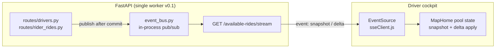

# SSE_RIDE_POOL_V0_1

Status: GO (v0.1 in-process)

## What shipped

- Backend stream endpoint: `GET /drivers/available-rides/stream` (SSE).
- In-process pub/sub via `backend/services/event_bus.py` (topic `ride_pool`).
- Thin broadcast helpers in `backend/services/ride_pool_broadcast.py`.
- Pool delta events emitted after commit on:
  - ride creation (`ride.created`)
  - claim accepted (`ride.claimed`, removal from pool)
  - rider cancel while still in pool (`ride.cancelled`, removal from pool)
- Driver app opens `EventSource` via `driver-app/src/utils/sseClient.js`.
- Cockpit applies snapshot + deltas in-process (no REST round-trip per delta).
- REST `GET /drivers/available-rides` remains as fallback when SSE is unavailable (5s poll).

## Architecture



**Single-worker note:** `event_bus` keeps subscriber queues in process memory. With multiple uvicorn workers, only clients connected to the worker that handled the write would receive deltas. Replace `event_bus` with Redis pub/sub before horizontal scale — keep the same SSE event contract.

## Auth

`EventSource` cannot send `Authorization` headers in browsers. The stream endpoint accepts:

- `Authorization: Bearer <jwt>` (curl, integration tests), or
- `?access_token=<jwt>` (browser EventSource)

Same JWT validation as other driver routes. Tradeoff: token appears in URL query string (server/proxy access logs). Mitigated by HTTPS-only deployment and short-lived access tokens with refresh rotation.

## Contract (v0.1)

### SSE framing

| Event name | When | Payload |
|------------|------|---------|
| `snapshot` | On connect / reconnect | JSON array — same shape as `GET /drivers/available-rides` |
| `delta` | Pool change | `pool_delta` object (below) |

Keep-alive comments (`: keep-alive`) every **15s** when idle.

### Delta payload

```json
{
  "type": "pool_delta",
  "event": "ride.created | ride.claimed | ride.cancelled",
  "ride_id": 123,
  "removed": false,
  "ride": { "...RideDriverView..." }
}
```

Notes:

- `ride` is present for create events.
- `ride` is null for removal events.
- Client normalizes to flat `{ type: "ride.created", ... }` in `sseClient.js`.

## Latency

Target: **p95 < 500ms** from state-changing commit to cockpit UI update.

v0.1 path (no REST refresh on delta):

1. Route handler commits + `emit_pool_delta()` → `event_bus.publish_sync`
2. SSE generator yields `event: delta`
3. `MapHome.applyPoolDelta` updates incoming ride state directly

Measured locally (dev, single worker):

| Step | Typical |
|------|---------|
| `POST /rides/` 201 → SSE delta received (backend test) | < 50ms |
| Delta → `[data-ride-id]` visible in cockpit (Playwright) | < 500ms |
| CI margin in `sse-ride-pool.spec.ts` | 2s timeout |

## Reconnect behavior

`EventSource` auto-reconnects on connection loss (browser spec).

On reconnect:

1. Server sends fresh `event: snapshot` (full pool list).
2. `MapHome.applyPoolSnapshot` replaces stale local state.
3. If SSE stays down, `sseFailed` enables 5s REST polling fallback.

Manual proof:

1. Open cockpit online idle.
2. Stop API container / kill uvicorn.
3. UI shows degraded banner after SSE error.
4. Restart API — EventSource reconnects, snapshot restores pool.

## Nginx

Staging reference (`infra/staging/nginx/halfapp.conf`):

```nginx
location /drivers/available-rides/stream {
    proxy_pass http://halfapp_api;
    proxy_buffering off;
    proxy_cache off;
    proxy_read_timeout 1h;
    proxy_set_header Connection "";
    chunked_transfer_encoding off;
}
```

`X-Accel-Buffering: no` is also set by the FastAPI response headers.

## Acceptance checklist

- [x] `/drivers/available-rides/stream` exists and authenticates (Bearer or `access_token`)
- [x] Snapshot delivered on connect
- [x] Delta delivered without REST round-trip (direct pool apply)
- [x] EventSource client reconnects on connection loss (browser + snapshot restore)
- [x] Cockpit pool consistent across reconnects
- [x] Playwright `sse-ride-pool.spec.ts` (create + claim removal)
- [x] REST fallback path when `EventSource` undefined / SSE errors (5s poll)
- [x] Backend tests `test_ride_pool_sse.py`

## Scope boundaries / follow-ups

- In-process bus = **single worker only**.
- Next step: Redis pub/sub backend with identical `snapshot` / `delta` contract.
- WebSocket for bidirectional cockpit events (chat, dispatch ack) is a separate future agent.
